# Modulo 1: esperimenti aggiuntivi

Esperimenti a supporto del report del Modulo 1 (vettorizzazione del partition mapping kernel). Per ciascuno il grafico e i punti principali. Misure su node09 (AMD EPYC 7301), lo stesso nodo del report.

| Esperimento | Riferimento nel report |
|---|---|
| Esp. 1: qualità della hash | Sez. 1.1, mapping function |
| Esp. 2: tetto di banda | Sez. 4.2, regime memory-bound |
| Esp. 3: grid search dei flag | Sez. 2, auto-vettorizzazione |
| Esp. 4: 32 vs 64 bit | Sez. 3, AVX2 intrinsics |
| Esp. 5: rerun CPU e CUDA | Tabella 1 e Sez. 5, CUDA |

## Esp. 1: qualità della hash

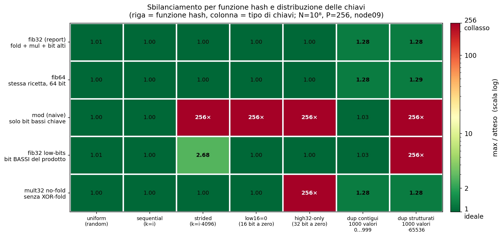

- Su chiavi uniformi tutte le funzioni bilanciano (fib32 = 1.01).
- Su chiavi strutturate `mod` collassa a 256x (tutte le chiavi in una partizione) quando i bit bassi mancano di entropia; le varianti che rimuovono un ingrediente della hash (il fold o i bit alti) falliscono su almeno una distribuzione.
- Solo fib32 e fib64 restano bilanciate su tutte le distribuzioni, con qualità equivalente.
- La preferenza per la famiglia `fib` rispetto a `mod` è motivata dalla robustezza (caso peggiore 1.28, nessun collasso su 7 distribuzioni contro 4 collassi di `mod`): in un join la distribuzione delle chiavi non è nota a priori.
- La larghezza a 32 bit non è invece decisa qui: fib32 e fib64 hanno qualità identica. È imposta da AVX2, che ha la moltiplicazione intera nativa solo a 32 bit (Esp. 4).

## Esp. 1: qualità della hash

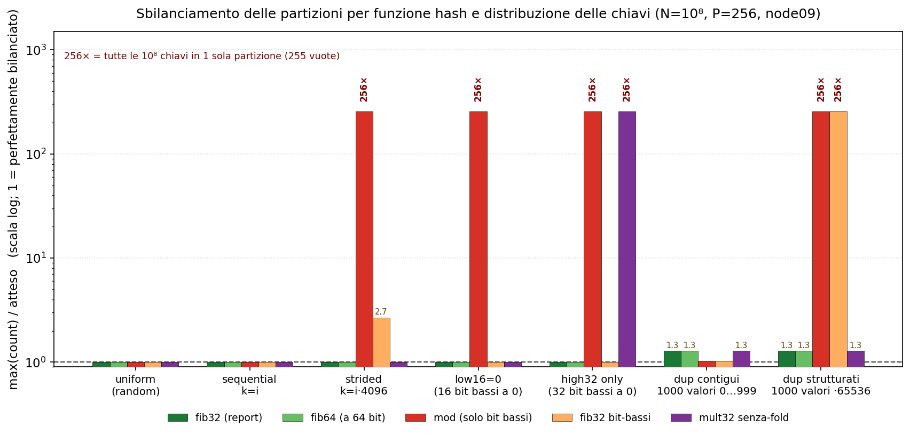

- In scala logaritmica il collasso di `mod` risulta di ordini di grandezza (fino a 256x), non uno scostamento marginale.
- Un collasso concentra tutte le chiavi in un'unica partizione e compromette la fase successiva.
- Le due colonne dup hanno la stessa distribuzione (1000 valori distinti, stesse molteplicità) e differiscono solo per la codifica: riscalando i valori di 2^16, `mod` passa da 1.03 a 256x mentre fib32 resta 1.28. Il vantaggio di `mod` sui duplicati contigui dipende dalla codifica in bit, non dalla statistica delle chiavi.
- Il 1.28 di fib32 sui dup è quantizzazione, non un difetto della funzione: i duplicati di un valore finiscono per costruzione nella stessa partizione, e con 1000 valori distinti su 256 partizioni la media è 3.9 valori per partizione, quindi nessuna hash può scendere sotto 4/3.9 = 1.02.

## Esp. 1: qualità della hash

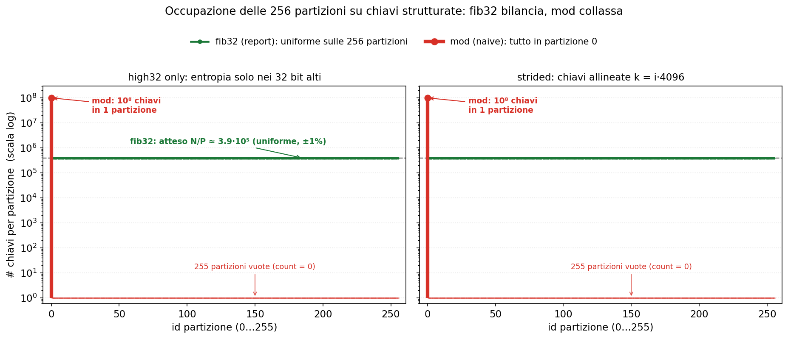

- fib32 distribuisce le chiavi in modo uniforme sulle 256 partizioni (N/P circa 3.9*10^5, entro l'1%); `mod` le concentra tutte in una, la partizione 0, e ne lascia 255 vuote.
- Il meccanismo dipende dai bit impiegati: `mod` seleziona i bit bassi della chiave, costanti su chiavi strutturate, mentre fib32 li rimescola con la costante aurea e seleziona i bit alti.

## Esp. 2: tetto di banda

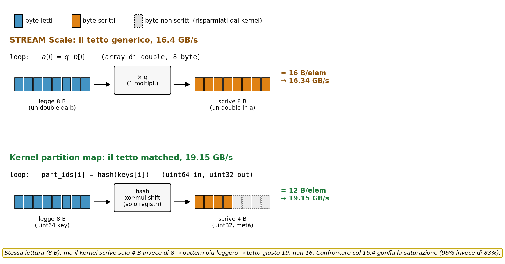

- Lo STREAM Scale legge 8 B e scrive 8 B per elemento (16.4 GB/s); il kernel legge 8 B (uint64) e scrive 4 B (uint32), con un traffico inferiore.
- Il tetto appropriato per questo pattern è la copia matched (read 8, write 4), pari a 19.15 GB/s, non lo STREAM Scale.
- Il regime resta memory-bound: cambia soltanto il denominatore del rapporto di saturazione.

## Esp. 2: tetto di banda

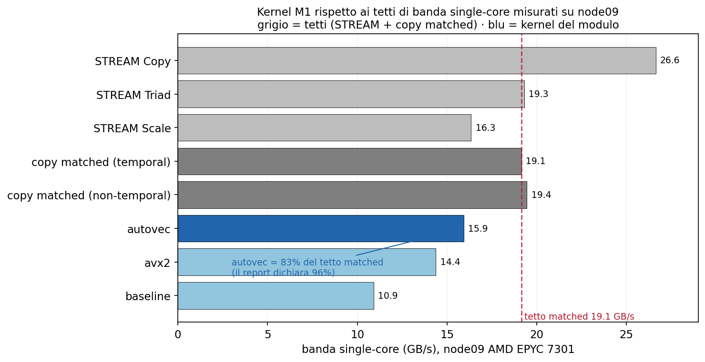

- Il kernel auto-vettorizzato raggiunge 15.9 GB/s, rispetto ai tetti misurati sul nodo (Copy 26.6, Triad 19.3, Scale 16.34, matched 19.15).
- Riferito al tetto matched, corrisponde all'83% della banda, non al 96%: quel valore adottava lo STREAM Scale come riferimento.

## Esp. 3: grid search dei flag

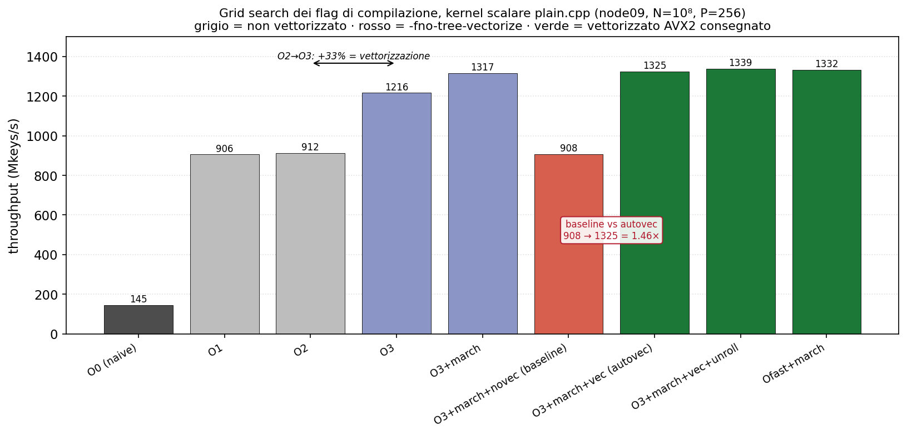

- O0 -> O1 (145 -> 906, 6.3x): a O0 ogni variabile risiede in memoria e ogni operazione passa dallo stack; O1 alloca i registri ed elimina quel traffico. È il salto più grande della scala e non riguarda la vettorizzazione.
- O1 -> O2 (906 -> 912): nessun effetto. A O2 GCC non auto-vettorizza il loop, e il throughput resta quello della baseline scalare (908).
- O2 -> O3 (912 -> 1216, +33%): O3 abilita `-ftree-vectorize`, che riscrive il loop su registri vettoriali elaborando più chiavi per istruzione. È l'unico incremento attribuibile alla vettorizzazione.
- +`-march=native` (1216 -> 1317, +8%): comunica al compilatore ISA e microarchitettura del nodo, che altrimenti assume il baseline x86-64. Il guadagno è contenuto perché il kernel è memory-bound: già senza AVX2 copre il 76% del tetto di banda misurato nell'Esp. 2.
- `-funroll-loops` (+1%) e `-Ofast` (+1%) restano entro la banda di riproducibilità (~1%): il primo riduce l'overhead di ciclo, il secondo riassocia le operazioni in virgola mobile, ma il kernel è a interi e il collo di bottiglia è la banda. Nessuno dei due entra nel Makefile.

## Esp. 3: grid search dei flag

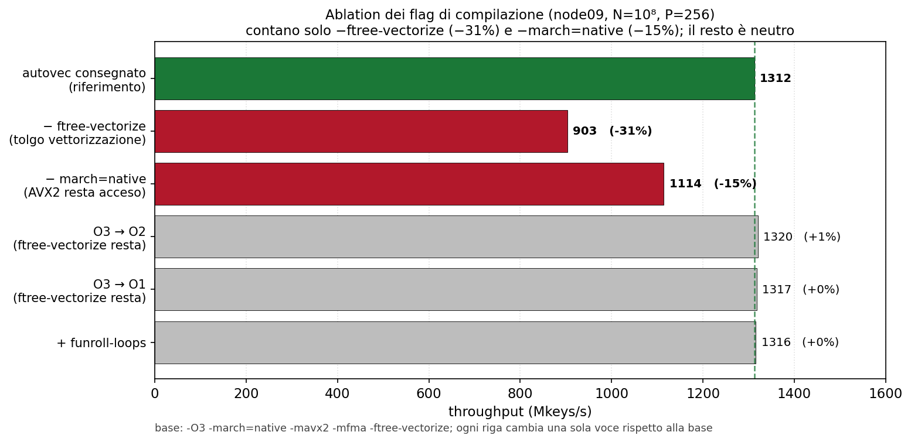

- Ogni riga parte dalla configurazione consegnata (-O3 -march=native -mavx2 -mfma -ftree-vectorize) e ne cambia una sola voce. La rimozione di -ftree-vectorize costa il 31%, quella di -march=native il 15%; ridurre il livello di ottimizzazione e aggiungere -funroll-loops non hanno effetto apprezzabile.
- O3 -> O2 e O3 -> O1 non cambiano nulla perché -ftree-vectorize resta passato esplicitamente: abbassare il livello non spegne la vettorizzazione. È la prova che il +33% del salto O2 -> O3 nella grid era la vettorizzazione (che O3 accende di default e O2 no), non l'ottimizzazione in sé: lo stesso -O2 dà 912 senza il flag e 1320 con il flag.
- -funroll-loops è neutro per un motivo diverso: srotolare riduce l'overhead di conteggio e salto del ciclo, che non è il collo di bottiglia di un kernel limitato dalla banda.
- Il contributo di -march=native è il tuning per la microarchitettura, non l'ampiezza dei vettori: abilitare AVX2 senza march (-O3 -mavx2 -mfma) scende a 1114, cioè sotto i 1216 di -O3 puro, che vettorizza con la sola SSE2. L'ISA più larga, da sola, riduce il throughput dell'8%.
- Lo speedup dipende esclusivamente da questi due flag: quelli del Makefile sono l'insieme minimale sufficiente.

## Esp. 4: 32 vs 64 bit

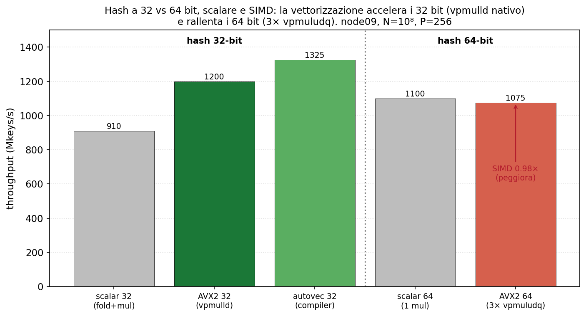

- La vettorizzazione accelera la hash a 32 bit (avx2_32/scalar32 = 1.32x) e rallenta quella a 64 bit (avx2_64/scalar64 = 0.98x). Il motivo è l'insieme di istruzioni: a 32 bit la moltiplicazione della hash è una singola `vpmulld` ogni 8 chiavi, a 64 bit AVX2 non ha l'istruzione corrispondente e servono 3 `vpmuludq` più shift e add ogni 4 chiavi, cioè sei volte tante moltiplicazioni per chiave su corsie che ne contengono la metà. Il costo aritmetico annulla il guadagno della SIMD.
- In versione scalare la hash a 64 bit supera quella a 32 bit (1100 contro 910, +21%) perché fa meno lavoro: la ALU moltiplica 64x64 con una sola istruzione, quindi restano una `imul` e uno shift, mentre la variante a 32 bit deve prima estrarre le due metà della chiave e applicare lo XOR-fold per portare l'entropia nei 32 bit bassi. Il fold esiste solo perché si lavora a 32 bit.
- I 32 bit non sono quindi scelti per un minor costo scalare, dove anzi perdono, ma perché sono l'unica larghezza che AVX2 moltiplica con un'istruzione nativa. La qualità di partizionamento non entra nella scelta, essendo equivalente (Esp. 1: fib32 = fib64).
- Il confronto che decide è fra i migliori di ogni larghezza tra le configurazioni misurate: 1325 (auto-vettorizzato a 32 bit) contro 1100 (scalare a 64 bit, dato che a 64 bit la SIMD peggiora), cioè +20% a favore dei 32 bit.

## Esp. 4: 32 vs 64 bit

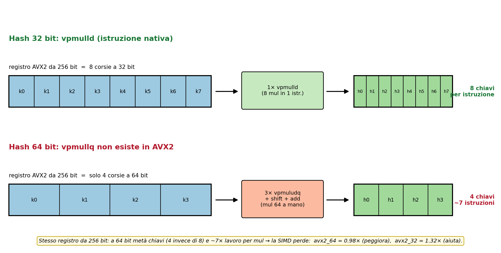

- `vpmulld` moltiplica 8 coppie di interi a 32 bit e tiene i 32 bit bassi di ogni prodotto: è esattamente la moltiplicazione modulo 2^32 della hash, in una istruzione su 8 chiavi. AVX2 non ha l'equivalente a 64 bit.
- `vpmuludq` moltiplica interi a 32 bit dando risultati a 64 bit su 4 corsie. Non esegue una moltiplicazione 64x64: ne produce i prodotti parziali.
- La 64x64 va quindi emulata a mano: `k*A mod 2^64 = k_lo*A_lo + (k_lo*A_hi + k_hi*A_lo)*2^32`, cioè 3 `vpmuludq` più 2 add, uno shift e l'estrazione della metà alta. Sono 7 istruzioni invece di una, su metà delle corsie (4 chiavi contro 8).
- La moltiplicazione intera a 64 bit in SIMD (`vpmullq`) esiste solo in AVX-512, che node09 (EPYC 7301, Zen 1) non implementa. Il vincolo è della CPU che esegue, non della toolchain: compilare su un nodo dotato di AVX-512 non aggirerebbe il problema, perché il binario va comunque eseguito su node09, che non decodifica quegli opcode e terminerebbe il processo per istruzione illegale. Misurare su un nodo diverso cambierebbe la piattaforma e i numeri non sarebbero confrontabili con il resto del modulo.

## Esp. 5: rerun CPU e CUDA

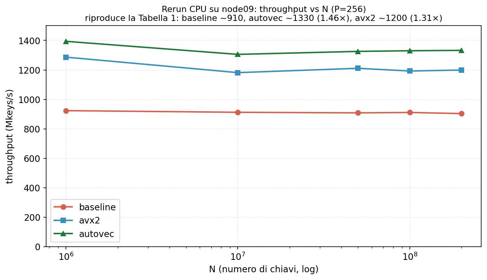

- Le tre curve sono piatte entro il 2% da N=10^7 a 2*10^8: il kernel legge ogni chiave una volta sola e non riusa i dati, quindi il costo per chiave non dipende da quante chiavi ci sono e il throughput non varia con la taglia. A N=10^6 è circa il 5% più alto, effetto compatibile con un working set (12 MB) in parte servito dalla cache, non isolato da questa misura.
- L'ordinamento auto-vettorizzato, avx2, baseline si mantiene su tutte le taglie: a N=10^8, P=256, baseline 911, auto-vettorizzato 1330 (1.46x), avx2 1193 (1.31x) Mkeys/s.
- I valori riproducono la Tabella 1 con checksum identici: baseline entro lo 0.8% su tutte le taglie, auto-vettorizzato entro il 2.5%.
- L'avx2 scarta fino al 4.1% (1152 contro 1199 a N=2*10^8), oltre la banda di riproducibilità dell'1%: l'ordinamento non cambia, il singolo valore non è stabile a quel livello.

## Esp. 5: rerun CPU e CUDA

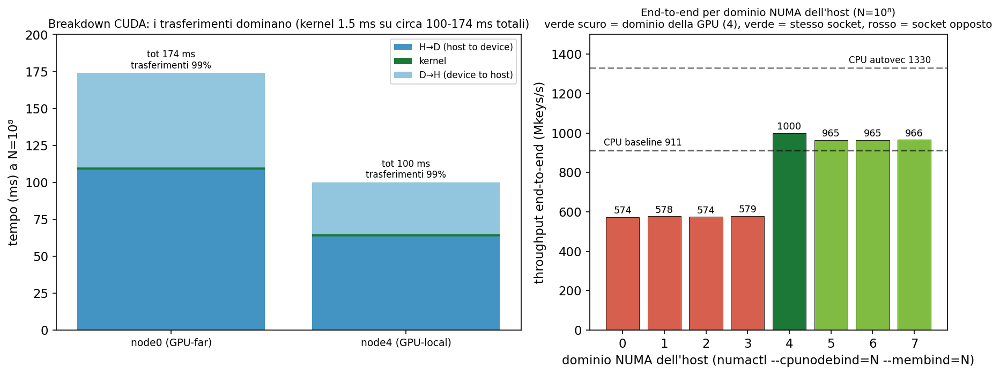

- Il kernel impiega 1.5 ms; i trasferimenti H->D e D->H sono il 99% del tempo end-to-end.
- L'end-to-end dipende dal dominio NUMA su cui gira l'host, a parità di kernel (66700 Mkeys/s e checksum identico su tutti i domini): sul dominio della GPU 1000 Mkeys/s (H->D 63.2 ms, D->H 35.3 ms), sul socket opposto 574 (H->D 108.6 ms, D->H 64.0 ms). Il trasferimento attraversa l'interconnessione fra socket e la banda scende da 12.6 a 7.4 GB/s.
- Il posizionamento è controllabile, non casuale: `numactl --cpunodebind=4 --membind=4` (con l'allocazione `--exclusive --cpus-per-task=64 --cpu-bind=none`, altrimenti SLURM confina il task al cpuset di un solo dominio) vincola CPU e memoria dell'host al dominio 4. Lo script consegnato non lo applica, quindi il dominio lo assegna SLURM.
- La misura sugli 8 domini segue le distanze NUMA riportate da `numactl --hardware`: 1000 sul dominio della GPU (distanza 10), 965 sugli altri tre domini dello stesso socket (distanza 16, -3.5%), 574-579 sui quattro del socket opposto (distanza 22-28, -43%).
