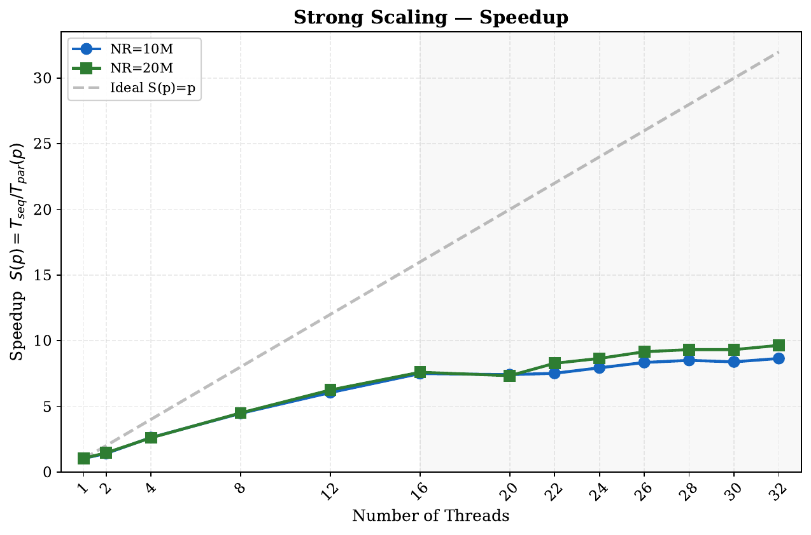
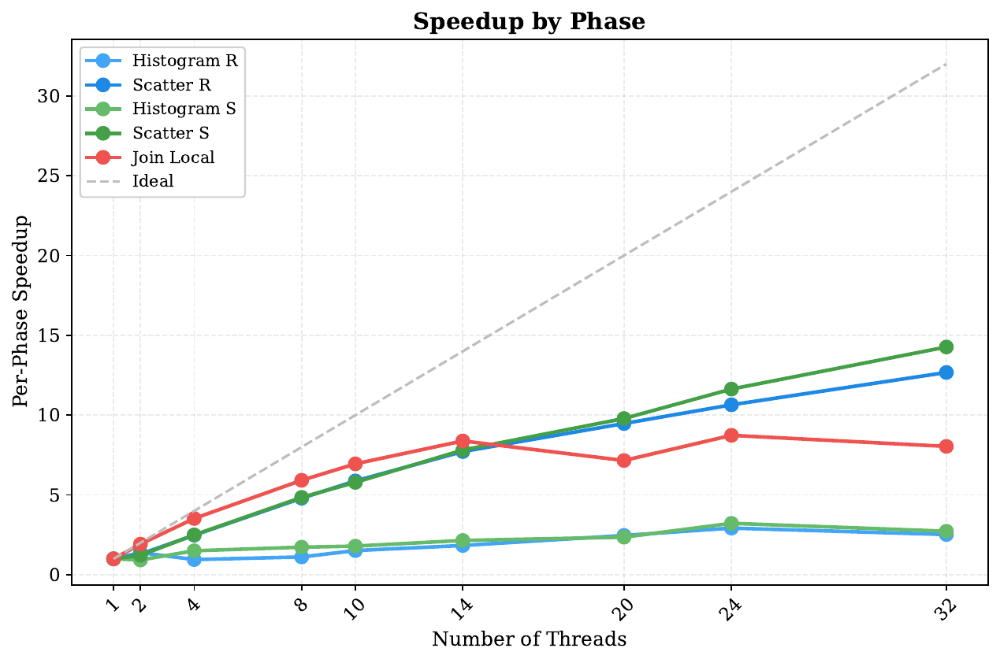
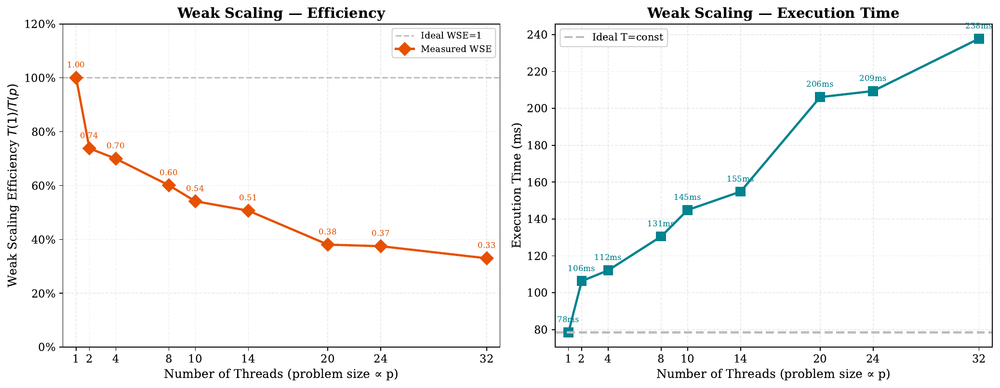
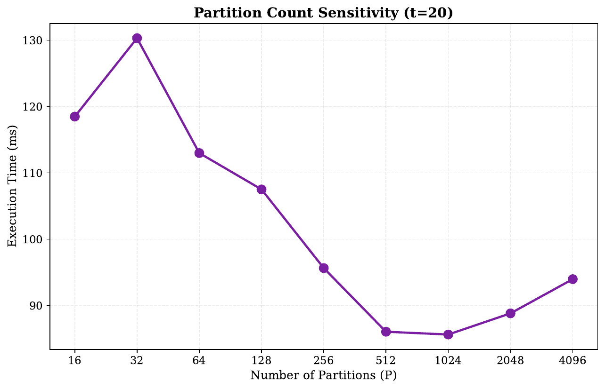
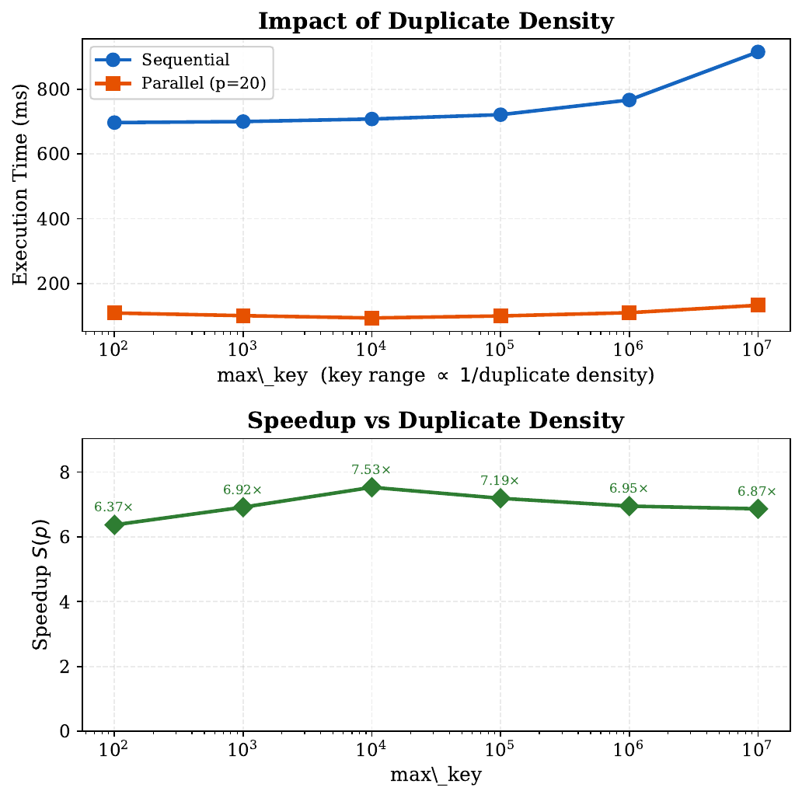

# Companion di studio, Modulo 2 (materiale extra per l'orale)

Materiale **aggiuntivo** per preparare l'orale del Modulo 2 (partitioned hash join con
duplicati, parallelizzato con C++ threads). Non modifica il report né il PDF consegnati: sta
tutto in `module_2/extra_experiments/`. L'obiettivo qui non è "mostrare altri numeri" ma
**spiegare il perché** di ogni scelta, dai primi principi e dal codice, usando gli esperimenti
come conferma.

Chiarimento di terminologia usato ovunque:

- **baseline di partenza** = `src/hashjoin_seq_baseline.cpp`, il codice di riferimento fornito
  dal docente come punto di partenza (partizionamento `k & (P-1)`, join con `std::unordered_map`).
- **versione consegnata (la mia)** = `src/hashjoin_seq.cpp` e `src/hashjoin_parallel.cpp`, con
  hash di Fibonacci e `FlatCountMap`. È quella che ho consegnato io.

Regola seguita ovunque: nessun numero inventato. Tutti gli esperimenti nuovi girano **su un
compute node Ivy Bridge** (`node01/02`: Intel Xeon E5-2640 v2, 2 socket × 8 core, 16 fisici /
32 con HT, L2 256 KB/core, L3 20 MB/socket, 2 nodi NUMA), lo **stesso tipo di nodo del report**
M2 (partizione `normal`; non il node09 con GPU, che serviva al Modulo 1).

---

## 1. Risposte rapide ai dubbi del todo

**Cos'è LPT?** *Longest Processing Time first*, un'euristica di scheduling. Spiegata a fondo
nell'Esp. 4; in breve: ordina i lavori (le partizioni) per costo decrescente e assegna ognuno
al thread meno carico. Il report la cita per dire che, con partizioni quasi uguali, il cyclic
la eguaglia a costo zero.

**Perché la barriera e non un thread pool con coda?** Perché le dipendenze fra le fasi
impongono comunque una barriera piena a ogni confine. La coda non compra overlap, paga solo
overhead. Misurato nell'Esp. 3 (**con grafico**: `microsync_overhead.png`): la coda costa da
1.1× a 198× in più della barriera sul solo primitivo di sincronizzazione.

**Da dove viene I ≈ 0.125 dell'histogram?** È l'intensità operazionale (operazioni utili per
byte letto). Derivata dal codice e **misurata** con perf nell'Esp. 5, spiegata a fondo lì.

**Come è stata stimata la frazione seriale f ≈ 0.078?** È **fittata** ai dati con un
least-squares (non contata dal codice). Spiegata rigorosamente nel §4.1, con la misura del
codice davvero seriale (0.1%) che dimostra che quella f è *apparente* (ingloba la banda).

**Come si controlla la correttezza?** Join naive O(N²) per input piccoli + uguaglianza
`join_count` e 2 checksum tra sequenziale e parallelo per input grandi. Dettagli nel §4.2.

**Cosa cambia rispetto alla baseline di partenza?** Due cose, e sono una **coppia obbligata**:
la hash di partizionamento e la struttura del join locale. L'Esp. 1 mostra perché.

**Perché lo speedup a p=1 è > 100% (S=1.03 a NR=10M, 1.04 a 20M)?** Non è super-lineare: a p=1
non c'è parallelismo. Lo speedup è time_seq/time_par(p), e i due sono **binari distinti** (il
riferimento sequenziale e la versione parallela lanciata con 1 thread). Best-of-5, distano entro
il 4% di varianza dichiarata; a p=1 la parallela esce avanti (dai CSV: 0.7469 vs 0.7665 s a 10M,
1.514 vs 1.574 a 20M), da cui S(1) un filo sopra 1. È la discrepanza attesa fra due eseguibili,
non un guadagno di calcolo.

**Perché il phase breakdown a p=1 è misurato due volte (769 e 753 ms)?** Sono due run indipendenti
(2.1% di scarto, dentro la varianza del 3%; entrambe in `phase_breakdown.csv`, riga threads=1). A
queste si aggiunge un terzo numero, l'outer timer dello strong scaling (766 ms): tre misure dello
stesso p=1, tutte entro il 3%. Il report usa il **769** per la tabella del breakdown (è la **somma
dei timer interni di fase** a p=1) e lo dichiara in nota. Onestà da riportare senza addolcirla:
scegliere il **più alto** dei due (769 invece di 753) rende gli speedup del breakdown **leggermente
ottimistici**, non prudenti, perché lo speedup è baseline/tempo(p) e una baseline più grande dà uno
speedup più grande. È esattamente ciò che ammette la nota del report ("slightly optimistic speedup
figures"), con effetto limitato al 3%. La ragione della scelta è la coerenza col resto (769 vicino
al 766 dell'outer timer), non un margine di prudenza.

**`T` e `p` sono la stessa cosa?** Sì: nel report "P=16 < T=20" e "P=32 (T=20)", `T` è il numero di
thread, fisso a 20 nel partition sweep; la notazione coerente col resto sarebbe `p=20`. `P`
maiuscola è invece il **numero di partizioni**. P<20 vuol dire meno partizioni che thread (thread
inattivi), P>20 più partizioni per thread.

---

## 2. Walkthrough del report con gli agganci agli esperimenti

| sezione del report | cosa dice | dove lo spiego/verifico |
|---|---|---|
| Thread team + barrier | team riusato via `std::barrier`, no pool | **Esp. 3** (grafico microsync) |
| Histogram memory-bound (I≈0.125) | scan di N×8 B, scala male | **Esp. 5** (roofline, misura perf + banda) |
| Scatter lock-free | offset precalcolati, nessuna contesa | §4.3 (la fase che scala meglio) |
| Join: FlatCountMap | struttura open-addressing in L3 | **Esp. 2** (cos'è, come è fatta, vantaggi) |
| Join: hash di Fibonacci | usata al posto di k mod P | **Esp. 1** (coppia obbligata con FlatCountMap) |
| Join: cyclic distribution | = LPT sotto uniforme, a costo zero | **Esp. 4** (con barre d'errore; LPT spiegata) |
| Padding a 64 B | `alignas(64)` contro false sharing | **Esp. 2** (packed vs padded) |
| Amdahl f≈0.078, S∞≈12.9 | fit sullo speedup | **§4.1** (fit + misura del seriale vero) |
| Partition sensitivity, P=512 | minimo per residenza in L3 | §4.5 |
| Duplicate density | key range ∝ 1/densità duplicati | §4.6 |

---

## 3. I cinque esperimenti (spiegazione, meccanismo, conferma)

### Esp. 1: cosa cambia rispetto alla baseline di partenza, e perché insieme (`01_baseline_vs_mine/`)

La baseline di partenza fa due scelte semplici: partizionamento `key & (P-1)` (uguale a
`k mod P` per P potenza di due) e join locale con `std::unordered_map`. La versione consegnata
le sostituisce con la hash di Fibonacci (Modulo 1) e la `FlatCountMap`. Per capire quanto pesa
**ogni** cambiamento ho eseguito le 4 combinazioni `{mod, fib} × {umap, flat}` sullo stesso
input, con lo stesso timing per fase: il delta fra due righe è l'effetto di una sola modifica.


Tempi (NR=10M, P=128, max_key=1M). V0 baseline di partenza 1177 ms; V1 (+fib) 1221 ms; V2
(+FlatCountMap) 1160 ms; V3 (fib+flat, **consegnata**) 743 ms. Guardando la sola fase **join**:
V0 732 ms, V1 765, V2 714, V3 **286**. Il fatto sorprendente:

- La FlatCountMap **da sola** (V2) migliora il join di appena il 2% (732 → 714). Quasi inutile.
- La hash **da sola** (V1) non tocca il join (l'unordered_map ha il suo hashing interno).
- **Insieme** (V3) il join crolla a 286 ms.

**Il meccanismo, passo per passo (perché hash e struttura sono una coppia).** Entrano in gioco
due funzioni che, senza saperlo, usano gli **stessi bit** della chiave.

*Funzione 1: quale partizione.* La versione consegnata partiziona con la hash del Modulo 1
(`include/common.hpp`):

```cpp
uint32_t hash_key(uint64_t key, unsigned shift32) {
    uint32_t k_lo = (uint32_t)key;             // 32 bit bassi
    uint32_t k_hi = (uint32_t)(key >> 32);     // 32 bit alti
    return ((k_lo ^ k_hi) * HASH_A32) >> shift32;   // shift32 = 32 - log2(P)
}
```

Lo `>> (32 - log2 P)` tiene i **log2(P) bit ALTI** del prodotto: l'id di partizione dipende dai
bit alti, non dai bit bassi della chiave. La baseline di partenza invece partiziona con
(`src/hashjoin_seq_baseline.cpp`) `compute_partition_id(key) = key & (P-1)`, cioè i **log2(P) bit
BASSI** della chiave.

*Funzione 2: dove nella tabella.* La FlatCountMap piazza una chiave allo slot iniziale
(`include/join_phases.hpp`) con `slot_of(key) = (uint32_t)key & mask` (mask = dimensione tabella
− 1), cioè di nuovo i **bit BASSI della chiave**, presi così come sono (identità, nessun
rimescolamento: è deliberato, per essere veloce).

*Attenzione a non confondere due cose.* Questo **non** è uno sbilanciamento di partizioni (con
`mod` su chiavi uniformi le partizioni restano di dimensione simile: è il tema del Modulo 1,
diverso). C'è **una FlatCountMap per partizione**, e il difetto è **dentro** la singola tabella:
riguarda in quali slot finiscono le chiavi di quella partizione, non quante chiavi riceve la
partizione. In `hashjoin_parallel.cpp` (Phase 4) si vede `FlatCountMap cntR(re - rb)` costruita
per la partizione `pid`, poi `cntR.increment(out_R[i].key)` per ogni sua chiave.

*L'interazione (il punto).* Costruita la FlatCountMap della partizione, `increment`/`count`
chiamano `slot_of` su ogni chiave di quella partizione. Quindi:

- **Con `mod`**: una chiave finisce nella partizione p se e solo se `key & (P-1) == p`. Perciò
  **tutte** le chiavi della partizione p hanno gli **stessi log2(P) bit bassi** (= p, costante).
  Ma `slot_of` usa proprio quei bit bassi, quindi lo slot iniziale di ogni chiave ha gli stessi
  log2(P) bit bassi: tutte le chiavi partono da **1/P** degli slot della tabella (solo quelli
  ≡ p mod P). Su quei pochi slot iniziali si accalcano tutte le chiavi distinte della partizione,
  e il linear probing (`h = (h+1) & mask`) deve scorrere catene lunghe per risolvere le
  collisioni. La tabella è a load factor 50%, ma quel 50% è "spalmato male": la regione
  raggiungibile dagli slot iniziali è affollata ~P volte tanto. Build e probe rallentano
  (misurato: join 714 ms con mod+flat, quasi come i 732 ms della baseline).
- **Con `fib`**: l'id di partizione viene dai bit **alti** del prodotto, che non toccano i bit
  bassi della chiave. Quindi dentro la partizione i bit bassi restano **pieni di entropia**, e
  `slot_of = key & mask` li sparge su **tutta** la tabella: catene corte (join 286 ms).

*Perché l'unordered_map non ne soffre* (e perché V0 e V1 hanno lo stesso tempo di join, 732 vs
765 ms). L'unordered_map **rimescola internamente** la chiave con la propria hash function (un
mixer su tutti i bit) prima di scegliere il bucket: non le importa che i bit bassi siano
costanti. La FlatCountMap invece **rinuncia** a quel rimescolamento (identità, per velocità) e
perciò **dipende** dal fatto che il partizionatore lasci liberi i bit bassi. È esattamente ciò
che dice il commento in `join_phases.hpp`: la slot function a identità "avoids correlation with
the Fibonacci partitioning hash" — funziona solo perché fib usa i bit alti.

*Morale.* La struttura veloce (slot a identità) e la hash (partizione dai bit alti) sono
progettate apposta per **non** usare gli stessi bit della chiave. Il cambio di struttura
**obbliga** il cambio di hash: non sono due modifiche indipendenti da sommare, sono un pacchetto
unico. Tenere la FlatCountMap con la hash `mod` la farebbe degenerare quasi a scansione lineare.

Il vantaggio della FlatCountMap sull'unordered_map inoltre **cresce** con le chiavi distinte, e
qui c'è il meccanismo, non solo la curva:


**Perché il divario si allarga.** L'unordered_map alloca **un nodo sull'heap per ogni chiave
distinta**; quando le chiavi distinte crescono (max_key grande), crescono le allocazioni e i
nodi finiscono sparsi in memoria, quindi il probe segue puntatori verso indirizzi imprevedibili
(pointer chasing) e ogni salto è un potenziale cache miss. La FlatCountMap è un unico array
contiguo: farlo crescere significa solo un array più grande, ma gli accessi restano contigui e
predicibili dal prefetcher. Perciò più le chiavi diventano uniche, più la struttura sparsa
dell'unordered_map soffre: a max_key=100 il join flat è 2.5× più veloce (201 vs 497 ms), a
max_key=10M diventa 3.5× (417 vs 1461 ms). Nota: histogram e scatter sono identici fra tutte le
varianti (~52 e ~405 ms), come dev'essere, le modifiche toccano solo hash e join.

### Esp. 2: cos'è la FlatCountMap, come è fatta, che vantaggi ha (`02_flatcountmap/`)

Prima il **cosa** e il **come**, poi la misura. Nel join di una partizione serve, per la parte
R, contare quante volte compare ogni chiave (fase *build*); poi, per ogni chiave di S, sommare
quel conteggio (fase *probe*). Serve quindi una mappa chiave → conteggio veloce. La baseline usa
`std::unordered_map<uint64,uint32>`; io uso la `FlatCountMap`. La differenza è nella **struttura
dati**, mostrata qui:


**`std::unordered_map` = separate chaining.** È un array di bucket; ogni bucket è una lista
concatenata di nodi, e ogni nodo (una coppia chiave/conteggio + un puntatore `next`) è allocato
singolarmente sull'heap. Problemi: (1) una `malloc` per ogni chiave distinta; (2) i nodi
finiscono sparsi in memoria e il lookup li insegue via puntatore (*pointer chasing*), con un
cache miss probabile a ogni salto; (3) memoria extra per i puntatori.

**`FlatCountMap` = open addressing con linear probing** (il codice è in `join_phases.hpp`). È un
**unico `std::vector<Slot>` contiguo**, allocato una volta sola. Ogni `Slot` è
`{uint64 key, uint32 cnt, uint32 pad}` = 16 byte, così **4 slot stanno in una cache line da 64
byte**. La chiave vuota è marcata da un valore sentinella (`~0`, cioè UINT64_MAX, sicuro perché
le chiavi sono `< max_key ≤ 2^30`). Funzionamento:

- `slot_of(key) = key & mask`: posizione iniziale (mask = dimensione−1, potenza di due).
- `increment(key)`: parti da `slot_of(key)`; se lo slot è occupato da un'**altra** chiave, passa
  allo slot successivo `h = (h+1) & mask` (è il *linear probing*); appena trovi la chiave o uno
  slot vuoto, ti fermi; inserisci/incrementa `cnt`.
- `count(key)`: stessa scansione, ritorna `cnt` se trovi la chiave, `0` altrimenti.
- Dimensione: `next_pow2(2 × |R_partizione|)`, cioè load factor ≤ 50%.

**I vantaggi, uno per uno (il perché è più veloce):**

1. **Zero allocazioni per chiave:** un solo vector, nessuna malloc nel loop caldo.
2. **Una cache line per lookup.** La tabella è un unico array contiguo, e al load factor operativo
   la catena è cortissima: α ≈ 0.25 nel test della cache → **1.17 probe**, α ≤ 0.5 nel caso
   peggiore → 1.5 probe. Quindi **almeno l'83% delle lookup tocca un solo slot**, cioè una sola
   linea. Da non vendere più di così: i "4 slot per linea" non regalano granché *qui*, perché lo
   scorrimento quasi non avviene; contano quando la catena si allunga, cioè a α alto, dove però
   noi non andiamo mai. Il vantaggio reale è per confronto: l'unordered_map, per la stessa lookup,
   tocca il bucket e poi uno o più nodi sparsi sull'heap.
3. **Niente pointer chasing:** l'indirizzo del prossimo slot è **calcolato** (`(h+1)&mask`), non
   letto da un puntatore. Non esiste quindi la catena di dipendenze che costringe ad attendere una
   lettura per sapere dove andare, e gli accessi sono sequenziali (prefetch-friendly). Fatto lo
   stesso lavoro, l'unordered_map deve *leggere* il puntatore prima di poter proseguire.

Ora la misura conferma il valore della struttura e giustifica il load factor:


Pannello (A): il probe costa **18.8 ns con unordered_map** e **4.7 ns con FlatCountMap**, **4×**
più veloce (il build, che scrive, 41 vs 7 ns).

Pannello (B) e il load factor. Qui i tre sizing (×1, ×2, ×4) misurano quasi lo stesso (4.9, 4.7,
4.6 ns), e hai ragione a notare che sembrano identici. Il motivo: in questo test la tabella è
dimensionata sul numero di **record** (in `join_phases.hpp`, `FlatCountMap cntR(r_end - r_begin)`
usa il conteggio dei record della partizione), ma quei record hanno molti **duplicati**
(distinct=20k su 40k record): le chiavi DISTINTE effettivamente inserite sono ~17k, e riempiono la
tabella a un load factor **basso** (α = 0.07-0.26 per ×4/×2/×1). A quei α la tabella è sparsa e il
probe è ~1 slot per tutte e tre.

Il load factor conta solo **vicino al 100%**, dove il linear probing degenera. Lo misuro fissando
la tabella e variando le chiavi distinte (`loadfactor_bench.cpp`):


**Come leggere questo grafico (e la prima domanda da aspettarsi).** La tabella qui è **fissa a
2^17 slot × 16 B = 2 MB in tutte e dieci le misure** (`loadfactor_bench.cpp`, `-tablelog 17`): a
variare sono solo le chiavi distinte, D = α × 131072. Siccome 2 MB stanno comodamente in L3
(20 MB/socket), **nessuna riga di questo test tocca la DRAM**: il degrado non è un effetto di
cache, è il load factor e basta. È il complemento esatto del grafico dopo, che invece fa crescere
la tabella tenendo il riempimento basso. Due assi indipendenti, due benchmark.

Vale la pena essere precisi su cosa è il probe: `slot_of(key) = key & mask` **salta** direttamente
alla posizione, non scorre. Il `while` avanza solo se lo slot è occupato da un'**altra** chiave.
Quindi la variabile rilevante non è "quanto sono lontane le chiavi" (non le attraversi mai) ma
"quanto è probabile atterrare su un slot già occupato", che è ~α, aggravato dal fatto che nel
linear probing gli occupati si aggregano in cluster e ogni chiave che ci cade dentro li allunga.

I numeri: 3.6 ns a α=10%, **10.4 a α=50%**, 22.2 a α=90%, **42.7 a α=98%**.

**Perché proprio α ≤ 0.5 (non è il ginocchio della curva).** La spiegazione naturale sarebbe che
0.5 cade dove la curva si piega. Il grafico la smentisce: la curva sale in modo regolare e accelera
solo dopo α=0.9. Il vincolo è invece strutturale, e discende da `slot_of`.

`slot_of` ricava la posizione con `key & mask`, che sostituisce il modulo **solo** se il numero di
slot è una potenza di due. La dimensione della tabella è quindi vincolata a essere una potenza di
due, e fissato il numero di record r le dimensioni ammissibili non formano un continuo: si passa da
`next_pow2(r)` al suo doppio, poi al quadruplo. Non si può allocare il 20% in più, solo il doppio.

Da qui il tetto di α, che si ricava in un passaggio. La tabella è dimensionata al più piccolo
valore potenza di due che sia almeno m volte il numero di record: `n = next_pow2(m*r)`. Nel caso
peggiore le chiavi sono tutte distinte, quindi quelle inserite sono r e il riempimento è r/n.
Siccome per costruzione `n ≥ m*r`:

    α = r/n ≤ r/(m*r) = 1/m

Il tetto vale dunque **1/m**, ed è raggiunto quando `n` coincide con `m*r`, cioè quando r è una
potenza di due e `next_pow2` non arrotonda nulla (verificato per m = 1, 2, 4 su r = 1..29999: il
tetto è toccato **solo** dalle potenze di due). Le uniche opzioni:

| sizing | α nel caso peggiore | tetto |
|---|---|---|
| ×1 `next_pow2(r)` | [0.500, 1.000] | **1.000** |
| ×2 `next_pow2(2r)` | [0.250, 0.500] | **0.500** |
| ×4 `next_pow2(4r)` | [0.125, 0.250] | **0.250** |

In questa famiglia non esistono valori intermedi: il moltiplicatore raddoppia, quindi il tetto si
dimezza. (Per precisione, da dire se te lo chiedono: un moltiplicatore *non* potenza di due darebbe
tetti intermedi — m = 4/3 dà esattamente 0.75 — ma al prezzo di una regola in cui l'occupazione
dipende da dove cade r rispetto alla potenza di due più vicina, e senza l'identità qui sopra.)

**Il limite di ×1 non è prestazionale.** Con ×1 il tetto è 1.000: quando r è una potenza di due e
le chiavi sono tutte distinte la tabella è piena, zero slot liberi. Il `while` di `count()`
(`join_phases.hpp`) esce solo su slot vuoto o su chiave uguale: con la tabella piena e una chiave
**assente** non si verifica nessuna delle due condizioni e il ciclo non termina. Nel join la chiave
assente è lo scenario ordinario (una chiave di S che non compare in R), e r = 1024, 2048, 32768
sono dimensioni di partizione del tutto plausibili. Verificato eseguendolo.

**In sintesi:** fra i sizing che garantiscono la terminazione, ×2 è quello con la **minima
occupazione di memoria** (2 volte i record, contro le 4 di ×4), e **α ≤ 0.5 è il tetto più alto
fra quelli ammissibili**. Da tenere distinte le due grandezze: il riempimento più basso di ×4
(0.250) non è un costo minore, è memoria in più spesa per stare più lontani dal tetto.

**Perché non ×4.** Al punto operativo non produce guadagno, ed è misurato. Il confronto diretto a parità di dati (`flatmap_impl.csv`):

| sizing | tabella | α | probe |
|---|---|---|---|
| ×2 | 2.0 MB | 0.153 | 4.681 ns |
| ×4 | 4.0 MB | 0.076 | **4.648 ns** |

Lo **0.7%**, per il doppio della memoria. Nella configurazione consegnata è ancora più netto:
NR=10M, P=512, max_key=1M danno **19531 record e ~1953 chiavi distinte per partizione** (10 record
per chiave), quindi con ×2 il riempimento **operativo** è **0.030**: la tabella è vuota al 97% e
sta ben dentro il tratto piatto della curva. Con ×4 sarebbe vuota al 98.5%, cioè niente.

Il vantaggio di ×4 (probe da 10.4 a 5.7 ns) esiste **solo nel caso peggiore a zero duplicati**, che
questo carico non raggiunge mai. Usarlo per giustificare la scelta sarebbe scorretto: ×2 non
ottimizza il caso operativo, **limita il caso peggiore al costo minimo che lo rende sicuro**.

**Onestà 1 (dire questo prima che lo dica il prof):** "piatto fino al 50%" sarebbe una lettura
generosa del grafico. Da α=0.1 a α=0.5 il costo **quasi triplica** (3.6 → 10.4 ns, 2.9×; 2.7× nel
re-run di controllo, vedi sotto); il tratto
davvero piatto finisce verso α=0.25. Lo x2 non è gratis: è un caso peggiore *limitato* (~10 ns)
contro un caso peggiore *illimitato*.

**Onestà 2, l'accordo con Knuth: il modello sbaglia i probe o il costo per probe?** Il modello
pertinente è la ricerca **con successo**, ½(1+1/(1−α)), perché il bench cerca solo chiavi presenti
(la ricerca *senza* successo è ½(1+1/(1−α)²) — il quadrato sta su (1−α), non su tutto — formula
diversa e molto più ripida: a α=0.5 dà 2.5 probe contro 1.5, a α=0.98 dà 1250 contro 25.5. Non
confonderle). I ns misurati **non** sono proporzionali ai probe attesi, e la domanda è perché.
Ci sono due possibilità, e `probe_count_bench.cpp` le separa **contando** gli slot visitati invece
di cronometrarli (stesse chiavi, stesse α, stessa tabella di `loadfactor_bench.cpp`):


| α | probe CONTATI | Knuth | ns misurati | ns / probe eseguito | KB toccati dal probe |
|---|---|---|---|---|---|
| 0.10 | 1.059 | 1.056 | 3.6 | 3.4 | 680 |
| 0.50 | 1.505 | 1.500 | 10.4 | 6.9 | 1819 |
| 0.90 | 5.375 | 5.500 | 22.2 | 4.1 | 2035 |
| 0.98 | 23.296 | 25.500 | 42.7 | 1.8 | 2046 |

**Knuth ha ragione**: i probe contati coincidono con quelli attesi entro il 2-9%. Quindi il
disaccordo non è nella combinatoria, è **tutto nel costo per probe**, che varia da 1.8 a 7.4 ns e
non è nemmeno monotono (massimo ad α=0.6). Il modello conta i probe, non i cicli.

**Perché il costo per probe non è costante.** "ns per probe" è una media su accessi che costano
cose molto diverse, e da qui la sua forma irregolare. Una lookup è fatta di due componenti
distinte:

1. **un** accesso iniziale in posizione casuale (`key & mask` salta dove capita);
2. **(probe − 1)** accessi di *seguito*, che per costruzione cadono nello slot successivo, cioè
   sequenziali e con l'indirizzo **calcolato** (`h = (h+1) & mask`), non letto da memoria.

Cioè: `ns(α) = C_primo(α) + (probe(α) − 1) × C_seguito`.

**Come si ricavano i due termini (l'algebra, non "si stima").** Il footprint è **saturo** per
α ≥ 0.90 (2035 → 2046 KB, fermo), quindi lì `C_primo` è costante e si **cancella nella
differenza** fra due punti di quella regione:

    ns(0.98) − ns(0.90) = [probe(0.98) − probe(0.90)] × C_seguito
    C_seguito = (42.749 − 22.173) / (23.296 − 5.375) = 20.576 / 17.921 = 1.148 ns

Questo passaggio non dipende dal modello: è la pendenza misurata dove l'altro termine è fermo.
Noto `C_seguito`, `C_primo` si ottiene per differenza punto per punto:

    C_primo(α) = ns(α) − [probe(α) − 1] × C_seguito
    es. α=0.50:  10.439 − (1.505 − 1) × 1.148 = 10.439 − 0.580 = 9.86 ns

![Decomposizione del costo di una lookup. Il primo accesso cade in posizione casuale e costa da 3.5 a 17 ns a seconda di quanto footprint e' stato toccato; ogni accesso successivo e' sequenziale, con l'indirizzo calcolato invece che letto, e costa 1.15 ns, circa 3 cicli. L'asse verticale riporta il costo di un singolo accesso, non di una lookup intera: il costo della lookup completa, C_primo + (probe-1) x C_seguito, e' il grafico piu' sopra. La media fra i due valori rende "ns per probe" non costante.](02_flatcountmap/plots/flatmap_lf_cost.png)

| α | C_primo | C_seguito | KB toccati |
|---|---|---|---|
| 0.10 | 3.53 ns | 1.15 ns | 680 |
| 0.50 | 9.86 ns | 1.15 ns | 1819 |
| 0.90 | **17.15 ns** | 1.15 ns | 2035 |
| 0.95 | **17.46 ns** | 1.15 ns | 2042 |
| 0.98 | **17.15 ns** | 1.15 ns | 2046 |

`C_primo` cresce col footprint toccato e **satura a ~17 ns esattamente dove satura il footprint**
(2035 → 2046 KB), su un valore che è l'ordine di grandezza di una latenza L3. Da qui tutto il
resto:

- **α basso (0.1 → 0.5):** i probe sono ancora ~1, quindi la lookup costa quasi solo `C_primo`, che
  però sta crescendo (3.5 → 9.9 ns) perché il footprint passa da 680 a 1819 KB. Risultato: probe
  **+42%**, tempo **+190%**. Knuth non modella il footprint, quindi qui **sotto**-predice.
- **α alto (0.9 → 0.98):** `C_primo` è saturo e le catene si allungano, ma ogni accesso in più
  costa 1.15 ns invece di 17. Risultato: probe **+333%**, tempo solo **+93%**. Knuth conta quei
  probe come se costassero quanto il primo, quindi **sovra**-predice.

Da α=0.1 a α=0.98 predice **24×**, la misura dà **11-12×** (11.9× nel CSV, 10.7× nel re-run). E
la stessa decomposizione spiega perché la FlatCountMap batte l'unordered_map: là *ogni* passo è un
salto di puntatore, cioè paga `C_primo` ogni volta; qui lo paga solo il primo.

**Perché un accesso di seguito costa ~3 cicli (e perché NON è "sta nella stessa cache line").**
La spiegazione facile sarebbe che la catena resta dentro una linea (4 slot da 16 B). È falsa
proprio dove serve: la catena media è 5.4 slot ad α=0.90 e **23.3 ad α=0.98**, cioè attraversa
~1.3 e **~5.8 cache line**. Il motivo vero è che l'indirizzo successivo è **calcolato**
(`h = (h+1) & mask`), non letto: non esiste la catena di dipendenze del pointer chasing, quindi la
CPU può correre avanti e sovrapporre gli accessi, e il flusso è sequenziale (prefetch-friendly). Il
costo marginale è limitato dal **throughput**, non dalla latenza. È esattamente ciò che
l'unordered_map non può fare: lì il prossimo indirizzo va letto prima di sapere dove andare.

**E non dipende da α ≤ 0.5:** `C_seguito` è misurato ad α = 0.90-0.98, lontanissimo da 0.5. La
contiguità è una proprietà del linear probing in sé; il load factor decide *quanti* accessi di
seguito fai, non *quanto costa ciascuno*.

*Limiti (da conoscere prima che li trovi il prof):*

- `C_seguito` **costante** è un'assunzione, verificata **solo** nella regione satura, dove due
  pendenze locali indipendenti danno **1.210** (α: 0.90→0.95) e **1.124** (0.95→0.98). Sotto
  α=0.90 non c'è evidenza diretta, perché lì le pendenze locali misurano la crescita di `C_primo`.
- L'impatto di quell'assunzione è però **limitato dove non è verificata**: il termine
  `(probe−1)×C_seguito` pesa l'1.9% del totale ad α=0.10, il 5.6% ad α=0.50, l'8.8% ad α=0.70.
  Anche raddoppiando `C_seguito`, `C_primo` cambierebbe dell'1.9% ad α=0.10 e del 5.9% ad α=0.50.
- L'attribuzione di `C_primo` ai livelli di cache è **per ordine di grandezza**, non misurata con i
  contatori hardware.
- Controllo indipendente: α=0.95 **non** entra nella stima di `C_seguito` e `C_primo` vi cade entro
  il 2% degli altri due punti saturi.

**Riproducibilità (rilanciato su node02 il 16/07, job slurm 706972).** Le due metà di questo
esperimento si riproducono in modo molto diverso, ed è bene saperlo prima che lo chieda il prof:

- `probe_count.csv` è **aritmetica intera deterministica** (niente clock, niente thread). Rilanciato
  su tre macchine diverse — Mac (clang, arm64), node09 e node02 (GCC 12.2, x86_64) — restituisce lo
  **stesso MD5**, byte per byte. Se cambiasse, sarebbe un bug, non rumore di misura.
- `loadfactor.csv` sono **ns wall-clock** (best-of-9) e sono specifici di node02. Il re-run li
  riproduce entro l'**1% su 7 α su 10**; +3-7% ad α=0.4/0.5/0.6 e **+11.9% ad α=0.10**, che è la
  misura più piccola (~4 ns) e quindi la più sensibile al rumore. I dati grezzi del controllo sono
  in `results/loadfactor_rerun_node02.csv`.

Le conclusioni non dipendono da quello scarto: il costo marginale dei probe extra viene **1.15 ns**
nel CSV e **1.16 ns** nel re-run, e il costo per probe varia 1.8-7.4 contro 1.8-7.6, con il massimo
ad α=0.6 in entrambi. Il CSV committato resta l'artefatto di riferimento: il re-run lo conferma,
non lo sostituisce.

*Limite:* il footprint è misurato (linee distinte toccate), ma attribuire i ns ai singoli livelli
di cache richiederebbe i contatori hardware, e non è stato fatto: la correlazione footprint-tempo
ad α basso è forte ma resta correlazione.

**Perché "fitta in L3" conta.** Facendo crescere il numero di chiavi distinte la tabella cresce e
attraversa i livelli di cache:


Il probe della FlatCountMap passa da 3.8 ns (tabella 64 KB, dentro L2) a 5.8 ns (16 MB, dentro
L3) a 6.9 ns (64 MB, oltre L3) fino a 14.4 ns (1 GB, in DRAM). È il motivo per cui il report
sceglie P in modo che ogni tabella per-partizione stia in L3 (a P=512 ogni tabella è ~1 MB):
sotto quella soglia il probe pesca da cache. Stesso meccanismo della partition sensitivity (§4.5).

Ma la parte da capire è **perché il divario fra unordered_map e FlatCountMap si allarga fuori da
L3**: in cache l'unordered_map costa ~15 ns e la FlatCountMap ~4 ns (gap ~11 ns); in DRAM (1 GB)
costano 77 vs 14 ns (gap ~63 ns). La causa è la **latenza di un accesso**. Dentro la cache un
accesso costa pochi ns, quindi anche il pointer chasing dell'unordered_map è tollerabile. Fuori
da L3 ogni accesso a un indirizzo nuovo è un **cache miss a piena latenza DRAM (~100 ns)**, e lì
le due strutture divergono:

- L'unordered_map fa **pointer chasing**: per ogni lookup segue puntatori a nodi in indirizzi
  **casuali e imprevedibili**. Il prefetcher non può anticiparli (deve prima *leggere* il
  puntatore per sapere dove andare), quindi ogni salto è un miss a piena latenza, e un lookup ne
  può incatenare diversi (bucket, poi nodo, poi nodo successivo).
- La FlatCountMap fa **linear probing**, e a questo load factor lo scorrimento **quasi non
  avviene**: il sizing ×2 e i duplicati di R tengono α ≈ 0.25 in tutte le righe del test, dove i
  probe contati sono **1.167 per lookup** (`probe_count.csv`), cioè in media 0.167 probe *extra*:
  ne segue che **almeno l'83% delle lookup tocca un solo slot**. Paga quindi ~un miss a piena
  latenza per lookup, non diversi — non perché lo scorrimento sia prefetchato, ma perché non c'è
  quasi niente da scorrere. Nei pochi casi in cui prosegue, l'indirizzo successivo è **calcolato**
  (`h = (h+1) & mask`) e sequenziale, quindi la CPU può sovrapporlo invece di attenderlo: costa
  ~1.15 ns, non un miss (vedi la decomposizione più su).

In sintesi: fuori da L3 entrambe pescano da DRAM, ma la FlatCountMap trasforma accessi casuali in
accessi **sequenziali e predicibili**, l'unordered_map no. Il costo della latenza si moltiplica
sull'unordered_map e resta contenuto sulla FlatCountMap.

**Il padding a 64 byte (false sharing).** Nel join parallelo ogni thread accumula il proprio
`JoinResult`; il codice li dichiara `struct alignas(64) PaddedResult`. Il motivo è il *false
sharing*: se due accumulatori stanno nella stessa cache line, quando un thread scrive il suo, il
protocollo di coerenza invalida la copia della linea negli altri core, che devono ricaricarla,
anche se stanno scrivendo un dato **diverso** nella stessa linea. È un ping-pong inutile sul bus:


Con accumulatori adiacenti (8 byte, packed) lo stesso lavoro passa da 123 ms (1 thread) a 349 ms
(32 thread); con il padding a 64 byte (un accumulatore per cache line) resta piatto (~130 ms):
fino a **2.2×** di penalità.

**Onestà (col codice alla mano).** Il padding è dichiarato in `hashjoin_parallel.cpp:105`:

```cpp
struct alignas(64) PaddedResult { JoinResult result{}; };   // 1 accumulatore per cache line
std::vector<PaddedResult> thr_results(nt);
```

Ma guardando **come** viene usato nella fase join (`hashjoin_parallel.cpp:232-254`), il false
sharing reale è quasi nullo:

```cpp
JoinResult local{};                       // accumulatore LOCALE (stack, privato al thread)
for (uint32_t pid = t; pid < P; pid += nt) {
    ...
    for (...) if (m) { local.join_count += m; local.checksum1 += ...; }   // scrive su LOCAL
}
thr_results[t].result = local;            // UNA sola scrittura sull'array condiviso, a fine fase
```

Ogni thread accumula in `local` (variabile di stack, tutta sua) e tocca l'array condiviso
`thr_results[t]` **una sola volta**, alla fine. Durante il loop caldo nessun thread scrive
sull'array condiviso, quindi **non c'è ping-pong di coerenza da combattere**: il false sharing
esisterebbe solo se si accumulasse direttamente su `thr_results[t]` a ogni iterazione (ed è
esattamente ciò che simula il caso "packed" del grafico). Perciò il `alignas(64)` è **difensivo**:
protegge la scrittura di riduzione e resta corretto se un domani qualcuno rimuovesse
l'accumulatore locale, ma non è un collo di bottiglia che ho misurato nella hot loop.

Seconda onestà, sulla struttura dello `Slot` (`join_phases.hpp`): il campo `_p` che porta lo
`Slot` a 16 byte è **ridondante** con l'allineamento naturale (uno `struct { uint64_t key;
uint32_t cnt; }` è già 16 byte per padding di coda del compilatore); rende solo **esplicito**
l'intento dei 4 slot per cache line, non cambia il `sizeof`.

### Esp. 3: barriera vs thread pool con coda (`03_barrier_vs_threadpool/`)

Ho implementato la **stessa** pipeline a 5 fasi due volte, nello stesso binario, sugli stessi
dati e con la stessa distribuzione del lavoro: una con `std::barrier` (come il codice
consegnato), una con un thread pool + coda di task (mutex + condition_variable). Cambia **solo**
il primitivo di sincronizzazione. Due misure.

**(1) Il costo puro di un confine di fase** (fasi vuote, per isolare il solo sync):


La barriera costa da 37 ns (1 thread) a 32 µs (32 thread); la coda da 7.4 µs a 37 µs. La coda è
**sempre** più cara (198× a 1 thread, ~1.1× a 32 thread, dove entrambe sono dominate dal costo
fisico di svegliare k thread).

**(2) La pipeline reale end-to-end** (`pipeline_barrier_vs_pool.png`): qui le due **pareggiano**
(a p=32: 87.0 vs 86.5 ms), perché il lavoro delle fasi (millisecondi) domina il sync
(microsecondi).

**La motivazione, e le dipendenze dati.** La pipeline è *bulk-synchronous*: histogram →
(prefix sum) → scatter → histogram S → scatter S → join. Ogni fase legge ciò che la precedente
ha scritto: lo scatter ha bisogno degli offset, che dipendono dal prefix sum, che dipende dagli
istogrammi **di tutti** i thread; il join ha bisogno di tutti i record già scatterati. Quindi
serve una barriera piena a ogni confine, **comunque**. Una coda di task avrebbe senso se le fasi
potessero sovrapporsi (task che partono mentre altri finiscono), ma qui non possono: non c'è
overlap da sfruttare. La barriera modella direttamente questo schema e ha meno overhead. Il
pareggio end-to-end dice che il pool non è un disastro; semplicemente non offre nulla in cambio
della complessità aggiunta (submit, coda, wakeup).

### Esp. 4: distribuzione del carico nel join, e perché cyclic (`04_join_load_balance/`)

Nel join, le P partizioni vanno assegnate ai k thread. Confronto quattro strategie sulla sola
fase join: **cyclic** (progetto: thread t possiede t, t+k, t+2k, …), **block** (range contigui
di partizioni), **dynamic** (contatore atomico condiviso: ogni thread pesca la prossima
partizione libera), **LPT**. Le provo su carico uniforme (la hash fib su chiavi uniformi dà
partizioni quasi uguali) e su carico **skewed** (un generatore con `hot` partizioni calde, come
nel Modulo 3).

**Nota sul comando: lo skew qui è materiale extra, non richiesto.** L'assignment del Modulo 2
(sezione *Performance Evaluation*) chiede solo "speedup, strong and weak scalability" più un
"breakdown across the main phases", e non menziona mai skew o distribuzioni non uniformi. Il
titolo "with Duplicates" riguarda i **duplicati** (stessa chiave ripetuta, generata come
`rng() % max_key`, quindi comunque **uniforme**), non lo skew: la *duplicate density* del report
è su dati uniformi. Lo skew (partizioni calde, tipo Zipf) è il territorio del **Modulo 3**
(`-skew`/`-hot`). Quindi il caso skew qui sotto serve solo a mostrare il **confine** di
applicabilità del cyclic; per il workload effettivamente richiesto (uniforme) le strategie
coincidono e la scelta si gioca sulla semplicità. Ogni punto è mean ± deviazione standard su **15 ripetizioni**, così le barre
d'errore dicono cosa è differenza vera e cosa è rumore.

**Cos'è LPT, in dettaglio.** *Longest Processing Time first* risolve il problema di scheduling:
assegnare P lavori con costi noti a k macchine identiche minimizzando il *makespan* (il tempo di
fine dell'ultima macchina, cioè il carico massimo su un thread). È il classico problema di
scheduling su multiprocessore (NP-hard in generale). LPT è l'euristica greedy: **ordina i lavori
per costo decrescente** e assegna ognuno alla macchina attualmente **meno carica**. L'intuizione
è "prima i sassi grossi, poi riempi i buchi con la ghiaia": mettere per primi i lavori grandi
evita di ritrovarseli alla fine senza posto dove bilanciarli. Garanzia teorica: il makespan di
LPT è ≤ (4/3 − 1/(3k)) volte l'ottimo, cioè al più ~33% peggio del perfetto.

**Perché il report cita LPT, e perché sceglie cyclic.** Il report dice: con la hash di Fibonacci
le partizioni sono statisticamente quasi uguali, quindi il cyclic ottiene lo stesso bilanciamento
di LPT a costo zero. Il ragionamento: LPT serve quando i costi sono **diversi** (mettere i grandi
per primi conta). Se tutti i lavori costano uguale, **qualunque** assegnamento che dia a ogni
thread ~P/k partizioni è già bilanciato, e l'ordinamento di LPT (O(P log P)) non compra nulla. Il
cyclic dà esattamente P/k partizioni a testa senza ordinare, senza atomici, senza sorting.


**Cosa mostra la misura, letta con onestà.** Sotto carico uniforme le quattro strategie danno lo
stesso imbalance (~1.08) e tempi che differiscono di **meno di 1 ms** (32.6-33.5 ms) contro una
deviazione standard fino a **4.3 ms**: la differenza è **dentro le barre d'errore**,
statisticamente **indistinguibile**.

Sotto skew (ρ=0.9 concentrato su 4 partizioni calde) le strategie divergono. Prima **da dove
viene il pavimento 3.62** (così non è un numero calato dall'alto). Con ρ=0.9 distribuito sulle 4
partizioni calde, ognuna riceve ≈ 0.9/4 = **22.5% di tutte le chiavi** (di R e di S); il restante
10% si spalma sulle 128 partizioni. Quindi la **partizione più calda vale ≈ 22.6% del lavoro
totale** del join. La quota equa di un thread è 1/k = 1/16 = **6.25%**. Il rapporto è
22.6% / 6.25% = **3.62**: la partizione più calda, da sola, è 3.62 volte la quota media. E una
partizione **non è divisibile** (è una sola FlatCountMap processata da un solo thread; in
`join_lb.cpp` è il ciclo `for pid : lista { join_parts(pid) }`). Perciò il thread che riceve quella
partizione ha per forza ≥ 3.62× la media: **imbalance ≥ 3.62 per QUALUNQUE strategia**. È il codice
a calcolarlo: `max_frac = max_cost * nt / tot_cost` (max_cost = partizione più grande, tot_cost =
somma dei costi).

Alla luce di questo: cyclic (imbalance 3.78) e LPT (3.66) sono **praticamente al pavimento**
(3.62), cioè quasi ottimi. **Perché invece block collassa a 10.8 (256.9 ms).** Block assegna a
ogni thread un **blocco contiguo** di partizioni (thread t possiede `[t·P/k, (t+1)·P/k)`, cioè 8
partizioni consecutive con P=128, k=16). Le 4 partizioni calde hanno id sparsi, ma per questo
seed **3 di esse cadono nello stesso blocco** di 8: quel thread si prende 3 × 22.5% ≈ **67% di
tutto il lavoro**, e infatti imbalance ≈ 0.67 × 16 = **10.8**, esattamente il misurato. Cyclic non
ha questo problema perché assegna a **salti di k**: due partizioni con id vicini (p, p+1) vanno a
thread **diversi**, quindi le calde si spargono su thread diversi qualunque siano i loro id. Block
è fragile a *dove* cadono le partizioni calde; cyclic no. È per questo che cyclic resta al
pavimento e block esplode.


**"Ma allora dynamic e LPT non erano meglio?" (la domanda giusta, e la risposta onesta).** Vale
la pena essere precisi invece di difendere cyclic a tutti i costi.

1. **Sotto carico uniforme (il regime del Modulo 2) le tre strategie sono statisticamente
   identiche.** Imbalance 1.06-1.09, tempi entro le barre d'errore (32.6-33.5 ms, spread 0.9 ms
   contro std 4.3 ms). Non c'è nessuna differenza di velocità: con partizioni quasi uguali
   qualunque assegnamento bilanciato va bene.
2. **Sotto skew, LPT è davvero un filo migliore e cyclic un filo peggiore.** Nel grafico dello
   sweep si vede chiaramente: a skew intermedio l'imbalance di cyclic è il **più alto** delle tre,
   LPT il **più basso**. A skew=0.9: LPT imbalance 3.66 (92.8 ms), dynamic 3.74 (96.0), cyclic
   3.78 (95.4). Differenze del ~3%, tutte incollate al pavimento 3.62. Quindi **no, cyclic non è
   il più veloce** neanche di poco; se mai, è l'ultimo dei tre sotto skew.
3. **I "costi" delle alternative, misurati, sono trascurabili.** Ho misurato `sched_ms`:
   l'ordinamento di LPT costa **20 µs**, cyclic 7.5 µs, dynamic 1.4 µs — su un join da ~90 ms sono
   lo **0.02%**, invisibili. E l'atomica di dynamic qui non degrada nulla (a P=128 sono solo ~128
   `fetch_add` totali; la contesa conterebbe con granularità molto più fine o molti più core, ma
   non in questo setup). Quindi **non posso onestamente dire che cyclic vince perché gli altri
   pagano overhead**: quell'overhead, misurato, non si vede.

**Allora perché cyclic?** Non perché sia più veloce (non lo è: è pari sotto uniforme, un filo
peggiore sotto skew), ma per **semplicità**, ed è esattamente ciò che dichiara il report ("cyclic
... requiring neither scheduling logic nor atomics", "the same load balance as LPT with zero
overhead"). È una sola formula (`pid += nt`), senza stato condiviso, senza atomica, senza
ordinamento, con assegnamento deterministico e riproducibile. Quando le prestazioni sono uguali
(ed è il caso del workload uniforme del Modulo 2), la scelta sana è la più semplice e con meno
parti mobili. Il vantaggio è la **semplicità a parità di bilanciamento**, non la velocità.

**L'onestà da portare all'orale:** se il Modulo 2 avesse carichi sbilanciati, LPT (o il dynamic
scheduling) sarebbe preferibile, di poco; e il suo costo (sort 20 µs) sarebbe comunque
trascurabile. Ma il generatore del Modulo 2 produce **solo** chiavi uniformi, dove non c'è margine
da recuperare e le tre coincidono. Il posto dove lo scheduling del carico conta davvero (skew
forte, granularità fine) è il **Modulo 3** (`-skew`/`-hot`, `schedule(dynamic,1)`). Quindi per il
Modulo 2 cyclic è la scelta più **semplice a parità di prestazioni**, non "la migliore in
assoluto", e questo va detto. L'unica strategia da bocciare è il **block**, che collassa sotto
skew (imbalance 10.8).

### Esp. 5: perché l'histogram è memory-bound (roofline, spiegato a fondo) (`05_histogram_roofline/`)

Prima il modello, poi la misura. La domanda del roofline è: **per un dato pezzo di codice, cosa
lo limita, la velocità di calcolo della CPU o la velocità con cui la memoria gli porta i dati?**

Ci sono due tetti hardware: il **picco di calcolo** (quante operazioni/s la CPU può fare se i
dati sono già nei registri) e la **banda di memoria** (quanti byte/s la DRAM può consegnare). Un
kernel ha un'**intensità operazionale** I = (operazioni utili) / (byte letti da DRAM): quante
operazioni fai per ogni byte che vai a prendere. È una proprietà dell'**algoritmo**, non della
macchina. Le prestazioni raggiungibili sono `min(picco_calcolo, I × banda)`:

- se I è **alta** (tanto calcolo per byte), il limite è il picco di calcolo: i dati arrivano in
  tempo e la CPU è sempre occupata → **compute-bound**;
- se I è **bassa** (poco calcolo per byte), il limite è `I × banda`: la CPU finisce il pochissimo
  calcolo e aspetta il prossimo byte → **memory-bound**.

Il confine (il "ginocchio") è dove `I × banda = picco_calcolo`, cioè I_knee = picco_calcolo /
banda; per questo Xeon è dell'ordine di qualche operazione per byte.

**L'histogram.** Il loop è `for rec: ++hist[hash_key(rec.key, shift)]`. Per ogni record: legge la
chiave (8 byte, e l'array delle chiavi a N=10M pesa 80 MB, molto oltre i 20 MB di L3, quindi ogni
chiave arriva da DRAM una volta); l'incremento `++hist[pid]` tocca `hist`, che ha P ≤ 1024
elementi (≤ 4 KB) e sta in L1, quindi non genera traffico DRAM. Il denominatore del roofline sono
perciò solo gli **8 byte/record letti**. Contando 1 operazione utile per record (la convenzione
del report): **I = 1/8 = 0.125 op/byte**. Anche contando tutta l'aritmetica della hash (xor, mul,
shift, ≈ 4-5 op) si arriva a ~0.6 op/byte, comunque ben sotto il ginocchio: **memory-bound in
ogni caso**.

Cosa significa concretamente memory-bound qui: la CPU legge una chiave, fa un lavoro minuscolo
(hash + incremento) e ha già bisogno della prossima chiave; il lavoro è così poco che finisce
molto prima che il byte successivo arrivi dalla DRAM, quindi la CPU passa la maggior parte del
tempo **ad aspettare la memoria**. Un'analogia: operai (i core) montano un pezzo in 1 secondo, ma
i pezzi (le chiavi) arrivano su un solo nastro trasportatore (la banda DRAM) uno ogni 8 secondi;
aggiungere operai non serve, aspettano tutti lo stesso nastro. La velocità del nastro è il limite,
non le mani degli operai.

Ora la misura, sul nodo, che conferma tutto questo:


Con N=200M uint64 (1.6 GB, ben oltre la cache): la **read pura** satura a **41 GB/s** (16 core) =
il tetto di banda del nodo. L'**histogram** parte da **4.7 GB/s a 1 core** (a un core è
limitato dalla catena dipendente load-chiave → hash → incremento → prossima, non dalla banda) ma
a 16 core raggiunge **40 GB/s**, cioè **lo stesso tetto della read pura**. Questa è la prova che
a scala l'histogram legge le chiavi alla massima banda del nodo, e il calcolo extra (la hash) è
completamente nascosto: è la **definizione** di memory-bound, misurata.


**Corroborazione con perf, e col report.** Con `perf` (contando le istruzioni retired) l'histogram
esegue **~11 istruzioni per record** contro **~2.75 della read pura**: fa 4× più istruzioni, eppure
a scala ottiene **la stessa** banda della read → le istruzioni sono "gratis", nascoste sotto la
latenza di memoria. E i numeri tornano col report: histogram_R = 17 ms per 10M chiavi = 80 MB /
0.017 s = **4.7 GB/s**, identico al mio single-core. Ecco perché il report osserva che l'histogram
scala solo 2-3× fino a p=32: satura la banda condivisa con pochi core e poi aggiungerne non aiuta
(la banda è condivisa fra i core, non replicata). La derivazione è anche nei commenti che ho
aggiunto a `compute_histogram` in `src/hashjoin_seq.cpp`.

---

## 4. Deep dive analitici (dai dati del report, riprodotti dai CSV)

### 4.1 Legge di Amdahl: come si stima f, e perché è una frazione *apparente*

**Il modello.** Amdahl divide il tempo sequenziale in una frazione seriale f (non
parallelizzabile) e una parallelizzabile 1−f: con p thread `S(p) = 1/(f + (1−f)/p)`, e per
p → ∞, `S∞ = 1/f`.

**Come si stima f (il metodo, in concreto).** f non si conta dal codice; si **fitta**. Si prende
la curva di speedup misurata S(p) (dai dati di strong scaling) e si cerca il valore di f che la
riproduce meglio, minimizzando la somma dei quadrati degli scarti fra i punti misurati e la curva
del modello (least-squares, `scipy.optimize.curve_fit`).

Perché un valore preciso esca dai dati si capisce girando il modello al reciproco:
`1/S(p) = f + (1−f)/p`, cioè `1/S(p) − 1/p = f·(1 − 1/p)`. È una retta per l'origine di pendenza f:
ponendo `y = 1/S − 1/p` e `x = 1 − 1/p`, ogni singolo thread count misurato dà già una stima
`f = (1/S − 1/p)/(1 − 1/p)`. Sui dati NR=20M queste stime si assestano su ~0.078 ai p alti
(0.074 a p=16, 0.077 a p=24, 0.075 a p=32); ai p bassi deviano verso l'alto (0.38 a p=2, 0.18 a
p=4), che è il residuo visibile nel pannello sotto. Il least-squares non fa che combinare tutte
queste stime in un solo numero, pesando di più i p alti dove S è grande (per questo `curve_fit`
dà 0.078 e non lo 0.094 di una regressione lineare che pesasse uguale anche i p bassi deviati). Ho
rifatto il fit sui CSV consegnati:


Il fit su NR=20M dà **f = 0.078 → S∞ = 12.9**, con **R² = 0.983**: i dati seguono davvero la forma
di Amdahl, quindi f è un riassunto sensato della curva (non un numero campato per aria). Il
pannello dei residui mostra che il fit non è perfetto ai punti bassi (a p=2 lo speedup misurato è
un po' sotto la curva): Amdahl è un modello a **un solo parametro**, e i punti che deviano ci
dicono che quel parametro sta riassumendo effetti diversi in un unico numero. (Per NR=10M il fit
dà f=0.087, S∞=11.4; il report pubblica la coppia della 20M.)

**Perché è un solo numero (e non le stime punto-per-punto).** La formula del reciproco dà una
stima di f per ogni p, e queste variano (0.38 a p=2, ~0.075 ai p alti). Il valore pubblicato non è
nessuna di quelle né la loro media: è il minimo della funzione **errore totale**, che dipende solo
da f (p e S sono i dati fissi):

```
E(f) = somma su tutti i p di [ S_misurato(p) − 1/(f + (1−f)/p) ] al quadrato
```

Per ogni f si disegna la curva del modello, si misura di quanto manca ogni punto, si eleva al
quadrato e si somma. E(f) è una conca con un solo fondo; quel fondo è f. Calcolata da
`plot_amdahl.py` sui dati NR=20M, P=128:

```
    f=0.020 → E=548.7      f=0.078 → E=  1.97  ← minimo
    f=0.050 → E= 58.2      f=0.085 → E=  4.11
    f=0.070 → E=  4.85     f=0.094 → E= 11.1
                           f=0.120 → E= 45.1
```

f è unico perché la conca ha un solo fondo, non perché i punti convergano ai p alti (che cadano
vicino allo 0.078 è solo perché il least-squares su S pesa di più i p con S grande: minimizzando
invece su 1/S, a peso uniforme, uscirebbe 0.094). `curve_fit` scende lungo la pendenza da 0.05
fino a dove dE/df = 0 e trova f = 0.078 → S∞ = 12.9.

**Perché quella f è *apparente* e non è il codice seriale (qui la parte che il prof cercherà).**
Se guardo il codice, l'unica parte davvero seriale è la *barrier completion*: il merge dei k
istogrammi locali (O(P·k)) + il prefix sum (O(P)) + il calcolo degli offset, eseguiti da un solo
thread fra le fasi. L'ho **misurata** cronometrandola dentro la pipeline (Esp. 6,
`06_amdahl/serial_fraction.cpp`):


Il codice davvero seriale è lo **0.095%** del tempo a p=32, P=128: circa **80 volte più piccolo**
della f fittata (7.8%). Quindi la f del fit **non può essere** il codice seriale. Cosa incassa
allora? La **saturazione di banda**: le fasi memory-bound (histogram e scatter) smettono di
scalare linearmente perché la banda DRAM è condivisa; Amdahl, avendo un solo parametro, mette
tutta questa non-idealità dentro f, come se fosse lavoro seriale. Ecco perché il picco misurato
(9.64×) resta sotto S∞ = 12.9: il collo di bottiglia non è un pezzo seriale fisso, è la banda.

**La prova decisiva (direzioni opposte).** La f fittata **cala** con P: 0.078 a P=128, 0.058 a
P=512 (le tabelle FlatCountMap entrano in L3, meno traffico DRAM, meglio scala). Ma il codice
seriale letterale (il merge, O(P·k)) **cresce** con P: 0.095% a P=128, 1.09% a P=512 (più
partizioni = più merge). Vanno in **direzioni opposte**: se la f del fit fosse il codice seriale,
dovrebbe crescere con P come il merge, invece cala. Questo dimostra, in modo misurato, che la f di
Amdahl qui misura la pressione di banda, non righe di codice seriale. È la cosa da dire all'orale.

### 4.2 Come viene fatto il controllo di correttezza

Due livelli, entrambi **fuori** dalla regione cronometrata.

1. **Input piccoli (NR, NS ≤ 500): confronto col join naive O(N²).** Il binario, per input
   piccoli, esegue anche `naive_join_verifier` (doppio ciclo su tutte le coppie) e confronta
   `join_count`, `checksum1`, `checksum2`, stampando `naive_verify=PASS/FAIL`. È il ground truth:
   il naive non usa né partizionamento né hash table, quindi verifica l'intera pipeline. Esempio:
   `./hashjoin_par -nr 50 -ns 80 -seed 13 -max-key 8 -p 4 -t 4` → `naive_verify=PASS`.
2. **Input grandi: sequenziale == parallelo su 3 valori.** Per NR=10M l'O(N²) è impraticabile; si
   confrontano i tre output del binario sequenziale e di quello parallelo, per ogni conteggio di
   thread. Se coincidono per ogni p, la parallelizzazione non ha introdotto race.

**Perché due checksum e non solo il conteggio.** `join_count` da solo potrebbe coincidere per
caso anche con match sbagliati. I checksum pesano ogni match per il valore della chiave via due
mixer indipendenti (`splitmix64(key)` e `splitmix64(key ⊕ costante)`): per farli coincidere con
conteggio giusto ma coppie sbagliate servirebbe una collisione su due hash a 64 bit indipendenti,
trascurabile. La moltiplicazione per la molteplicità (`× m`) rende i checksum sensibili anche ai
duplicati.

### 4.3 Strong scaling, phase breakdown e regime Hyper-Threading

Efficienza da 70% a p=2 fino a 27% a p=32 (NR=10M); picco 8.64× (10M) e 9.64× (20M) a p=32.



Breakdown sequenziale: Histogram R+S 50.9 ms (6.6%), Scatter R+S 408.8 ms (53.1%), Join 309.5 ms
(40.2%); totale 769 ms. Le tre fasi scalano diversamente, e capire perché è la chiave del gap con
Amdahl:

- **Histogram**: il peggiore (2-3× a p=32), memory-bound a I=0.125 (Esp. 5). Piccolo (6.6%) ma è
  il maggior contributore alla f apparente.
- **Scatter**: domina il baseline (53%) e migliora anche in HT (9.7× → 13.7× da p=20 a p=32): è
  lock-free (nessuna contesa), e le scritture random sono memory-bound, quindi i thread HT
  aumentano il *memory-level parallelism* (più richieste in volo) e aiutano.
- **Join**: scala bene fino a p=14 (8.4×) poi si appiattisce: è compute-bound (hash + lookup in
  cache), e le coppie HT condividono le porte della ALU, quindi thread logici in più non aggiungono
  capacità di calcolo.



**Il dip NUMA a p=20.** Da p=16 (ultimo core fisico, S=7.49×) si **scende** a 7.41× a p=20 prima
di risalire: è l'inizio dell'uso del secondo socket, con accessi a memoria remota (latenza più
alta). Il dip è più marcato per NR=20M (working set più grande, più traffico NUMA). Da p=16 a p=32
l'end-to-end migliora solo ~13% pur raddoppiando i thread logici: lo sweet spot pratico è p=12-16.
A P=512 il dip quasi sparisce perché il join diventa cache-resident (11.4× a p=32, f=0.058).

### 4.4 Weak scaling

Ogni thread processa 1M record di R (2M di S); WSE = T(1)/T(p), ideale 1.0. Dai CSV: 0.74 (p=2),
0.60 (p=8), 0.38 (p=20), 0.33 (p=32). Calo monotono. **Causa dominante: lo scatter**: crescendo il
problema con i thread, le scritture random generano traffico DRAM crescente che più core non
possono assorbire (banda condivisa). Il crollo più netto è fra p=14 e p=20 (0.51 → 0.38),
coincidente con HT e NUMA. A P=512 il WSE a p=32 sale a 0.45 (join cache-resident).



### 4.5 Partition count sensitivity (sweet spot)

Sweep P in [16, 4096] a p=20, NR=10M: minimo a **P=512-1024 (~86 ms)**, +20% rispetto a P=128
(107 ms). I tempi sono **end-to-end di tutte le fasi** (histogram+scatter+join): il punto P=128 del
sweep (107.5 ms) coincide col totale del phase breakdown a p=20 (106.7 ms), che è misurato
sull'intero algoritmo. Il costo del join a P fisso è governato dal rapporto fra la dimensione della
tabella per-partizione e L3 (stesso crossover dell'Esp. 2):

- P=16: ~625K record/partizione, tabella ~32 MB, spilla in DRAM; inoltre 4 thread inattivi (P<p).
- Bump a P=32 (130 ms, più lento di P=16): tutti i 20 thread lavorano ma 12 fanno 2 partizioni,
  ognuna con una fresh FlatCountMap da 16 MB (ancora DRAM-bound): costo malloc/free senza beneficio.
- Ottimo P=512 (~86 ms): ~20K record/partizione, tabella ~1 MB, comodamente in L3.
- P=4096 (94 ms): ceil(4096/20)=205 cicli costruttore/distruttore per thread (vs 26 a P=512):
  overhead di allocazione e pressione TLB.

**La frase del report "plateau ampio su P tra 256 e 1024, il conteggio di partizioni non è un
parametro critico" è troppo forte, e va precisata (nota per l'orale).** I numeri veri dal CSV
(p=20, NR=10M, ms): P=16: 118.5, P=32: 130.3, P=64: 113.0, P=128: 107.5, P=256: 95.6, P=512: 86.0,
P=1024: 85.6, P=2048: 88.8, P=4096: 94.0. Quindi:

- Il **vero tratto piatto è stretto: solo [512, 1024]** (86.0 vs 85.6 ms, 0.5% di scarto). P=256 è
  già 12% sopra l'ottimo, e il passaggio da 256 a 512 è un calo reale del 10%, non un plateau.
- Da 1024 in su **risale** (2048 +3.7%, 4096 +9.8%): la curva è a U, non piatta a destra.
- Sull'intero sweep lo scarto peggiore-migliore è **~45 ms (130.3 vs 85.6), cioè il caso peggiore è
  ~52% più lento dell'ottimo**: a 20 thread fissi la scelta di P conta eccome.

Cosa **regge** della tesi del report: c'è un bacino largo e tollerante (entro ~12% dell'ottimo per P
tra 256 e 2048), quindi non serve azzeccare il valore esatto, e P=512 (la scelta del report) è
sull'ottimo vero. Formulazione onesta: P non è un parametro *a coltello* (piccoli scostamenti da 512
costano poco), ma **è un parametro che conta**: P troppo piccolo (sotto 128) o troppo grande (oltre
2048) costa il 20-50%. Non "non critico".



### 4.6 Duplicate density (cos'è il "key range ≈ 1/densità di duplicati")

**L'asse x, con la matematica giusta.** `max_key` è il dominio delle chiavi, generate **a caso**
come `rng() % max_key`, quindi uniformi in [0, max_key). Con NR=10M record fissi, quante chiavi
**distinte** escono? Non è `min(NR, max_key)` (era una mia scorciatoia imprecisa): siccome le
chiavi sono casuali è un problema di **palline nelle urne** (NR palline in max_key urne), e il
valore atteso è

E[distinte] = max_key · (1 − (1 − 1/max_key)^NR) ≈ max_key · (1 − e^(−NR/max_key)).

I numeri veri (verificati per simulazione, NR=10M):

| max_key | distinte | record/chiave |
|---|---|---|
| 100 | 100 | 100000 |
| 10K | 10K | 1000 |
| 100K | 100K | 100 |
| 1M | ~1.0M | 10 |
| 10M | **6.32M** | **1.58** |

Quando NR ≫ max_key (cioè max_key ≤ 1M) tutte le urne si riempiono e distinte ≈ max_key: lì la
densità di duplicati (record/chiave) = NR/max_key, quindi **max_key ≈ 1/densità** a NR fisso
(raddoppiare max_key dimezza i duplicati). La scorciatoia `min` regge in questo regime. Ma
all'estremo max_key=10M (= NR) sbaglia: le chiavi distinte sono **6.32M, non 10M**, perché con NR
tiri casuali su NR valori il ~37% dei valori non esce mai (e^(−1) ≈ 0.37) e ci sono comunque
collisioni. Quindi ogni chiave compare in media **1.58 volte**: anche al punto "più unico" della
curva ci sono ancora duplicati sostanziali, non chiavi tutte distinte.

**Le curve.** Il tempo sequenziale è quasi costante fino a max_key=100K (697-721 ms: poche chiavi
distinte tengono le tabelle piccole), poi sale a 915 ms a 10M perché le distinte crescono a 6.32M
(≈ 49K per partizione, tabelle molto più grandi e con più traffico DRAM per probe; non "piene" nel
senso di load factor, restano ~19% cariche, ma grandi). Lo **speedup** ha un picco a max_key=10K
(7.53×: i valori si distribuiscono bene sulle 128 partizioni, tabelle né troppo vuote né troppo
grandi), scende a 6.37× a max_key=100 (100 distinti per 128 partizioni → qualche partizione vuota
→ sbilanciamento) e si assesta a 6.87× a 10M (a P=128 le tabelle grandi restano DRAM-bound). Tesi:
la pipeline **regge su tutte le densità** (6.4-7.5×), è robusta alla distribuzione delle chiavi.

**Attenzione: il report è impreciso proprio qui (da dire all'orale).** Il report chiama max_key=10M
"near-unique keys" e dice che "the hash table is fully populated". Sono **entrambe imprecise**, per
lo stesso motivo della scorciatoia `min`: a max_key=10M le chiavi distinte sono **6.32M** (1.58
record/chiave, ~63% uniche), non tutte distinte; e la tabella (4 MB, 262144 slot) è occupata al
**~19%**, non "piena". Cosa invece è **corretto** nel report: il "≈4 MB per FlatCountMap" (la
tabella è dimensionata sui *record*, `FlatCountMap(re-rb)` con ~78K record/partizione = NR/P, quindi
è sempre 4 MB **a ogni** max_key, non cambia con la densità), e la conclusione (working set sempre
DRAM-bound a P=128). Il meccanismo vero del rallentamento del seq a 10M: non la tabella più "piena"
(è sempre ~19% al massimo), ma **più chiavi distinte → probe sparsi su più slot dei 4 MB (> L2) →
più cache miss**. È imprecisione di linguaggio, non un risultato sbagliato: la conclusione (speedup
robusto, DRAM-bound) regge.



### 4.7 La soglia `min_items_per_thread` e il costo O(k·P) del merge (quello che il report motiva male)

Il numero di thread non è fisso: `compute_thread_count` (`hashjoin_parallel.cpp:55-66`) lo taglia in
base alla taglia del problema,

k = min(kmax, floor(min(NR, NS) / Tmin)),  con Tmin = 8192.

Sotto Tmin item per thread la funzione ripiega verso 1 thread. Il report giustifica la soglia così:
"con N < k·Tmin la scansione di ogni thread finisce in meno tempo del merge O(k·P), quindi
l'overhead di sincronizzazione domina il lavoro utile". La **conclusione** (esiste una granularità
sotto la quale il parallelismo non conviene) è giusta, ma la **motivazione è imprecisa** su tre
punti, e conviene saperla raddrizzare all'orale.

**1. Il costo O(k·P) del merge è reale e verificabile.** Ogni thread costruisce un istogramma locale
lungo P (una conta per partizione); dopo la barriera un solo thread (il delegate) somma i k
istogrammi nel globale. È il doppio loop `for t in [0,k): for pid in [0,P): global[pid] +=
local[t][pid]` (`hashjoin_parallel.cpp:135-137`, e di nuovo per S a 160-162), più il calcolo degli
offset per lo scatter (141-149), anch'esso k·P. Quindi il lavoro seriale fra una fase e l'altra è
O(k·P). Su questo il report ha ragione.

**2. Ma "N < k·Tmin" non deriva dal merge: è la definizione stessa dell'euristica.** Il codice usa k
thread solo se N e' almeno k·Tmin (perché k = floor(N/Tmin)). Dire "con N < k·Tmin ogni thread ha
meno di Tmin item" è vero **per costruzione**, non perché il merge costi O(k·P). Il report presenta
una tautologia come se fosse una conseguenza del costo di sincronizzazione: sono due affermazioni
scollegate, cucite da un "quindi" che non regge.

**3. Il crossover fisico vero è quadratico, non lineare.** Mettiamo i tempi, non i simboli. Il lavoro
utile per thread è la scansione, Tscan = (N/k)·cs (cs = costo per item letto, memory-bound).
L'overhead seriale a ogni barriera è il merge, Tmerge = (k·P)·cm. Il parallelismo conviene finché la
scansione domina il merge:

(N/k)·cs > (k·P)·cm,  cioè  N > k^2 · P · (cm/cs).

Il crossover è N ~ k^2·P, **quadratico in k**, mentre la soglia del codice N < k·Tmin è lineare. Le
due forme coincidono solo se Tmin ≈ k·P·(cm/cs), cioè per un valore particolare di k e P: coi numeri,
a k=32 e P≈256 si ha k·P ≈ 8192 = Tmin (ecco perché l'euristica "azzecca"), ma a k=4 la soglia
lineare vale 32768 e quella quadratica circa 4096·(cm/cs), e divergono. Quindi Tmin = 8192 non è
dedotto dal merge: è un **proxy tondo** (una potenza di due, 2^13) calibrato sull'ordine di grandezza
del crossover vero, e solo vicino a k massimo.

**Il profilo giusto è a radice.** Minimizzando il tempo totale T(k) = (N/k)·cs + (k·P)·cm rispetto a
k, l'ottimo è

kopt = sqrt( N·cs / (P·cm) ) ~ sqrt(N/P),

cioè il numero di thread conveniente cresce come la radice di N/P, non linearmente. La soglia lineare
del codice è un'approssimazione grezza e conservativa di questo profilo.

**Una precisazione (non un errore del report).** Fra i costi il report elenca "barrier
synchronisation and cache-line traffic between threads", senza dire **dove** avvenga quel traffico.
Vale la pena esplicitarlo, perché il report è corretto ma sintetico: il traffico di cache-line fra
thread **non è durante lo scan parallelo** (lì gli istogrammi sono thread-local, `local_hists_R[t]`,
un array separato per thread, apposta per non avere false sharing), ma **al merge** (il delegate
tira in cache le linee di tutti i k istogrammi locali) e **alla barriera**. Esplicitarlo rafforza il
punto: il traffico inter-thread si concentra proprio sul collo seriale O(k·P), non sulla parte
parallela.

**E comunque la soglia non si attiva mai, come il report stesso dichiara** ("never reached in the
benchmarks", NR almeno 10^6). Vale la pena ribadirlo col numero: floor(10M / 8192) ≈ 1220, molto
maggiore di kmax = 32, quindi k è sempre saturato a 32 e il floor protegge solo il caso degenere
(tabelle minuscole). 8192 non ha influenzato nessun numero del report.

**Come dirlo all'orale.** Non "N < k·Tmin implica scan < merge". Piuttosto: "il merge seriale costa
O(k·P), verificabile nel codice; perché il parallelismo convenga, il lavoro utile per thread O(N/k)
deve dominarlo, da cui un crossover N ~ k^2·P; Tmin = 8192 è un proxy lineare conservativo, calibrato
sull'ordine di grandezza a k massimo, e qui non morde perché N è enorme".

---

## 5. Onestà: le sfumature dove conviene essere precisi

Da dire spontaneamente all'orale (mostra spirito critico):

1. **La f ≈ 0.078 di Amdahl è apparente, non del codice.** Il codice seriale vero (merge+prefix) è
   ~0.1%, misurato; la f del fit ingloba la saturazione di banda (§4.1). Rafforza la spiegazione
   del report (il limite è la banda), non la indebolisce.
2. **La FlatCountMap rende solo con la hash di Fibonacci** (Esp. 1): le due modifiche sono una
   coppia obbligata, non due scelte indipendenti.
3. **Il padding a 64 B è difensivo**: nel join l'accumulo è thread-local con una scrittura finale.
   Il campo `pad` dello `Slot` è ridondante con l'allineamento naturale.
4. **cyclic non è "il più veloce"** (Esp. 4): sotto uniforme è pari agli altri entro il rumore,
   sotto skew è anzi un filo peggiore di LPT (imb 3.78 vs 3.66). Si sceglie per **semplicità a
   parità di prestazioni** (una formula, niente atomica/sort/stato condiviso), non per velocità.
   I costi delle alternative, misurati (sort LPT 20 µs), sono trascurabili: l'argomento onesto è
   la semplicità, non un overhead che non si vede. Sotto uniforme (il regime del Modulo 2) le tre
   coincidono; il margine di LPT esiste solo sotto skew, che è il Modulo 3.
5. **Il thread pool non è un disastro end-to-end** (Esp. 3): pareggia; la barriera si sceglie per
   semplicità e perché le dipendenze impongono comunque la barriera.
6. **Il report è impreciso sulla duplicate density** (§4.6): chiama max_key=10M "near-unique keys"
   e "hash table fully populated", ma le chiavi distinte sono 6.32M (1.58 record/chiave, non
   uniche) e la tabella è al ~19% (non piena). È un problema di palline-nelle-urne: distinte =
   max_key·(1−e^(−NR/max_key)), non min(NR,max_key). Il ≈4 MB per tabella e la conclusione
   (robusta, DRAM-bound) restano corretti; è imprecisione di linguaggio.
7. **Il "plateau ampio, non un parametro critico" della partition sensitivity è sovrastimato**
   (§4.5): il tratto davvero piatto è solo [512, 1024]; sull'intero sweep il peggiore (P=32, 130 ms)
   è ~52% più lento dell'ottimo (P=1024, 86 ms). C'è un bacino tollerante entro ~12% per P tra 256 e
   2048, ma P conta: troppo piccolo o troppo grande costa 20-50%. Onesto dire "bacino largo con
   ottimo a 512", non "parametro non critico".
8. **Il dip NUMA a p=20 è misurato, il rimedio no** (§4.3): la regressione a p=20 è nei dati (10M:
   da 102.3 a 103.5 ms fra p=16 e p=20; 20M: da 207 a 215 ms, più marcata), coerente con l'attacco
   del secondo socket. Ma **non ho lanciato un esperimento con allocazione NUMA-interleaved
   (numactl)**: l'attribuzione alla memoria remota e il miglioramento atteso oltre p=8 sono
   un'ipotesi, non una misura. Il report è corretto a etichettarli "not directly measured".
9. **Refusi e formulazioni del report (non si correggono nel report, si gestiscono a voce).**
   - I segni "§" rimasti accanto ai numeri di sezione sono refusi di riferimento (dovevano essere
     "Sezione N" o solo il numero).
   - "Join Local tells a different story", "With the granular thread sweep now available", "(a
     general characteristic of dual-socket NUMA hardware)": frasi discorsive. Il contenuto tecnico
     regge, la formulazione è informale: all'orale spiega il fatto, non la frase.
   - Il conto inline "(0.4457 − 0.3300)/0.3300 = 35%" è corretto ma andrebbe fuori dal corpo del
     testo (è un calcolo, non una conclusione).
   - Il phase breakdown **campiona anche p=14** (giusto sotto i 16 core fisici): p=14 è nei dati
     (`phase_breakdown.csv`), non è un valore ipotetico. Il set campionato è
     {1, 2, 4, 8, 10, 14, 20, 24, 32}, non tutti i p: per questo alcuni grafici hanno i tick radi
     sull'asse x.
10. **La motivazione della soglia `min_items_per_thread` nel report è imprecisa** (§4.7): il costo
    O(k·P) del merge è vero e verificabile nel codice, ma "N < k·Tmin implica scan piu' corto del
    merge" non regge: è la definizione dell'euristica, e il crossover fisico vero è quadratico
    (N ~ k^2·P), non lineare. Tmin=8192 è un proxy tondo calibrato a k massimo, e nel Modulo 2 non
    si attiva mai (N=10M, floor(N/8192)≈1220, molto maggiore di kmax=32). Onesto dirlo così.

---

## 6. Cheat-sheet orale M2 (numeri da ricordare)

- Nodo: Xeon E5-2640 v2, Ivy Bridge, 2×8 core (16 fisici / 32 HT), L2 256 KB/core, L3 20 MB/socket, 2 NUMA.
- Pipeline: Histogram → Prefix sum → Scatter → Join → riduzione. Seq 769 ms (Scatter 53%, Join 40%, Histogram 6.6%).
- Amdahl: f = 0.078 (NR=20M, **fittata**, R²=0.98), S∞=12.9; seriale **letterale misurato** 0.1% (la f è apparente = banda). P=512: f=0.058, S∞=17.
- Baseline di partenza → versione consegnata: **1.58×** end-to-end, tutto nel join (732 → 286 ms), e solo con fib **e** FlatCountMap insieme.
- FlatCountMap: open addressing + linear probing, slot 16 B (4/cache line), load factor ≤50%; probe **4×** più veloce di unordered_map; vantaggio fino a 3.5× sul join a max_key=10M (poche duplicazioni); crossover L3.
- Chiavi distinte = palline nelle urne: max_key·(1−e^(−NR/max_key)), NON min(NR,max_key). A max_key=NR=10M sono 6.32M (1.58 record/chiave), non 10M.
- Barriera vs pool: coda più cara sul sync (fino a 198×), pari end-to-end; dipendenze = bulk-synchronous.
- Load balance join: uniforme tutte pari entro il rumore (cyclic a costo zero); skew block collassa (imb 10.8), cyclic/dynamic/LPT al pavimento 3.62.
- Histogram: I = 0.125 op/byte; 4.7 GB/s a 1 core, ~40 GB/s (= tetto read) a 16 core → memory-bound; ~11 istr/record (perf).
- False sharing: padded vs packed fino a 2.2×.

Ogni cartella `0N_*/` ha `README.md`, il sorgente `.cpp`, `run_*.sh`, `plot_*.py`, `results/` e
`plots/`. Si rieseguono con `bash extra_experiments/run_all.sh` dentro `salloc --partition=normal
--exclusive` su un nodo Ivy Bridge.
