# Modulo 2: esperimenti aggiuntivi

Esperimenti a supporto del report del Modulo 2 (partitioned hash join con duplicati). Per ciascuno il grafico e i punti principali. Misure sul nodo Ivy Bridge (Xeon E5-2640 v2), lo stesso tipo di nodo del report.

| Esperimento | Riferimento nel report |
|---|---|
| Esp. 1: baseline vs versione consegnata | Join, hash di Fibonacci e FlatCountMap |
| Esp. 2: FlatCountMap | Join, struttura dati e padding a 64 B |
| Esp. 3: barriera vs thread pool | Thread team con barriera |
| Esp. 4: distribuzione del carico nel join | Join, cyclic distribution |
| Esp. 5: histogram memory-bound | Histogram, I = 0.125 |
| Esp. 6: legge di Amdahl | Analisi di scalabilità |

## Esp. 1: baseline vs versione consegnata

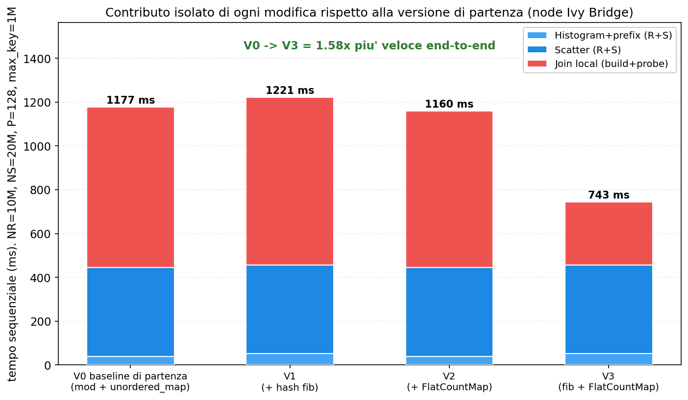

- Fase join: V0 732 ms, V1 (+fib) 765, V2 (+FlatCountMap) 714, V3 (fib + FlatCountMap) 286 ms.
- La FlatCountMap da sola migliora il join del 2% e la hash da sola non lo modifica; il crollo avviene solo con entrambe. Costituiscono una coppia obbligata, non due modifiche additive.
- La ragione è nei bit impiegati: fib ricava la partizione dai bit alti della chiave e lascia liberi i bit bassi, che la FlatCountMap usa (per identità) come slot iniziale; con `mod` entrambe userebbero i bit bassi e le catene di linear probing si allungherebbero.

## Esp. 1: baseline vs versione consegnata

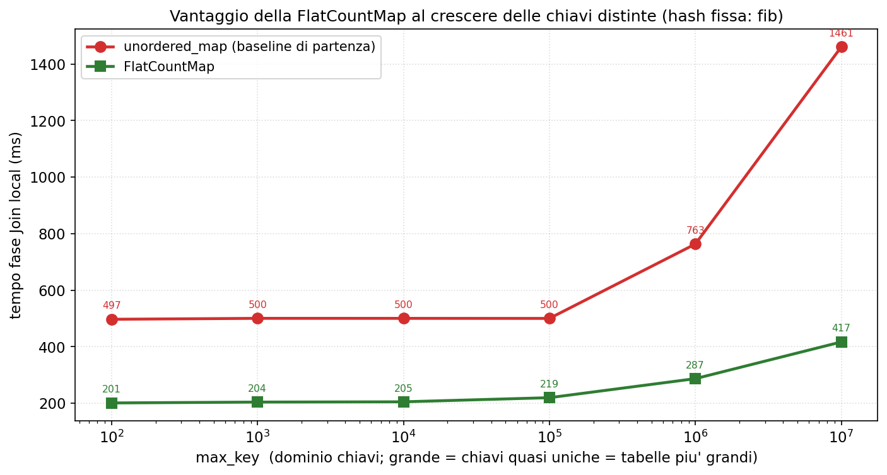

- A hash fissata (fib), il vantaggio della FlatCountMap cresce con il numero di chiavi distinte: 2.5x a max_key=100 (201 vs 497 ms), 3.5x a 10M (417 vs 1461 ms).
- L'unordered_map alloca un nodo sull'heap per ogni chiave distinta: più chiavi uniche comportano più nodi sparsi e più pointer chasing. La FlatCountMap è un array contiguo, prevedibile per il prefetcher.
- Histogram e scatter restano invariati fra le varianti (circa 52 e 405 ms): le modifiche interessano solo hash e join.

## Esp. 2: FlatCountMap

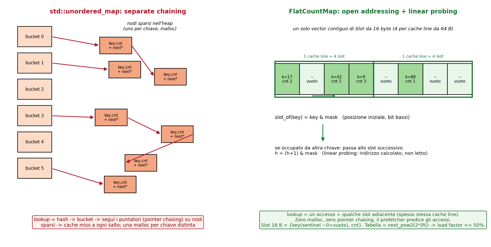

- L'unordered_map adotta separate chaining: un array di bucket con liste di nodi allocati singolarmente sull'heap.
- La FlatCountMap adotta open addressing con linear probing: un unico vector contiguo, con Slot da 16 B, 4 per cache line.
- Ne conseguono l'assenza di allocazioni per chiave, buona località di cache e nessun pointer chasing, poiché lo slot successivo è calcolato anziché letto da un puntatore.

## Esp. 2: FlatCountMap

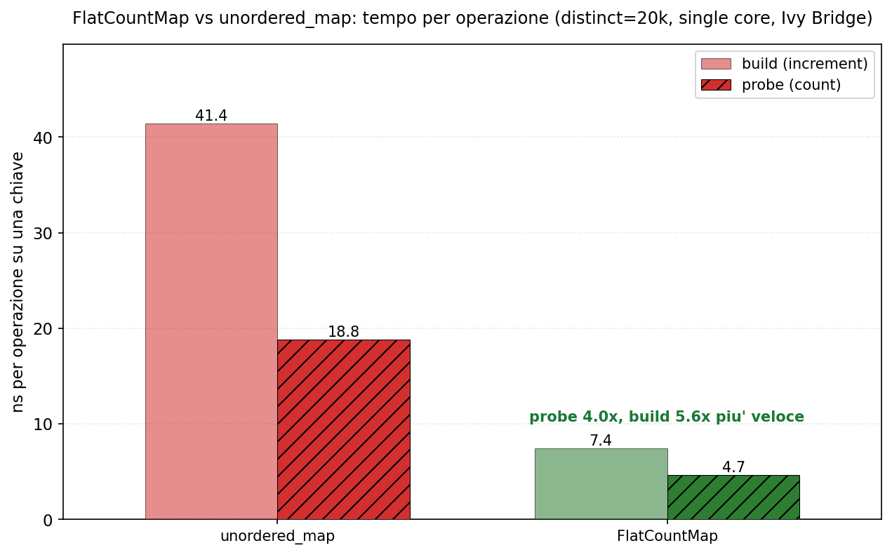

- L'unità è il tempo di una singola operazione su una chiave (ns): il probe è una lookup, il build un increment.
- Il probe costa 18.8 ns con l'unordered_map e 4.7 ns con la FlatCountMap (fattore 4); il build 41 vs 7 ns.
- Il vantaggio deriva dalla struttura contigua, con accessi locali, rispetto al pointer chasing dell'unordered_map.

## Esp. 2: FlatCountMap

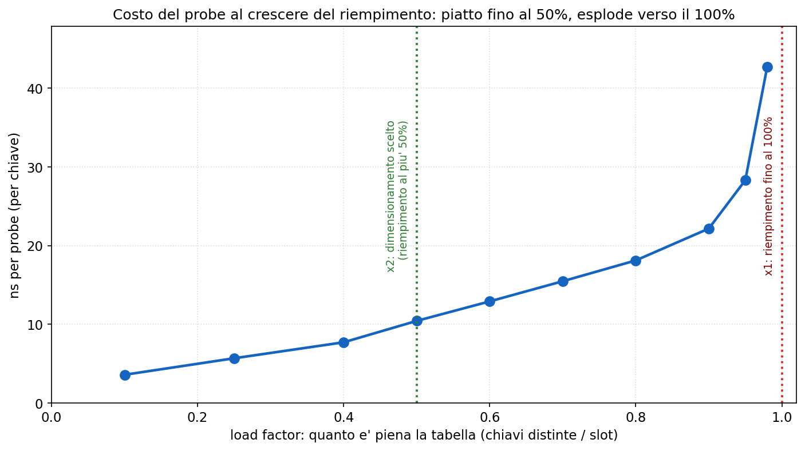

- Il load factor indica quanto è piena la tabella (chiavi distinte / slot).
- Il costo del probe resta piatto fino al 50% di riempimento, poi cresce rapidamente verso il 100% (22 ns al 90%, 43 ns al 98%): con il linear probing le catene si allungano.
- Il dimensionamento a x2 (next_pow2(2 x record)) mantiene il riempimento entro il 50% anche nel caso peggiore, cioè nel tratto piatto.

## Esp. 2: FlatCountMap

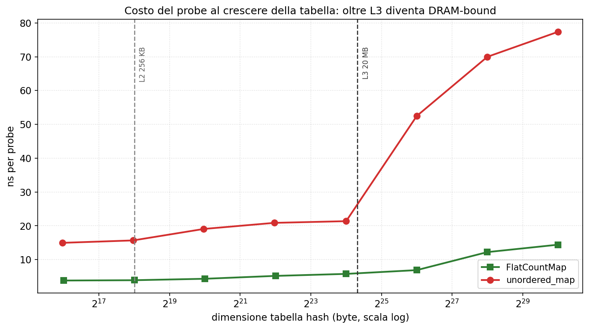

- Il probe passa da 3.8 ns (64 KB, in L2) a 5.8 ns (16 MB, in L3) a 14.4 ns (1 GB, in DRAM).
- Oltre L3 il divario con l'unordered_map si amplia (11 ns in cache, 63 ns in DRAM): ogni accesso è un miss a piena latenza, e la FlatCountMap ne paga uno solo per lookup perché il prefetcher anticipa gli slot successivi.
- Per questo P è scelto in modo che ogni tabella per-partizione resti in L3 (circa 1 MB a P=512).

## Esp. 2: FlatCountMap

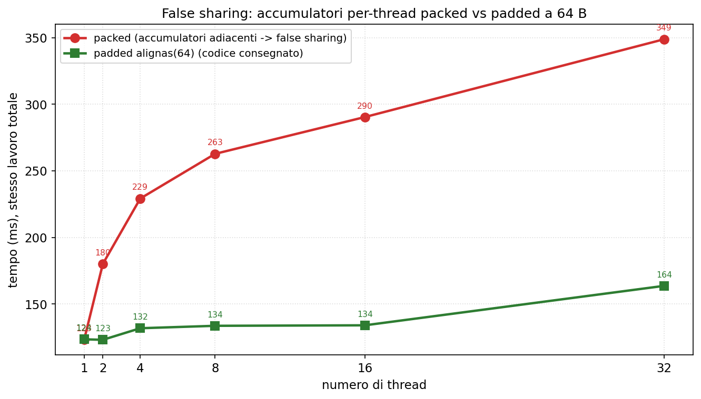

- Con accumulatori adiacenti (packed) lo stesso lavoro passa da 123 ms (1 thread) a 349 ms (32 thread); con il padding a 64 B resta piatto (circa 130 ms), fino a 2.2x di penalità.
- Il false sharing si manifesta quando due accumulatori condividono una cache line e si invalidano a vicenda a ogni scrittura.
- Nel codice consegnato il padding è difensivo: ogni thread accumula in una variabile locale e scrive sull'array condiviso una sola volta a fine fase, per cui il false sharing effettivo è trascurabile.

## Esp. 3: barriera vs thread pool

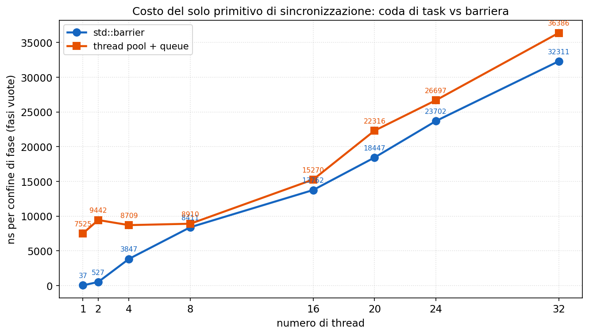

- Con fasi vuote, per isolare la sola sincronizzazione: la barriera varia da 37 ns (1 thread) a 32 microsecondi (32 thread), la coda di task da 7.5 a 36 microsecondi.
- La coda è costantemente più costosa (200x a 1 thread, circa 1.1x a 32): paga submit e wakeup che la barriera non richiede.
- I valori sono nell'ordine dei microsecondi: il fattore 200x è relativo, mentre l'overhead assoluto resta minimo.

## Esp. 3: barriera vs thread pool

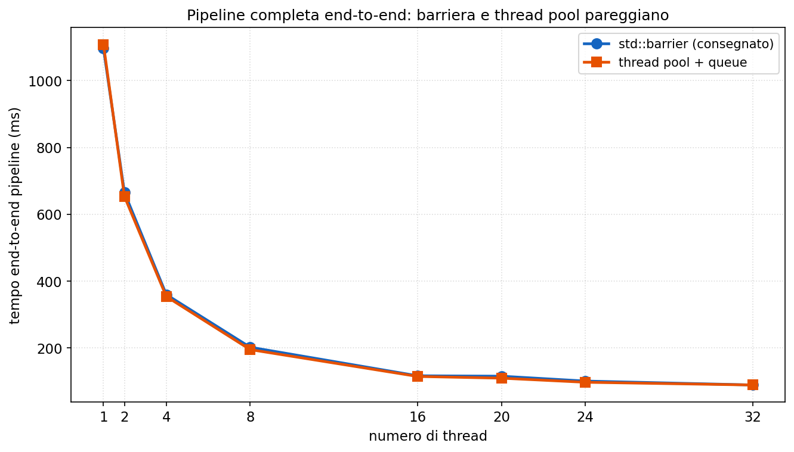

- Sulla pipeline completa i due primitivi risultano equivalenti end-to-end (89.5 vs 89.4 ms a p=32), con identico `join_count`: varia solo il primitivo.
- La ragione è che il lavoro delle fasi è nell'ordine dei millisecondi e la sincronizzazione dei microsecondi: il fattore 200x non incide su un totale in ms.
- Il report non sostiene che la barriera sia più veloce, ma che una barriera è comunque necessaria a ogni confine (per le dipendenze fra fasi), rendendo il thread pool una complessità superflua. Vale lo stesso principio del cyclic: a parità di prestazioni si adotta la soluzione più semplice.

## Esp. 4: distribuzione del carico nel join

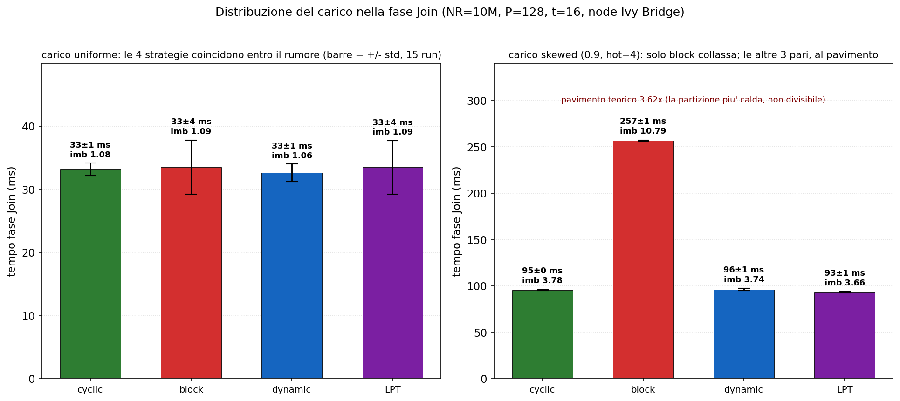

- Quattro strategie sulla sola fase join, con barre d'errore su 15 ripetizioni.
- Sul carico del Modulo 2 (uniforme) le quattro coincidono: imbalance circa 1.08, tempi entro il rumore di misura. La strategia è ininfluente.
- Sotto carico skewed (stress test, tipico del Modulo 3) solo block degrada (imbalance 10.8); cyclic, dynamic e lpt restano prossime al pavimento (circa 3.6).
- Il pavimento 3.62 è un limite inferiore imposto dai dati, non dall'algoritmo. Con skew 0.9 la partizione più calda contiene da sola circa il 22.6% del lavoro, contro una quota equa del 6.25% per thread (1/16): 22.6/6.25 = 3.62. Poiché una partizione è indivisibile (elaborata da un solo thread), il thread che la riceve svolge almeno il 22.6% del lavoro, e nessuna strategia può scendere sotto tale valore.

## Esp. 4: distribuzione del carico nel join

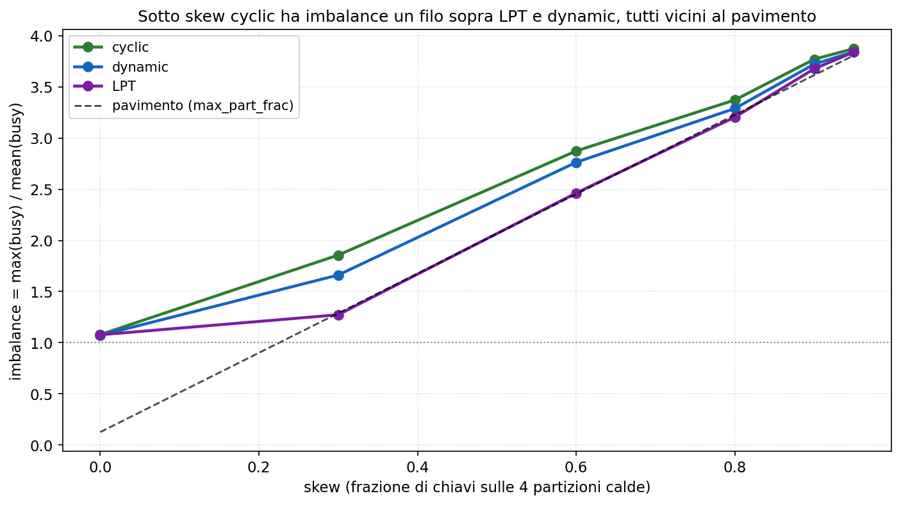

- A skew 0.9: LPT 3.66, dynamic 3.74, cyclic 3.78, tutte prossime al pavimento 3.62.
- Sotto skew cyclic è marginalmente peggiore (circa 3%), sotto carico uniforme è pari alle altre: non è la più veloce, ma non è richiesto esserlo sul carico uniforme del Modulo 2.
- Il carico skewed appartiene comunque al Modulo 3: il generatore del Modulo 2 produce chiavi uniformi.

## Esp. 4: distribuzione del carico nel join

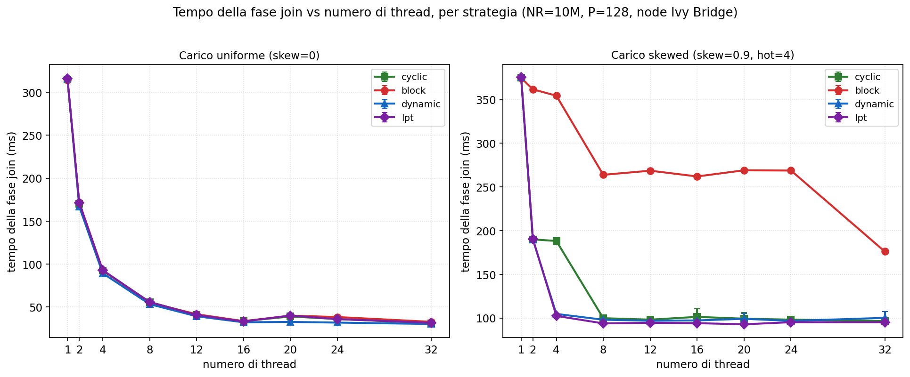

- Sul carico uniforme (Modulo 2) le partizioni hanno costo pressoché uguale, quindi qualsiasi assegnamento bilanciato è equivalente: le quattro strategie coincidono fino a 16 core e a 32, scalando insieme (315 ms a 1 thread, 31 ms a 32). Nella fascia Hyper-Threading (20-24 thread) solo dynamic migliora leggermente, per il ribilanciamento a runtime; cyclic resta pari alle altre strategie statiche (block, lpt).
- Il pannello destro riporta il carico skewed: block resta indietro (circa 260 ms fra 8 e 24 thread), mentre cyclic, dynamic e lpt scendono al pavimento di circa 95 ms. cyclic presenta uno scarto solo a 4 thread (188 vs 103), poi converge.
- cyclic è scelta perché al punto di lavoro (fino a 16 core) eguaglia le altre ed è la più semplice (una formula, senza atomiche né ordinamento); l'unica da escludere è block. Non vi è contraddizione con il report, che si riferisce al carico uniforme.

## Esp. 5: histogram memory-bound

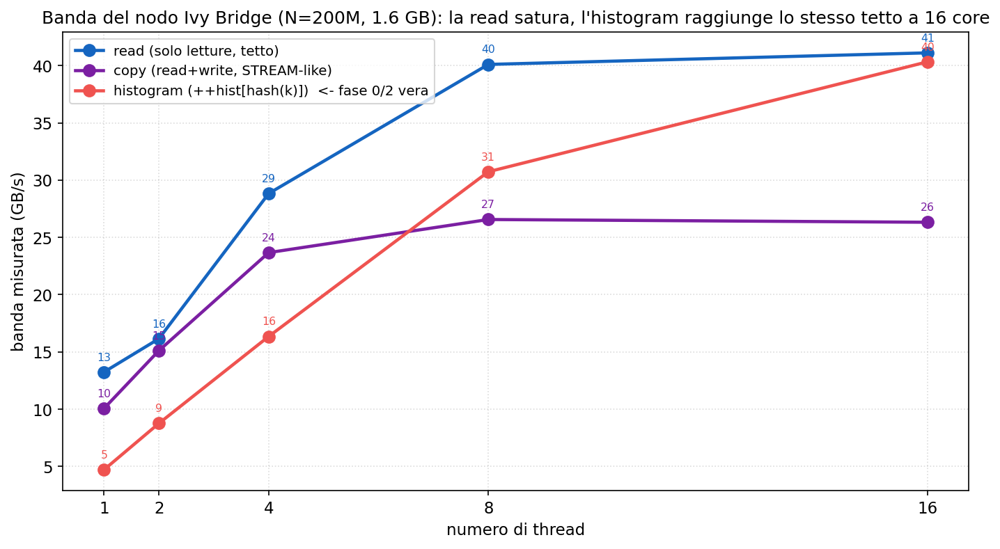

- L'esperimento dimostra che l'histogram è memory-bound, cioè limitato dalla banda di memoria e non dal calcolo, il che ne spiega la scarsa scalabilità.
- La lettura pura satura a 41 GB/s (il massimo erogato dalla memoria a 16 core); l'histogram parte da 4.7 GB/s a 1 core e raggiunge 40 GB/s a 16 core, cioè lo stesso tetto.
- Raggiungere la banda di una lettura pura indica che il limite è la memoria e che il calcolo (la hash) è nascosto: con perf l'histogram esegue circa 11 istruzioni per record contro 2.75 della lettura pura, ottenendo tuttavia la stessa banda.

## Esp. 5: histogram memory-bound

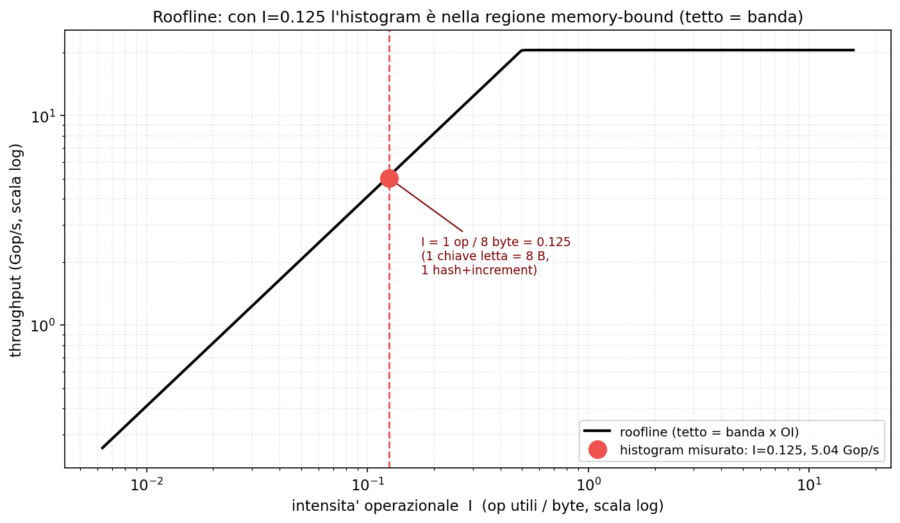

- Il roofline indica cosa limita un kernel, il calcolo della CPU o la banda di memoria, in funzione dell'intensità operazionale I (operazioni utili per byte letto).
- L'histogram ha I = 0.125, cioè quasi nessun calcolo per byte: si colloca nella regione memory-bound, dove il limite è I x banda e non il picco di calcolo.
- Ne segue che aggiungere core non porta beneficio una volta saturata la banda (condivisa): per questo l'histogram scala solo 2-3x fino a p=32.

## Esp. 6: legge di Amdahl

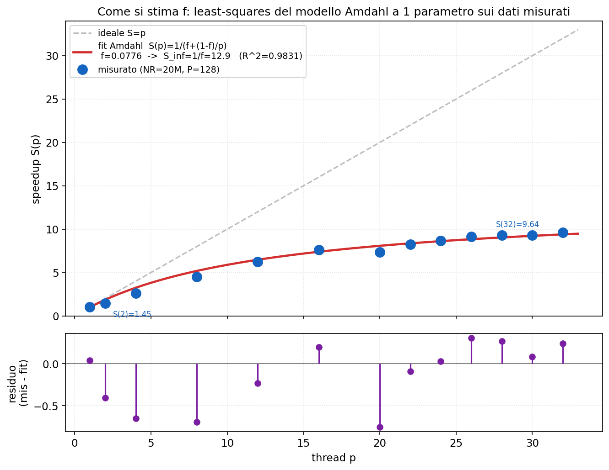

- Amdahl: S(p) = 1/(f + (1-f)/p), con f la frazione seriale; per p tendente all'infinito S tende a 1/f, il limite di speedup.
- La f si stima dai dati, non si conta dal codice: si adatta il modello alla curva di speedup misurata con i minimi quadrati, secondo la prassi consueta. Qui f = 0.078, S∞ = 12.9, R² = 0.983.
- Non è ricavabile dal codice perché la frazione seriale di Amdahl è un parametro effettivo, che aggrega tutte le cause di scalabilità non ideale (banda, sincronizzazione, sbilanciamento) e non solo le righe seriali.
- L'R² elevato indica che i dati seguono la forma di Amdahl. Tuttavia questa f è apparente, non corrisponde al codice seriale, come mostra il grafico successivo.

## Esp. 6: legge di Amdahl

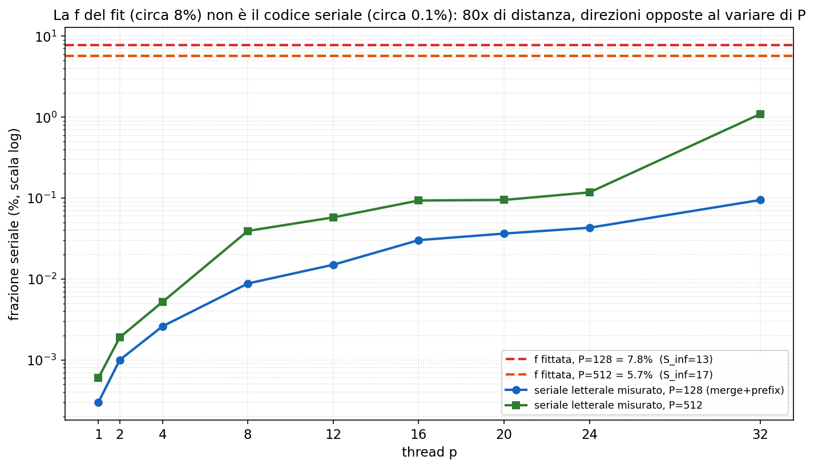

- Il codice effettivamente seriale (merge + prefix sum, cronometrato) è lo 0.095% del tempo a p=32, 80 volte inferiore alla f del fit (7.8%): la f del fit non corrisponde dunque al codice seriale.
- Tale f incorpora la saturazione di banda: le fasi memory-bound cessano di scalare, e il modello a un parametro attribuisce l'intero effetto a f.
- La conferma è nelle direzioni opposte: al crescere di P la f del fit diminuisce (0.078 a P=128, 0.058 a P=512), mentre il codice seriale letterale aumenta (dallo 0.095% all'1.09%). La f misura quindi la banda, non righe di codice seriale.
