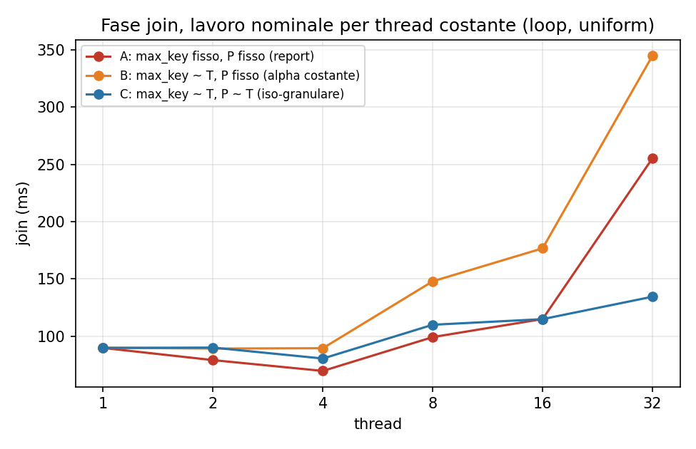

# Companion di studio, Modulo 3 (materiale extra per l'orale)

Materiale di studio personale, separato dal report consegnato (che non viene toccato).
Copre: le risposte ai dubbi del todo, il walkthrough del report figura per figura, gli
esperimenti aggiuntivi (`01..09_*/`), i deep dive sui costrutti OpenMP usati nel codice,
i punti di onestà e il cheat-sheet finale.

Tutti i numeri citati sono misurati: o vengono dai CSV del report (`results/cluster/`),
o dai CSV degli esperimenti extra (`0N_*/results/`), girati sullo stesso tipo di nodo
(Ivy Bridge, Xeon E5-2640 v2, 2x8 core, 2 thread hardware per core, 2 nodi NUMA, L3 20 MB
per socket) con `OMP_PROC_BIND=close`, `OMP_PLACES=cores`, NR=10M, NS=20M, P=128, seed 42,
max_key=5M, 5 ripetizioni.

---

## 1. Risposte rapide ai dubbi del todo

**Perché il merge degli istogrammi sta in un `#pragma omp single`?**
Il merge somma T istogrammi privati (T x P contatori) in uno globale e ne fa il prefix sum:
è una riduzione con dipendenza sequenziale sul prefix e un volume di lavoro minuscolo
(T·P = 16·128 = 2048 somme, più 128 per il prefix: microsecondi). Parallelizzarlo
richiederebbe sincronizzazione aggiuntiva per un lavoro che non paga nemmeno il costo di
un fork. `single` (e non `master`) perché non importa quale thread lo faccia, e perché
`single` ha una barriera implicita in uscita che gli altri thread devono comunque
attraversare prima dello scatter: la dipendenza è strutturale (lo scatter usa gli offset
prodotti dal merge).

**Perché lo scatter usa `schedule(static)`?**
Due ragioni. (1) Il lavoro per tupla è costante (hash + una scrittura), quindi non c'è
imbalance da assorbire e `static` è la politica a overhead zero. (2) È un requisito di
correttezza del trucco dei cursori: `static` garantisce che il thread t visiti nello
scatter esattamente lo stesso range di input che ha contato nell'histogram, quindi
`cursors[t][pid]` (derivato da `local_hists[t]`) è l'offset esatto di partenza del thread
t dentro la partizione pid, e le scritture non collidono mai senza lock né atomiche.
Con una politica dinamica il range visitato cambierebbe e gli offset per-thread non
sarebbero più validi.

**Da dove viene il rapporto ~290x fra partizione hot e cold?**
f_hot = rho/H + (1-rho)/P = 0.9/4 + 0.1/128 = 0.2258 (22.6% dei record su una hot);
f_cold = (1-rho)/P = 0.1/128 = 0.00078 (0.078% su una cold). Rapporto 0.2258/0.00078 ≈ 289.
Il primo termine di f_hot è la quota del pool hot che cade su quella chiave (le 4 chiavi
hot stanno su 4 partizioni distinte per costruzione del generatore), il secondo è la quota
uniforme che ci finisce comunque sopra.

**`dynamic,1` sul join: quanto costa davvero il dispatch?** Esp. 1: a parità di tutto,
sul carico uniforme la differenza mediana con `static` sul join vale +2.35 ms a P=128
(6.3% della fase) e scende sotto il punto percentuale da P=2048 in su, dove le iterazioni
sono 32 volte più piccole. Il dispatch è una fetch-and-add sul contatore condiviso del
loop: decine di nanosecondi per iterazione, irrilevante quando un'iterazione vale
centinaia di microsecondi.

**Il `nowait` sul `single` del join task è davvero necessario?** No, ed è un punto da
ammettere con onestà (esp. 2): con e senza `nowait` i tempi restano entro il 4% su ogni T
e ogni carico. Due ragioni, la seconda più forte della prima.

Primo, la barriera implicita del `single` è un *task scheduling point*: i thread fermi
alla barriera eseguono i task pendenti invece di aspettare a vuoto.

Secondo, e decisivo: in `run_task` il `single` che emette i task è l'ultimo costrutto
della `#pragma omp parallel`, e dopo la sua chiusura non c'è altro codice, solo la fine
della regione parallela (`omp_ablation.cpp:369-426`). Con il `nowait` i worker escono
subito dal `single` e raggiungono la barriera finale della regione, dove consumano i task;
senza `nowait` si fermano alla barriera del `single` e consumano gli stessi task lì.
Cambia quale barriera li assorbe, non cosa fanno. Ne segue che nessun carico può far
emergere la differenza in questa struttura: lo scenario in cui i task pendenti si
esauriscono e i worker restano fermi (per esempio se l'emissione fosse più lenta del
consumo) li lascerebbe fermi in entrambe le versioni, non avendo comunque altro da
eseguire. Il `nowait` pagherebbe solo se dopo il `single` ci fosse lavoro indipendente dai
task, tipicamente un `omp for` successivo, e qui non c'è. È innocuo, ma la frase del
report "senza sarebbero fermi" è tecnicamente imprecisa.

**Tied vs untied.** I task sono tied (default): un task sospeso riprende solo sul thread
che l'aveva iniziato. Nel codice ogni body legge `omp_get_thread_num()` e lo usa per
indicizzare `thr_results[tid]`: fra la lettura e l'uso non c'è nessun task scheduling
point, quindi l'indice è stabile. Con task untied un task potrebbe migrare a un altro
thread in un punto di scheduling e `tid` diventerebbe stantio: qui non succederebbe
comunque (nessun punto di sospensione nel body), ma untied non darebbe alcun vantaggio,
perché i task non si sospendono mai e la granularità è grossa.

**Taskgroup vs taskwait vs barriera.** `taskgroup` aspetta *tutti i discendenti* generati
nel blocco (anche i task annidati), `taskwait` solo i figli diretti. Nel codice:
i due `taskgroup` di histogram e scatter servono da barriera di fase (il merge non può
partire finché ogni contatore è arrivato); il `taskgroup` annidato dentro il task di una
partizione hot garantisce che la tabella condivisa `tbl` (stack del task esterno)
sopravviva a tutti i sub-task di probe che la leggono. Qui `taskwait` sarebbe equivalente
(i probe sono figli diretti), ma `taskgroup` esprime l'intenzione "aspetta il lavoro che
ho generato, incluso ciò che i figli potrebbero generare". La variante loop non usa niente
di tutto ciò: si affida alle barriere implicite dei costrutti worksharing.

**LPT e bound di Graham.** Longest Processing Time first: si ordinano i job per peso
decrescente e ogni job va al worker più scarico (qui: entra prima nella coda). Graham
(1969): il makespan di LPT è al più 4/3 - 1/(3m) volte l'ottimo su m macchine identiche.
Il proxy di costo |Rp| + |Sp| è giusto perché build e probe sono lineari nei rispettivi
input. Ma la misura (esp. 3) ridimensiona LPT su questo problema: vale il 2-5% sul join,
mentre lo split intra-partizione vale il 15%; con P/T = 8 la coda ha abbastanza task
piccoli da riempire i buchi comunque.

**Perché il build della tabella hot resta sequenziale?** `FlatCountMap::increment` fa
read-modify-write non atomico sugli slot (probing lineare + contatore): due thread
potrebbero scegliere lo stesso slot per chiavi diverse o perdere incrementi. Servirebbero
CAS per l'inserimento e fetch-and-add per i contatori, che costano più del guadagno:
sotto questo skew il build della partizione hot conta 4 chiavi distinte (tabella
minuscola, tutta in L1), è il probe dei 4.5M record a dominare, ed è read-only, quindi si
parallelizza gratis. Lo split parte infatti solo sul probe.

**Perché la validazione skewed usa il parallelo a T=1 come riferimento?** Il binario
sequenziale consegnato non ha il generatore skewed (arrivato con l'M3); il parallelo a
T=1 esegue lo stesso identico algoritmo senza concorrenza, quindi è un riferimento valido
per il confronto della tripla (join_count, ck1, ck2) a parità di input. Il check
aggiuntivo loop == task a T=4 verifica che le due varianti calcolino la stessa cosa
anche in presenza di concorrenza.

**Il calcolo dei checksum non andrebbe fuori dal tempo misurato, visto che è
"verifica"?** No: va distinta la verifica dall'output. I due checksum calcolati nel probe
sono l'output della query: il risultato del join è per definizione la tripla
(join_count, ck1, ck2), un'aggregazione sui match (come la SUM di una query di
aggregazione), non la materializzazione delle coppie. Toglierli dal timing
significherebbe o materializzare i match per calcolarli dopo (più lento, cambia il
kernel) o non produrre nulla per match, e allora il compilatore potrebbe eliminare il
probe come dead code. Il costo (2 splitmix64 per match) è identico in tutte le varianti
e in tutti i moduli, quindi non distorce alcun confronto. La VERIFICA vera (naive join
O(N²), confronto col sequenziale) è invece davvero fuori dalla regione misurata.

**Perché i checksum sono invarianti all'ordine?** Ogni match contribuisce
splitmix64(k)·m sommato modulo 2^64 (overflow naturale degli unsigned): la somma è
commutativa e associativa, quindi il totale non dipende dall'ordine in cui thread e task
completano. splitmix64 serve a rendere il contributo sensibile alla chiave (un semplice
+m non distinguerebbe errori compensati); il secondo checksum usa la chiave xorata con la
costante aurea per avere una seconda proiezione indipendente.

---

## 2. Walkthrough del report, figura per figura

**Tab. 1 / Fig. 1 (strong scaling).** Quattro curve: {loop, task} x {uniforme, skewed}.
Uniforme: loop sempre davanti (a T=16, 0.070 contro 0.092 s, gap 31%), e il gap sta tutto
in histogram+scatter (esp. 2); il join è identico. Due riesecuzioni dell'esp. 2 su nodi
diversi misurano lo stesso gap al 25.7% e al 32.2%: il valore assoluto oscilla col nodo e
col rumore fra invocazioni (esp. 2, controllo di riproducibilità), la scomposizione no. Il loop tocca 7.9x relativo a se stesso
a T=16 (50% di efficienza: kernel memory-bound, la banda satura prima dei core), crolla a
T=20 (il team a cavallo fra core fisici e SMT: 4 thread condividono 2 core mentre 12 core
hanno un thread; le barriere aspettano i 4 lenti) e recupera parzialmente a T=32 (SMT
simmetrico). Skewed: si inverte, il task vince dal T=4 in poi (LPT + split; il grosso è lo
split, esp. 3).

**Fig. 2 (skew gap).** Pannello (a): il tempo del join loop vs task sotto skew; il gap è
la firma dello split intra-partizione. Pannello (b): il rapporto T_loop/T_task tocca 1.17
a T=8, si restringe a 16-20, riallarga a 1.28 a T=32: il loop è inchiodato al collo delle
4 partizioni (tetto 1/f_hot ≈ 4.4 sul join, esp. 3), il task lo aggira.

**Fig. 3 (weak scaling).** Efficienza = T(1)/T(p) con input proporzionale ai thread.
Uniforme: ~80% (loop) dentro il socket, 63% a T=16, 26% a T=32: il working set dello
scatter cresce linearmente con T e la banda aggregata dei due socket satura prima dei
core. Il task assorbe in più il costo di creazione task per fase. Skewed peggio: crescere
NR fa crescere anche le partizioni hot in proporzione, e il build hot resta sequenziale.

Due cose che la figura non dice e l'esp. 8 misura. (a) L'efficienza è **sopra 1** a T=2 e
T=4 (1.06 e 1.07): non è superlinearità, è la calibrazione (max_key fisso mentre NR scala
fa crollare il load factor della FlatCountMap, e con esso il costo del probe). Ricalibrato
sparisce. (b) Il degrado non è tutto banda: il ginocchio a T=8 lo è, ma da T=16 in su
domina il footprint della tabella per partizione, che con P fisso cresce con T. Il weak
iso-granulare a T=32 fa 0.341 contro lo 0.272 della figura.

**Fig. 4 (breakdown).** Nota preliminare su due scelte della figura: (a) "T=1 omesso
perché domina visivamente" significa solo che la barra sequenziale (~550 ms) è 5-8 volte
quelle parallele e su asse condiviso le schiaccerebbe; (b) il taglio a T=20 è una scelta
editoriale, non di dati: il CSV dello strong scaling ha le fasi a ogni T, e l'esp. 7
(`07_breakdown_full/`) ricostruisce il breakdown intero, T=1 e T=32 compresi.

**Contenuto della fig. 4.** Uniforme: il join domina nel loop (67% a T=8); nel task
histogram+scatter si gonfiano (+17 ms a T=8) e comprimono la quota del join. Skewed:
l'imbalance sta solo nel join (histogram e scatter hanno costo per-tupla indipendente
dalla distribuzione); a T=16 il join è il 76% del totale nel loop, 70% nel task.

**Fig. 5 (schedule).** A T=8: su uniforme tutte e cinque le politiche entro l'1% (P/T=16
partizioni a thread, lavoro identico comunque distribuito); su skewed le due `dynamic`
a ~80 ms contro ~130 di static/guided (-38%): static incolla le 4 hot a chi capita,
dynamic le fa rubare. Esteso in esp. 1 a T={4,16,32} e 7 politiche: la conclusione regge,
con la nota che chunk grandi (dynamic,16 e guided,16) degradano a T alto perché 128/16=8
blocchi non bastano per 16-32 thread.

**Fig. 6 / Tab. 2 (M2 vs M3).** Stesso algoritmo, stesso nodo, stessa baseline (0.802 s):
il confronto isola il modello di sincronizzazione più le ottimizzazioni di sez. 2.4.
Loop 11.46x contro 7.86x di M2 a T=16. I due contributi grossi: scatter (29 contro 85 ms
a T=8, ed è il prefetch: esp. 4 misura 2.1x proprio sullo scatter) e histogram (9 contro
35 ms a T=8). A T=32 convergono (0.086 vs 0.089 s): al tetto di banda la primitiva di
sincronizzazione è un dettaglio di secondo ordine.

**Efficienza sopra 1 a T basso (eff ≈ 1.22 a T=4).** Non è superlinearità: la baseline
non ha i prefetch. Esp. 6: con la baseline riottimizzata l'efficienza diventa 1.12, 1.07,
0.95 a T=1,2,4. Vedi sez. 5 (onestà) per come formularlo.

---

## 3. Gli esperimenti (spiegazione, meccanismo, conferma)

### Esp. 1: schedule del join su tutto il range (`01_schedule_sweep/`)

Il report misura la sensibilità solo a T=8. Due domande restavano aperte: la conclusione
regge a ogni T? e quanto costa il dispatch dinamico quando le iterazioni sono piccole?

Il binario degli esperimenti (`common/omp_ablation.cpp`) usa `schedule(runtime)` +
`omp_set_schedule()`, così la politica è un parametro e non una ricompilazione
(`omp_ablation.cpp:296`). Risultati:

- Uniforme: le politiche a chunk piccolo restano vicine, con spread che cresce da 0.4% a
  T=4 e 1.9% a T=8 fino a 3.8% a T=16 e 6.8% a T=32. `dynamic,16` e `guided,16` degradano
  da T=16 in su (52.0 e 54.3 ms contro 37.2 a T=16; 79.3 e 77.7 contro 42.9 a T=32): con
  chunk 16 su P=128 ci sono solo 8 unità di lavoro, meno dei thread. A T=4 e T=8 gli 8
  blocchi bastano e la penalità non c'è: la rottura cade dove T supera il numero di
  blocchi. Su un loop corto il chunk grande non riduce l'overhead, riduce il parallelismo.
- Skewed: `dynamic,1` e `dynamic,4` migliori o pari merito a ogni T (74.8 e 75.2 contro
  124.5 di `static` a T=16). `guided,1` le raggiunge solo a T=16 (73.8) ma crolla a T=4
  (171.7 contro 120.1). `static,1` recupera a T=32 (77.2): l'interleaving ciclico pid mod
  T con T=32 mette le 4 hot su 4 thread diversi per costruzione; a T=8/16 possono
  collidere sullo stesso thread.
- Attenzione a come si difende `dynamic,1`: non è "mai peggiore". Su uniforme `static` lo
  batte del 3.3% a T=16 e del 6.8% a T=32, con segno consistente su tutte le ripetizioni.
  L'argomento corretto è minimax: al più il 7% perso su uniforme contro il 40% guadagnato
  su skewed, dove `static` costa il 66% in più.
- Granularità (pannello destro della seconda figura, solo fase join): la quantità in y è
  la differenza relativa, join con `dynamic,1` meno join con `static` diviso `static`,
  sulla stessa ripetizione. Su uniforme +6.3% a P=128 (+2.35 ms, tutte le rep positive) e
  +2.7% a P=512; da P=2048 in su la differenza è sotto il punto percentuale e a P=4096 il
  segno oscilla fra le ripetizioni. Il dispatch è trascurabile a granularità di partizione.
- Su skewed il bilanciamento ripaga il dispatch a ogni P, con margine che non si assottiglia
  assottigliando le iterazioni: -39.4% a P=128, poi stabile fra -45% e -46% da P=512 in su.
  Il vantaggio è del bilanciamento a runtime, non della granularità scelta.
- Bonus: sul carico uniforme il join scende da 37.1 a 21.4 ms alzando P da 128 a 2048
  (tabelle per-partizione da 4 MB a 256 KB, misurate in `08_weak_calibration/`: con 8
  thread per socket l'aggregato passa da 32 MB, cioè fuori dai 20 MB di L3, a 2 MB). Il
  totale ha il minimo
  da P=512 in su (48.4 contro 61.1 ms): coerente con la partition sensitivity del Modulo 2
  (sweet spot 512-1024). P=128 nel report è ereditato per confrontabilità, non è l'ottimo
  assoluto.

### Esp. 2: il costo del modello a task, e il nowait (`02_task_overhead/`)

Sweep del numero di task per fase (`-tchunks`) con il loop di riferimento sempre allo
stesso T e sullo stesso carico dei task, per T in {8, 16, 32}, uniforme e skewed. Variare T
da un lato solo misurerebbe la scalabilità del loop invece del costo del dispatch.

- **Il punto che ribalta la lettura**: su uniforme il task perde e peggiora col team
  (+10.7% sul totale a T=8, +32.2% a T=16, +44.7% a T=32), su skewed vince (-16.0% a T=8,
  -11.6% a T=16, +0.9% a T=32). Se lo chiedono: il modello a task non è più lento del loop,
  è più lento sul carico per cui non è stato scelto. Mostrare solo uniforme (come faceva la
  versione precedente della figura) racconta metà della storia.
- Sulle fasi regolari il divario resta su entrambi i carichi ma è molto più stretto sotto
  skew (T=16: histogram 8.4 contro 6.6, scatter 15.5 contro 14.0) che su uniforme (15.4
  contro 6.7, 29.7 contro 17.8). A ribaltare il totale sotto skew è il join, dove LPT e
  split ripagano il costo delle fasi regolari.
- Le fasi regolari costano molto meno sotto skew, in entrambi i modelli: nel loop lo
  scatter scende del 20-34%, l'histogram non cambia (entro il 2%). Lettura compatibile:
  con rho=0.9 il 90% delle tuple va in 4 partizioni invece che su 128, quindi lo scatter
  tiene attivi pochi buffer di destinazione. Non è verificato con i contatori hardware:
  dirlo come lettura, non come causa dimostrata.
- Il collasso a un task per thread è reale (supera il rumore): a T=32 uniforme lo scatter
  costa 44.2 ms con 16 task e 23.4 con 32. Con un task per thread chi parte in ritardo
  finisce in ritardo e l'ultimo task chiude la fase.
- **Quello che il sweep NON dice**: la "U", il minimo a 256 o 512 task, il costo per-task
  in microsecondi. La mediana dei punti a task grossi porta un'incertezza del 15-25% (vedi
  sotto), e fra due esecuzioni su nodi diversi il minimo si è spostato da 256 a 512 task.
  Da 32 task in su la curva delle mediane è piatta.
- nowait on/off (`-DNO_NOWAIT`): entro il 4% su ogni T e carico. Nessuna differenza, e non
  può essercene: la ragione è strutturale, vedi sez. 1.

**Perché i numeri delle fasi a task ballano** (utile se lo chiedono, e per giustificare
cosa non affermo). Non è il nodo: il loop è riproducibile allo 0.4% sullo scatter e all'1.2%
sull'histogram, escludendo la prima rep che è di warm-up in entrambi i modelli. È la
variante task a granularità grossa: con un task per thread la dispersione fra le rep è del
25.4% sull'histogram, con 1024 task scende all'1.7%, al livello del loop. È il jitter di
partenza, lo stesso meccanismo del collasso a T=32, e si vede meglio nella varianza che
nelle mediane. Conseguenza: i punti a task grossi portano un'incertezza del 15-25%, per
questo la "U" e il costo per-task sono ritirati.

### Esp. 3: LPT vs split intra-partizione (`03_lpt_split/`)

La variante task sotto skew combina LPT e split: chi dei due paga? Matrice
{lpt, naturale, casuale} x {split on, off} a T=16 skewed, sul join:

|            | split on | split off |
|------------|----------|-----------|
| LPT        | 59.6 ms  | 70.4 ms   |
| naturale   | 61.3 ms  | 73.1 ms   |
| casuale    | 62.8 ms  | 74.4 ms   |

- Lo split vale ~15% qualunque sia l'ordine; LPT vale 2-5% rispetto agli altri ordini.
  Il claim onesto: il vantaggio task sotto skew è per 3/4 lo split, per 1/4 l'ordine.
- Tetto strutturale: senza split lo speedup del join satura a 4.6 da T=8 (curve task e
  loop insieme), contro il limite teorico 1/f_hot = 4.4. Il tetto misurato è leggermente
  sopra il teorico perché f_hot pesa i record, ma il probe della partizione hot costa
  meno per record della media (tabella di 4 chiavi in L1). Con lo split la curva supera
  il tetto e arriva a 5.5.
- Soglia hot: piatta da 1x a 16x il peso medio (mediane 59.4-60.6 ms, range sovrapposti:
  il minimo apparente a 4x non è distinguibile da 8x), poi 70 ms a 32x e 64x. Il peso
  della hot è f_hot·P = 29x la media e lo split è un if su quel peso: la transizione è
  un gradino esatto a 29x, non una salita da 16 a 32 (29 non è un punto misurato, è
  calcolato dai pesi di input). La scelta di 8x è insensibile per costruzione, non un
  numero magico.

### Esp. 4: prefetch software (`04_prefetch/`)

I due `__builtin_prefetch` del codice: scatter a distanza 12 sullo slot di destinazione
(`part.data[cursors[tid][pid_next]]`, scrittura, hint di non-località temporale), probe a
distanza 8 sullo slot della tabella (`tbl.slots[slot_of(k_next)]`, lettura). Entrambe le
strutture sono accedute in ordine casuale rispetto allo stream di input: il prefetcher
hardware copre lo stream sequenziale (l'input) ma non può indovinare una destinazione che
dipende dall'hash della chiave. Il prefetch software calcola l'indirizzo con 12 (o 8)
iterazioni di anticipo, cioè paga l'hash due volte per mascherare un miss da centinaia di
cicli.

- Ablation 2x2 a T=16: nessuno 93 ms, solo scatter 73, solo probe 82, entrambi 62 ms
  (1.49x). I contributi si compongono perché mascherano miss indipendenti.
- Scatter: fattore 2.1 sulla fase a ogni T (37 contro 17 ms a T=16). A T=8 misuro 59
  contro 29 ms: il conto del report sul gap M2-M3 (~56 ms attribuiti al prefetch) torna.
- Distanza scatter: curva a U con plateau 8-16; a 2-4 il prefetch arriva tardi, a 48 la
  riga viene sfrattata o il cursore è già avanzato (+20-40%). 12 sta al centro.
- Distanza probe: a T=1 piatta da 2 a 48 (327-329 ms); a T=16 il minimo scivola a 24-48
  (35.6 contro 38.7 ms, -8% sul join, -5% sul totale): con la banda contesa la latenza
  effettiva cresce e serve più anticipo. Da ammettere senza giri: non serviva alcun
  tuning per-T, una costante unica 16-24 dominava la scelta consegnata (uguale a T=1,
  meglio a T=16) a parità di complessità. 8 è stato calibrato sul regime a basso
  parallelismo; il costo dell'errore è ~3 ms.

### Esp. 5: NUMA first-touch (`05_numa_firsttouch/`)

Il meccanismo nel codice consegnato: `PartitionedRelation::data` usa un allocatore che
default-inizializza, quindi `resize()` riserva le pagine senza toccarle; lo zero-init in
`parallel for schedule(static)` è la prima scrittura di ogni pagina, e sotto Linux
first-touch la pagina viene allocata sul nodo NUMA del thread che la tocca. Poiché lo
scatter usa la stessa `schedule(static)`, ogni thread riscrive le pagine che ha toccato.

- A T=8 nessuna differenza par/seq: con `OMP_PROC_BIND=close` tutto il team sta sul
  socket 0, dove anche il first-touch sequenziale alloca.
- A T=16 uniforme: par 63, seq 71 ms (+13% sul totale); la differenza è quasi tutta nello
  scatter (17 contro 23 ms, +35%: metà delle scritture attraversa QPI).
- Interleave (numactl --interleave=all): 69 ms, e colpisce il join (47 contro 39 ms):
  le letture di build+probe trovano metà dei buffer sul nodo remoto.
- Skewed: stesso pattern, attenuato (le hot sono cache-resident e la quota di traffico
  remoto pesa meno).

### Esp. 6: la superlinearità apparente (`06_seq_opts/`)

`common/seq_opts.cpp` è la baseline sequenziale con gli stessi prefetch del binario
parallelo, attivabili a runtime. Misure (uniforme):

- seq senza prefetch (config. del report): 910 ms. Con solo scatter: 689. Con solo probe:
  847. Con entrambi: 634 ms. OpenMP loop a T=1: 566 ms.
- Efficienza a T={1,2,4} contro la baseline nuda: 1.61, 1.54, 1.36 (sopra 1, come nel
  report). Contro la baseline ottimizzata: 1.12, 1.07, 0.95. La superlinearità sparisce.
- Il residuo a T=1 (634/566 = 1.12, quasi tutto nello scatter: 237 contro 180 ms) non è
  prefetch (entrambi i binari lo hanno, stessa distanza) e non è nemmeno pinning o NUMA:
  test dedicato (`run_pinning.sh`, job 697793), stesso nodo e stesso job, seq_opts sotto
  `taskset -c 0` e sotto `numactl --cpunodebind=0 --membind=0` dà tempi identici al run
  libero (621-625 contro 625 ms), mentre omp T=1 resta a 555. Restano come candidati le
  differenze di codegen (`-fopenmp` estrae il loop `omp for` in una funzione separata) e
  la struttura a cursori per-thread; causa non identificata, e va detta così. L'histogram
  identico alla cifra decimale garantisce che i binari sono confrontabili.

---

### Esp. 8: la calibrazione del weak scaling (`08_weak_calibration/`)

**Il dubbio.** Il weak del report misura efficienza 1.06 a T=2 e 1.09 a T=4, e non la
commenta. Sopra 1 nel weak significa che aggiungere lavoro ha fatto scendere il tempo: o è
superlinearità da cache, o il problema per thread non è davvero costante.

**Il meccanismo: perché il braccio A va sopra il 100%.** È la catena che l'esperimento
verifica, ed è il cuore di tutto il resto. `scripts/run_weak.sh` scala NR=2M·T tenendo
fissi max_key=5M e P=128, e da lì:

1. NR cresce con T ma **max_key resta 5M**, quindi crescono i duplicati per chiave
   (NR/max_key va da 0.4 a 12.8).
2. Le chiavi **distinte** per partizione non possono superare max_key/P = 39062, quindi
   **saturano**. La tabella invece è dimensionata sui **record** (`next_pow2(2·r_count)`),
   che crescono con T (NR/128 = 15625·T).
3. Quindi la tabella si allarga mentre le chiavi inserite no: **alpha crolla** (0.393 a
   T=1, 0.037 a T=32, misurato).
4. Load factor più basso vuol dire **catene di probe lineare più corte**: il probe accelera
   (15.19 ns a T=1, 4.80 a T=16, misurato).
5. Quindi il join per thread **diventa più veloce al crescere di T** pur facendo sempre gli
   stessi 4M probe, e questo **compensa e supera** il peggioramento delle altre fasi (a T=4
   il join guadagna 21.5 ms mentre histogram e scatter ne perdono 10.8).
6. Il tempo totale scende, e l'efficienza va sopra 1.

Non è superlinearità da cache: il problema per thread non è costante, è diventato più
facile. Il numero di operazioni sì che è costante (2M build + 4M probe a ogni T, perché il
costo per match è nullo: il join aggrega per chiave invece di materializzare le coppie),
ma il costo **per operazione** dipende da T. In più il footprint esplode, e i due effetti
tirano in direzioni opposte: i bracci B e C spezzano la catena al punto 1 e li separano.

**Il disegno.** Tre bracci a parità di lavoro nominale per thread:

| braccio | max_key | P | alpha | tabella per thread |
|---|---|---|---|---|
| A (= report) | 5M | 128 | 0.39 -> 0.04 | 512 KB -> 16 MB |
| B | 5M·T | 128 | costante 0.39 | 512 KB -> 16 MB |
| C | 5M·T | 128·T | costante 0.39 | costante 512 KB |

A vs B isola il load factor, B vs C il footprint, C è il weak iso-granulare. Il braccio A
riproduce il report entro il 3% pur con un binario diverso (join 89.8/79.1/69.7/99.2/115.0
contro 92.6/82.2/71.1/99.8/119.4 a T=1,2,4,8,16), quindi i bracci sono confrontabili.

**Risultati** (node01, 5 rep, uniform).

- **Non è superlinearità.** Sopra 1 solo in A (1.063 e 1.070 a T=2 e T=4); in B 0.982/0.921,
  in C 0.974/0.979. Tenendo alpha costante sparisce, in entrambe le varianti.
- **Il meccanismo, misurato:** probe da 15.19 ns (T=1, alpha 0.393) a 4.80 (T=16, alpha
  0.074), **-68% a parità di chiavi probate**. In B e C alpha resta 0.393 a ogni T e il
  probe non ha trend sistematico (12-17 ns, dispersione fra le rep).
- **Banda e residenza, separate.** Il ginocchio a T=8 resta anche in C (80.5 -> 110.0 ms,
  +37%), dove la tabella è 512 KB e l'aggregato per socket 4 MB, dentro i 20 MB di L3:
  quel salto non è residenza, è il socket che si riempie, cioè banda. Il degrado successivo
  è invece footprint: da T=8 a T=32 il braccio C va da 110 a 134 ms (+22%), il braccio B da
  148 a 345 (+133%) a parità di alpha. Con la tabella tenuta a 512 KB il join fa weak
  scaling quasi ideale su 32 thread (89.8 -> 134.5 ms).
- **Il report sottostima il proprio codice a T alto.** A T=32 l'iso-granulare fa 0.341
  contro 0.272 (task 0.334 contro 0.260; a T=16 task 0.627 contro 0.484). Le curve si
  incrociano: A è ottimista fino a T=16 grazie al load factor e pessimista a T=32, dove la
  tabella da 16 MB per thread domina. Il 26% del report non è il limite del kernel.

**Cosa non è affermabile.** Il braccio C cambia due cose insieme, la dimensione della
partizione e il numero di partizioni per thread (in A il rapporto P/T scende a 4 a T=32, in
C resta 128): è la definizione di iso-granularità, ma non è un braccio a variabile singola
rispetto a B. E P alto ha un costo proprio sulle fasi di partizionamento (esp. 1: scatter
+15/+23% fra P=128 e P=2048 a T=16), che sul totale del braccio C è incluso.

---

### Esp. 9: il confronto con M2 a parità di parametri (`09_fair_m2/`)

`tab:m2` dichiara il confronto apples-to-apples, ma l'affermazione copre hardware e
allocazione SLURM, non i parametri: M2 gira con max_key=1M e best of 5
(`module_2/scripts/bench_slurm.sh:24,35-48`), M3 con max_key=5M e media di 3, e lo speedup
di M2 è calcolato sulla baseline di M3. Qui i due moduli girano nello stesso job, stessi
parametri, stessa statistica, con entrambe le baseline sequenziali misurate a ogni max_key.
A parità di max_key il `join_count` coincide (199999829 a 1M, 40006682 a 5M): il confronto
è fra implementazioni che calcolano la stessa cosa.

| T | 1M: m2 / m3-loop / gap | 5M: m2 / m3-loop / gap |
|---|---|---|
| 8 | 0.1762 / 0.0905 / 1.95x | 0.1835 / 0.1117 / 1.64x |
| 16 | 0.1050 / 0.0592 / 1.78x | 0.1238 / 0.0692 / 1.79x |
| 32 | 0.0900 / 0.0679 / 1.33x | 0.1164 / 0.0848 / 1.37x |

**Il gap a T=16 è 1.79x, contro 1.46x nel report.** Il meccanismo è nel max_key: con 1M le
chiavi distinte per partizione sono 7812 e il load factor della FlatCountMap è 0.030, con
5M sono 33763 e alpha sale a 0.129. Il confronto del report mette M2 sul primo carico e M3
sul secondo, quindi M3 paga catene di probe più lunghe su una fase che pesa per circa metà
del suo tempo. Il gap misurato è lo stesso su entrambi i carichi (1.78x e 1.79x), il che è
la verifica che l'effetto era del parametro e non dell'implementazione: a parità, il
vantaggio non dipende più dalla calibrazione. La sua origine resta quella documentata nel
report, prefetch sullo scatter e `omp single` contro la completion function della
`std::barrier` sull'histogram.

**A T=32 il gap si riduce ma non si annulla** (1.37x). La tendenza che il report legge è
reale e ha il meccanismo che il report indica: a saturazione il kernel è limitato dalla
banda aggregata, che è la stessa per i due moduli, quindi il modello di sincronizzazione
pesa di meno e le due curve si avvicinano. Quello che non regge è il punto di arrivo: il
report conclude che si incontrano (0.086 contro 0.089) confrontando M2 a 1M con M3 a 5M,
mentre a parità restano separati del 33-37%. La banda comprime il divario, non lo azzera.

**Le baseline sequenziali sono due, non una**: a 5M m2_seq fa 0.9214 e m3_seq 0.8538.
`tab:m2` ne usa una sola (0.802) per entrambi; con la propria, M2 a T=16 fa 7.49 invece di
7.86. Il best-of-5 contro media-di-3 vale circa l'1% (0.1050 contro 0.1036): delle tre
asimmetrie è l'unica trascurabile.

**Cosa non è affermabile.** M2 non emette i tempi per fase, quindi a parità si confrontano
i totali: l'attribuzione del gap a scatter e histogram viene dal report e non è stata
rimisurata a parità di max_key. La baseline 0.802 non è riprodotta (qui m3_seq a 5M fa
0.8538 su 5 rep): lo scarto del 6% non è indagato, e non tocca il confronto, che è fra
tempi paralleli misurati nello stesso job. Il gap a T=8 differisce fra i due carichi (1.95x
contro 1.64x) e il meccanismo di quella differenza non è isolato.

---

## 4. Deep dive: i costrutti OpenMP nel codice

**Le sette schedule a confronto, e cosa vuol dire il numero.** Il numero dopo la virgola è
il *chunk size*, secondo argomento della clausola (`schedule(dynamic, 1)`): quante
iterazioni prende un thread per volta. Per `guided` è il minimo sotto cui il blocco non
scende. Con P=128 iterazioni (una per partizione) e T=16, sul join:

| schedule | assegnamento | blocco | blocchi a T=16 | join unif. (ms) | join skew (ms) |
|---|---|---|---|---|---|
| `static` | a priori | P/T contigue | 16 da 8 | 37.2 | 124.5 |
| `static,1` | a priori | 1, round robin | 16 da 8 sparse | 38.5 | 126.8 |
| `guided,1` | a runtime | decrescente, min 1 | 43, da 8 a 1 | 38.1 | 73.8 |
| `guided,16` | a runtime | decrescente, min 16 | 8 da 16 | 54.3 | 130.5 |
| `dynamic,1` | a runtime | 1 fisso | 128 | 38.4 | 74.8 |
| `dynamic,4` | a runtime | 4 fisso | 32 | 38.5 | 75.2 |
| `dynamic,16` | a runtime | 16 fisso | 8 | 52.0 | 130.5 |

Tre cose da avere pronte su questa tabella.

Primo, `static` e `static,1` sono la stessa famiglia ma la distribuzione opposta: blocco
contiguo contro round robin (iterazione i al thread i mod T). Nessuno dei due costa a
runtime; il primo tiene la località, il secondo la sparpaglia. Solo `static,1` recupera
sullo skew a T=32 proprio perché il round robin separa per costruzione le 4 hot.

Secondo, `guided,16` non è "guided" a questi T. La formula del runtime prende il massimo
fra il chunk minimo e le iterazioni rimanenti diviso T: con P=128, appena T supera 8 il
secondo termine non arriva mai sopra 16, quindi il blocco resta fisso e `guided,16`
degenera in `dynamic,16`. Previsione confermata dalle misure: T=8 72.8 contro 72.6, T=16
54.3 contro 52.0, T=32 77.7 contro 79.3. A T=4 divergono (101.5 contro 96.6) perché lì il
primo blocco vale davvero 32. Se lo chiedono: "guided con chunk grande su un loop corto non
è un compromesso, è dynamic scritto in un altro modo".

Terzo, `guided` non è una terza categoria teorica. La dicotomia è assegnamento a priori
contro assegnamento a runtime; `guided` sta dentro la seconda (è il guided self-scheduling
di Polychronopoulos e Kuck, 1987) e serve a pagare meno prelievi di `dynamic,1` a parità di
bilanciamento. Qui non paga: su skew costa 171.7 ms a T=4 contro 120.1 di `dynamic,1` e
130.2 contro 81.5 a T=8, pareggia solo a T=16 (73.8 contro 74.8), e a T=32 torna indietro
(87.4 contro 74.9). Perché sia competitivo proprio a T=16 e non altrove non è spiegato dai
dati raccolti: dirlo come "misurato, non spiegato" invece di improvvisare una causa.

**La regione parallela di `compute_phases` (variante loop).** Un'unica
`#pragma omp parallel` copre histogram e scatter: si paga un fork/join solo, e le barriere
interne sono quelle implicite di `for` e `single`. Sequenza: (1) `single` alloca i vettori
di vettori; (2) ogni thread first-touch-a la PROPRIA riga di `local_hists`/`cursors`
(località NUMA delle strutture di appoggio); (3) barriera esplicita; (4) `for
schedule(static)` per l'histogram; (5) `single` per merge + prefix + cursori (vedi sez. 1);
(6) `for schedule(static)` per lo scatter, stessi range del punto 4.

**Attenzione al dettaglio dei timer (utile se lo chiedono):** `h_end` è preso all'inizio
del `single` del merge e `s_start` alla sua fine, quindi il costo del merge non appartiene
né all'histogram né allo scatter nel breakdown. È comunque O(T·P + P) ≈ 4000 operazioni,
microsecondi a P=128: invisibile. La frase del report "il costo del merge è in parte
nascosto dalla regione successiva" è imprecisa: il merge non è nascosto (tutti i thread lo
aspettano alla barriera del single), è semplicemente piccolo e non attribuito a una fase.
Il vero gap con M2 sull'histogram (9 contro 35 ms a T=8) va raccontato come differenza fra
i modelli di sincronizzazione attorno alla fase, non come merge nascosto.

**`reduction(+: join_count, checksum1, checksum2)` nel join loop.** Ogni thread accumula
copie private e il runtime le combina alla fine: niente false sharing, niente atomiche nel
loop. Nella variante task la stessa cosa è fatta a mano con `PaddedResult
thr_results[T]` allineato a 64 byte (una cache line a slot, `static_assert` a garanzia),
perché la reduction OpenMP non attraversa i confini dei task.

**`firstprivate` nei task.** `pid`, `K`, i range dei chunk: ogni task cattura il valore al
momento della creazione. Necessario perché la variabile di loop cambia mentre i task
restano in coda; `shared` sarebbe una race sul valore.

**Il task annidato per le partizioni hot.** Il task esterno costruisce `tbl` sul proprio
stack, il `taskgroup` interno emette K sub-task di probe che la condividono in lettura e
garantisce che il task esterno non termini (deallocando `tbl`) finché tutti i probe non
hanno finito. K = min(T, peso/media, con clamp a 2): sub-task grandi circa quanto una
partizione media, così entrano nella stessa economia di scheduling degli altri task.

---

## 5. Onestà: le sfumature dove conviene essere precisi

0. **Le misure delle fasi a task grossi ballano, e so perché.** Non è il nodo: il loop è
   riproducibile allo 0.4% (scatter) e 1.2% (histogram). È la variante task a un task per
   thread, che oscilla del 25% sull'histogram e scende all'1.7% con 1024 task: è il jitter
   di partenza misurato (esp. 2). Conseguenza: sulle fasi regolari a task grossi due punti
   non sono distinguibili sotto il 15-25%, ed è il motivo per cui la "U" del numero di task
   e il costo per-task sono stati ritirati.

1. **Il `nowait` non è "required".** Misurato: nessuna differenza, e nel codice non
   potrebbe essercene, perché dopo il `single` non c'è altro da eseguire e le due versioni
   cambiano solo la barriera che assorbe i worker (la barriera implicita è comunque un
   task scheduling point). Dire: "l'ho messo per non far attraversare ai worker una
   barriera inutile; la misura mostra che il runtime consuma i task anche senza, e in
   questa struttura nessun carico potrebbe distinguerle".
2. **LPT conta poco qui.** Il vantaggio task sotto skew è dominato dallo split (15%)
   più che da LPT (2-5%). Il bound 4/3 di Graham resta la motivazione teorica corretta
   dell'ordinamento, ma con P/T = 8 la coda si autoalimenta comunque.
3. **La superlinearità non esiste.** Con baseline pari-ottimizzazioni l'efficienza a T=4
   è 0.95. Il report lo dice già ("not genuine super-linear scaling"); ora c'è la misura.
4. **La distanza di prefetch del probe (8) non è ottima a T=16** (24-48 danno un altro
   8% sul join, 5% sul totale, ~3 ms). E non era questione di tuning per-T: a T=1 le
   distanze 2-48 sono equivalenti, quindi una costante unica 16-24 era semplicemente
   migliore. Miglioria piccola ma reale, lasciata sul tavolo perché il valore fu
   calibrato a basso parallelismo.
5. **Il "merge nascosto" del confronto con M2** va riformulato: il merge è minuscolo
   (microsecondi) e nel breakdown M3 non è attribuito a nessuna fase (cade fra i due
   timer). Il gap sull'histogram con M2 viene dal modello di sincronizzazione, non dal
   costo del merge in sé.
6. **P=128 non è l'ottimo.** A P=512-2048 il totale scende del 20%+ (tabelle in cache):
   P=128 è tenuto per confrontabilità con il Modulo 2.
7. **Il tetto misurato (4.6) è leggermente sopra 1/f_hot = 4.4**: f_hot pesa i record,
   non il tempo; il probe hot costa meno per record (tabella in L1). Il modello è un
   bound sul volume, la realtà lo supera di poco perché il costo unitario non è uniforme.
8. **Il confronto con M2 non è a parità di parametri**, e va detto prima che lo chiedano.
   M2 gira con max_key=1M (`module_2/scripts/bench_slurm.sh:24`) e prende il best of 5; M3
   gira con max_key=5M e fa la media di 3. Il load factor del join è quindi 0.030 in M2 e
   0.129 in M3: il join di M2 (52.3 ms a T=8 contro 73.7) è più veloce perché il carico è
   più facile, non per il modello di sincronizzazione. In più `tab:m2` calcola lo speedup
   di M2 sulla baseline di M3 (0.802): con la sua (0.7665) a T=16 farebbe 7.49, non 7.86.
   Tutte e tre le asimmetrie favoriscono M2, quindi **il vantaggio di M3 è reale e
   sottostimato**: vince pagando un join più costoso. Rifatto a parità (esp. 9): il gap a
   T=16 è **1.79x, non 1.46x**, e a T=32 i due **non convergono** (1.37x), quindi la frase
   del report sui due moduli che si incontrano a saturazione va ritirata. Dettagli in
   `09_fair_m2/` e `utils/m2_comparison_data.md`.
9. **L'efficienza weak sopra 1 non è superlinearità** (esp. 8), ed è la cosa più esposta
   del report perché la figura la mostra e il testo la ignora. È la calibrazione: max_key
   fisso mentre NR scala fa crollare il load factor da 0.39 a 0.04, e il probe con esso
   (15.19 -> 4.80 ns). Ricalibrando, 1.07 diventa 0.98 a T=4. Va aggiunto subito che
   l'artefatto taglia in entrambi i sensi: a T=32 il weak iso-granulare fa **0.341 contro
   0.272**, quindi il codice scala meglio di quanto il grafico mostri.

---

## 6. Cheat-sheet orale M3 (numeri da ricordare)

- Nodo: E5-2640 v2, 2x8 core, 32 HT, 2 NUMA. Input: NR=10M, NS=20M, P=128, max_key=5M.
- Report: seq 0.802 s; loop T=16 0.070 s (11.46x), task T=16 0.092 s (8.72x);
  M2 T=16 0.102 s (7.86x). A T=32 tutti a ~0.086-0.089 s (tetto di banda).
- M2 vs M3 a parità (esp. 9): il confronto del report NON è a parità (M2 con max_key=1M e
  best-of-5, M3 con 5M e media-di-3). Rifatto: gap a T=16 **1.79x** (non 1.46x), a T=32
  **1.37x** e NON convergono. join_count identico = confronto valido. Le asimmetrie
  favorivano M2, quindi M3 era sottostimato del 22%.
- Skew: f_hot = 0.9/4 + 0.1/128 = 22.6%; hot/cold ≈ 290x; peso hot = 29x la media;
  tetto join senza split 1/f_hot = 4.4 (misurato 4.6), con split 5.5.
- Schedule: uniforme chunk piccoli entro 0.4-6.8% (spread cresce con T); skewed dynamic
  -40% vs static; dispatch dynamic +6.3% a P=128 ma sotto l'1% da P=2048. Chunk 16 da
  T=16 in su: solo 8 blocchi, degrada. `dynamic,1` non è mai-peggiore (static lo batte del
  6.8% a T=32 uniforme): l'argomento è minimax, -7% al peggio contro +40% su skewed.
- Task: il gap si RIBALTA col carico. Uniforme +10.7/+32.2/+44.7% sul totale a T=8/16/32
  (tutto in histogram+scatter: 15.4+29.7 contro 6.7+17.8 a T=16, join uguale); skewed
  -16.0/-11.6/+0.9%: sul carico per cui il task è stato scelto, vince. Collasso a 1 task
  per thread reale (T=32 uniforme: scatter 44.2 con 16 task, 23.4 con 32). Oltre, la curva
  è piatta: la U e il costo per-task erano dentro il rumore, ritirati. nowait: zero
  misurato e zero possibile (dopo il single non c'è codice).
- Variabilità (esp. 2): loop riproducibile allo 0.4%; task a 1 task per thread oscilla del
  25% sull'histogram, all'1.7% con 1024 task. È il jitter di partenza, non il nodo.
- Prefetch: totale 93 -> 62 ms a T=16 (1.49x); scatter 2.1x (37 -> 17 ms); probe 1.28x
  (49 -> 38 ms). Distanze: scatter U con plateau 8-16; probe piatto 2-48 a T=1 ma
  minimo a 24-48 a T=16 (-8%): costante unica 16-24 avrebbe dominato la scelta di 8.
- NUMA: first-touch sbagliato +13% totale a T=16 (+35% sullo scatter); interleave
  penalizza il join (+21%). A T=8 (un socket) nessun effetto.
- Baseline: seq 910 ms nuda, 634 con prefetch, omp T=1 566; eff a T=4: 1.36 -> 0.95.
- Weak (esp. 8): eff sopra 1 a T=2/4 (1.06/1.07) = artefatto della calibrazione, non
  superlinearità: max_key fisso -> alpha 0.39 -> 0.04, probe 15.2 -> 4.8 ns. Ricalibrato
  0.97/0.98. Tabella per partizione: 512 KB a T=1, 4 MB a T=8 (x8 thread = 32 MB, fuori
  dai 20 di L3), 16 MB a T=32. Ginocchio T=8 = banda (resta a tabella fissa), degrado da
  T=16 = footprint. Iso-granulare a T=32: 0.341 contro 0.272 del report.
- Validazione: triple identiche fra ogni variante/schedule/ordine degli esperimenti
  (uniforme: join_count 40006682); naive O(N²) sui piccoli; skewed vs parallelo T=1.
