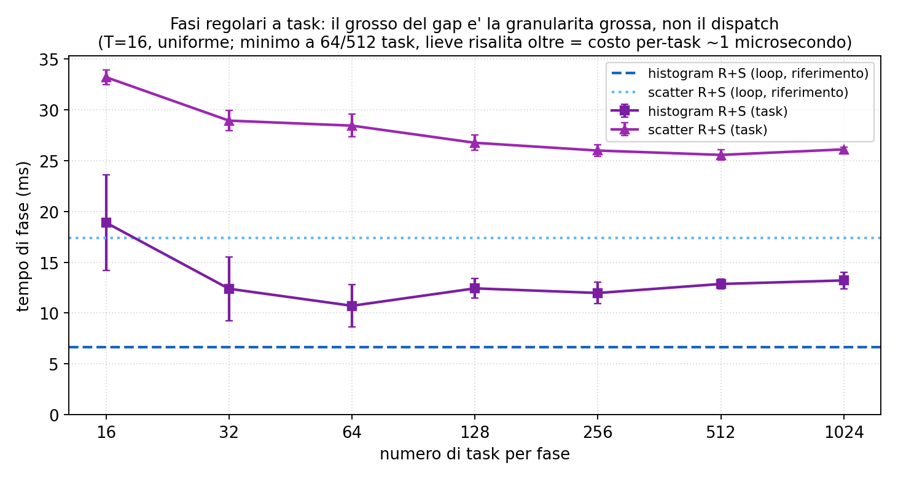

# Modulo 3: esperimenti aggiuntivi

Esperimenti a supporto del report del Modulo 3 (partitioned hash join con OpenMP, varianti loop e task). Per ciascuno il grafico e i punti principali. Misure su un nodo Ivy Bridge (Xeon E5-2640 v2, 16 core fisici / 32 hardware thread, 2 nodi NUMA), lo stesso tipo di nodo del report, con `OMP_PROC_BIND=close` e `OMP_PLACES=cores`. Parametri del report: NR=10M, NS=20M, P=128, seed 42, max_key=5M; 5 ripetizioni per punto.

| Esperimento | Riferimento nel report |
|---|---|
| Esp. 1: schedule del join su tutto il range | Sez. 2.2 e 5.5, scelta di `dynamic,1` |
| Esp. 2: costo del modello a task e nowait | Sez. 2.3 e 5.2, gap loop vs task su histogram e scatter |
| Esp. 3: LPT e split intra-partizione | Sez. 2.3 e 2.4, tetto H/T e sua rottura |
| Esp. 4: prefetch software | Sez. 2.4 e 5.6, distanze 12 (scatter) e 8 (probe) |
| Esp. 5: NUMA first-touch | Sez. 2.4, piazzamento dei buffer di partizione |
| Esp. 6: baseline e superlinearità apparente | Sez. 5.6, efficienza sopra 1 a T basso |
| Esp. 7: breakdown sull'intero range di thread | Fig. 4, T=1 omesso e regime SMT |

## Esp. 1: schedule del join su tutto il range

- Il report misura la sensibilità alla schedule solo a T=8; qui il confronto copre T in {4, 8, 16, 32} e sette politiche.
- Su carico uniforme le politiche a chunk piccolo coincidono entro il 2% a ogni T. Le eccezioni sono `dynamic,16` e `guided,16` a T=16 e 32: con chunk da 16 su P=128 restano 8 blocchi di lavoro, meno dei thread del team, e parte del team resta senza iterazioni (58 e 52 ms contro 38 a T=16).
- Su carico skewed le due `dynamic` a chunk piccolo restano le migliori a ogni T (74 ms contro 122-128 a T=16, circa il 40% in meno). `static,1` recupera solo a T=32, dove l'interleaving ciclico distribuisce per costruzione le 4 partizioni hot su thread diversi.
- La conclusione del report (`dynamic,1` mai peggiore delle alternative) regge su tutto il range, non solo a T=8.

## Esp. 1: schedule del join su tutto il range

- Con P=4096 il lavoro per iterazione si riduce di 32 volte rispetto a P=128: se il dispatch di `dynamic,1` avesse un costo apprezzabile, emergerebbe qui.
- Il pannello destro mostra la differenza dei tempi del join, `dynamic,1` meno `static`, sulla stessa ripetizione (T=16, carico uniforme): barre sopra lo zero indicano il dispatch dinamico più lento, sotto lo zero più veloce. A P=128 il costo è reale ma piccolo, +1.3 ms (il 3.5% della fase); a P=512 scende a +0.7 ms; da P=2048 in su le differenze restano sotto il punto percentuale, con segno che oscilla fra le ripetizioni: le due schedule diventano indistinguibili, e il costo per-dispatch resta trascurabile anche con 8192 iterazioni.
- Effetto collaterale misurato: il join scende da 38 a 20 ms passando da P=128 a P=2048, perché le tabelle per-partizione (circa 34k chiavi distinte, 2 MB a P=128) tornano a stare in cache. Il totale scende da 62 a 48 ms con il minimo da P=512 in su, coerente con la sensibilità a P osservata nel Modulo 2.

## Esp. 2: costo del modello a task e nowait

- Con 16 task per fase (uno per thread, la configurazione consegnata) histogram e scatter costano 19 e 33 ms contro 6.6 e 17.4 del loop: il gap del 31% a T=16 uniforme del report sta tutto qui, il join è identico fra le varianti (37.5 ms).
- Aumentare i task riduce il gap invece di aumentarlo: histogram scende da 19 a 10.7 ms (minimo a 64 task, la configurazione più rumorosa: min-max 10.4-15.4), scatter da 33 a 25.6 ms (minimo a 512). Il costo dominante a 16 task non è quindi il dispatch per-task ma la granularità grossa, che non assorbe il ritardo di partenza dei thread e lascia l'ultimo task a definire il tempo di fase.
- Oltre il minimo le curve risalgono leggermente (histogram 13.2 ms a 1024, scatter 26.1, con range disgiunto da quello di 512): è il costo per-task che diventa finalmente visibile, circa 1 µs per task, e serve arrivare a migliaia di task per fase perché pesi. Anche nel punto migliore resta comunque un divario strutturale rispetto al loop: +4 ms per histogram e +8 per scatter.

## Esp. 2: costo del modello a task e nowait

- Il report presenta il `nowait` sul `single` come necessario, con l'argomento che senza di esso i T-1 worker attenderebbero alla barriera implicita invece di consumare i task.
- La misura non conferma l'argomento: con e senza `nowait` i tempi coincidono entro il rumore (88 contro 89 ms a T=16 uniforme, deviazione standard 5-7 ms), su entrambi i carichi e a ogni T.
- La ragione è nello standard OpenMP: la barriera implicita è un task scheduling point, quindi i thread in attesa alla barriera eseguono i task pendenti. Il `nowait` resta innocuo ma non è ciò che rende il pattern corretto o veloce.

## Esp. 3: LPT e split intra-partizione

- La variante task del report combina due ingredienti: l'ordinamento LPT dei task e lo split del probe delle partizioni hot. La matrice ordine x split li separa.
- Lo split vale circa il 15% sul join a T=16 skewed (da 70-74 a 60-63 ms) qualunque sia l'ordine; l'ordinamento LPT vale il 2-5% rispetto all'ordine naturale o casuale, con o senza split.
- Il grosso del vantaggio task sotto skew viene quindi dallo split intra-partizione, non da LPT: con 128 partizioni per 16 thread il fattore di riempimento della coda è già alto e ogni ordine ragionevole tiene i thread occupati.

## Esp. 3: LPT e split intra-partizione

- La partizione hot più pesante contiene f_hot = rho/H + (1-rho)/P = 22.6% dei record: finché il suo probe è un blocco indivisibile, lo speedup del join non può superare 1/f_hot = 4.4.
- Senza split la curva misurata si ferma a 4.6 da T=8 in poi (il tetto in tempo è leggermente più alto di 4.4 perché il probe della partizione hot, con la tabella di 4 chiavi residente in cache, costa meno per record della media).
- Con lo split la curva supera il tetto e arriva a 5.5: il probe della partizione hot viene servito da più thread cooperanti, che è l'unico modo di estrarre parallelismo oltre H/T.
- Il loop `dynamic,1` senza split segue la stessa saturazione (4.5): la conferma che il limite è strutturale, non della politica di scheduling.

## Esp. 3: LPT e split intra-partizione

- La soglia consegnata (8 volte il peso medio di partizione) non è un numero critico: il join è piatto per ogni soglia da 1x a 16x, con mediane fra 59.4 e 60.6 ms e range sovrapposti (il minimo apparente a 4x non è distinguibile da 8x: 0.6 ms di differenza dentro il rumore).
- Il peso della partizione hot è f_hot per P = 29 volte la media, e lo split è una condizione booleana su questo peso: qualunque soglia sotto 29x seleziona le stesse 4 partizioni e produce lo stesso tempo, qualunque soglia sopra non ne seleziona nessuna e il join sale a 70 ms. La transizione è quindi un gradino esatto a 29x, non una salita graduale: nel grafico i due regimi sono tratti separati e il raccordo tratteggiato indica la discontinuità attesa, non una misura.
- Sotto questo carico la scelta di 8x è quindi insensibile per costruzione; conta solo che stia sotto il peso relativo delle partizioni hot.

## Esp. 4: prefetch software

- Ablation on/off dei due `__builtin_prefetch` sullo stesso binario. A T=16 il totale passa da 93 ms (nessun prefetch) a 62 ms (entrambi): un fattore 1.49.
- Il prefetch dello scatter da solo porta a 73 ms, quello del probe da solo a 82 ms; i due contributi sono indipendenti e si compongono, perché mascherano miss su strutture diverse (slot di destinazione del buffer di partizione, slot della tabella hash).
- Sulla fase scatter l'effetto è un fattore 2.1 a ogni T (37 contro 17 ms a T=16; 407 contro 181 a T=1): il conto del report sul confronto con il Modulo 2 (circa 56 ms di differenza sullo scatter a T=8 attribuiti al prefetch) è compatibile con la misura diretta (59 contro 29 ms a T=8).

## Esp. 4: prefetch software

- La curva è a U: a distanza 2-4 il prefetch arriva troppo tardi per coprire la latenza, oltre 24 la riga prefetchata viene sfrattata prima dell'uso o il cursore di destinazione è già cambiato (a 48 il costo risale del 20-40%).
- Il minimo è largo, fra 8 e 16: la distanza consegnata (12) sta al centro del plateau e non richiede tuning fine.
- La forma della curva è la stessa a T=1 e T=16: il fenomeno è per-thread e non dipende dalla contesa di banda.

## Esp. 4: prefetch software

- A T=1 la curva satura esattamente a distanza 8 (da 381 a 327 ms) e resta piatta fino a 48: la distanza consegnata è al bordo del plateau.
- A T=16 il minimo si sposta leggermente più avanti: 24-48 danno 35.6 ms contro i 38.7 di distanza 8, un ulteriore 8%. Con la banda contesa da 16 thread la latenza effettiva per miss cresce e serve più lavoro fra prefetch e uso.
- A T=1 le distanze da 2 a 48 sono equivalenti (327-329 ms), quindi una costante unica a 16-24 sarebbe stata uguale a T=1 e migliore dell'8% a T=16, a parità di complessità: il valore 8, scelto osservando il regime a basso parallelismo, lascia sul tavolo circa 3 ms (il 5% del totale a T=16). Una miglioria possibile, di entità piccola, emersa solo misurando il sweep a T alto.

## Esp. 5: NUMA first-touch

- Le tre politiche: first-touch parallelo con `schedule(static)` (consegnato: ogni pagina finisce sul nodo NUMA del thread che poi vi scrive nello scatter), first-touch sequenziale (tutte le pagine sul nodo del master), `numactl --interleave=all` (pagine alternate fra i nodi).
- A T=8 parallelo e sequenziale coincidono: con `OMP_PROC_BIND=close` gli 8 thread stanno su un socket, lo stesso dove il first-touch sequenziale alloca. L'effetto compare quando il team attraversa i due socket: a T=16 uniforme 63 contro 71 ms (+13% per il sequenziale), a T=32 74 contro 81 ms.
- L'interleave non è una via di mezzo: distribuisce le pagine a caso rispetto ai proprietari e a T=16 uniforme costa quanto il first-touch sbagliato (69 ms), penalizzando in particolare il join.

## Esp. 5: NUMA first-touch

- Il first-touch sequenziale colpisce soprattutto lo scatter (23 contro 17 ms, +35%): metà delle scritture attraversa l'interconnect QPI verso il socket remoto.
- L'interleave colpisce soprattutto il join (47 contro 39 ms, +21%): build e probe leggono i buffer di partizione, e metà delle letture finisce sul nodo remoto indipendentemente da quale thread possiede la partizione.
- L'histogram è insensibile (legge l'input, che non è toccato da queste politiche, e scrive tabelle private che stanno in cache).

## Esp. 6: baseline e superlinearità apparente

- Il report osserva efficienza sopra 1 a T basso e la attribuisce alle ottimizzazioni presenti nel binario OpenMP ma non in `hashjoin_seq`. Qui la spiegazione viene verificata dando alla baseline gli stessi prefetch.
- La baseline sequenziale passa da 910 ms (nessun prefetch, configurazione del report) a 634 ms con entrambi i prefetch; il binario OpenMP a T=1 fa 566 ms.
- Il prefetch spiega quindi la gran parte dell'offset a T=1 (910/634 = 1.44 dei 910/566 = 1.61 misurati in questa campagna); il residuo 12% (634/566) sta quasi tutto nello scatter e non è parallelismo. Un test dedicato esclude anche pinning e NUMA: la baseline sotto `taskset -c 0` e sotto `numactl` (cpu e memoria sul nodo 0) dà tempi identici al run libero; restano come candidate le differenze di compilazione e di struttura fra i due binari, causa non identificata.

## Esp. 6: baseline e superlinearità apparente

- Contro la baseline senza prefetch l'efficienza a T in {1, 2, 4} è 1.61, 1.54, 1.36: sopra 1, come nel report.
- Contro la baseline con le stesse ottimizzazioni scende a 1.12, 1.07, 0.95: la superlinearità sparisce e a T=4 l'efficienza è già sotto 1.
- La lettura corretta dei numeri del report è quindi: il confronto misura insieme il guadagno del parallelismo e quello delle ottimizzazioni di sezione 2.4; separandoli, il parallelismo da solo si comporta normalmente (efficienza sotto 1 e decrescente).

## Esp. 7: breakdown sull'intero range di thread

- Nessuna nuova misura: sono gli stessi dati dello strong scaling del report (medie di 3 ripetizioni), il cui CSV contiene i tempi per fase a ogni T; la fig. 4 del report ne mostra solo il sottoinsieme T in {4, 8, 16, 20}.
- La figura intera rende visibile il motivo dell'omissione di T=1: la barra sequenziale (circa 550 ms) è 5-8 volte più alta di quelle del regime parallelo (70-110 ms), che su asse condiviso si comprimono e perdono ogni leggibilità nelle proporzioni fra fasi. È una scelta di scala del grafico, non di dati.
- A T=1 le proporzioni sono comunque interessanti: il join pesa circa il 60% e lo scatter il 30%, su entrambi i carichi; l'histogram resta la fase minore a ogni T.

## Esp. 7: breakdown sull'intero range di thread

- Il dettaglio su T in {16, 20, 32} estende la fig. 4 del report al regime SMT e conferma per fase l'analisi dello strong scaling.
- Uniforme: a T=20 il dip sta nelle fasi statiche (histogram+scatter del loop: da 27 a 43 ms, gli 8 thread sui 4 core condivisi fanno da straggler alle barriere); a T=32 le fasi statiche recuperano (31 ms, simmetria ripristinata) mentre il join peggiora lentamente (43 -> 46 -> 53 ms, contesa dei due contesti SMT su cache e banda).
- Skewed: histogram e scatter sono quasi identici fra loop e task a ogni T; la differenza sta tutta nel join. Il join del loop cresce a T=32 (74 -> 89 ms di media, con ripetizioni fra 74 e 101 ms: il thread che serve la partizione hot va a velocità dimezzata quando condivide il core), quello del task resta piatto (~62 ms) grazie allo split intra-partizione.
