# Modulo 3: esperimenti aggiuntivi

Esperimenti a supporto del report del Modulo 3 (partitioned hash join con OpenMP, varianti loop e task). Misure su nodo Ivy Bridge (Xeon E5-2640 v2, 16 core fisici / 32 hardware thread, 2 nodi NUMA), lo stesso tipo di nodo del report, con `OMP_PROC_BIND=close` e `OMP_PLACES=cores`. Parametri del report: NR=10M, NS=20M, P=128, seed 42, max_key=5M; 5 ripetizioni per punto.

| Esperimento | Riferimento nel report |
|---|---|
| Esp. 1: schedule del join su tutto il range | Sez. 2.2 e 5.5, scelta di `dynamic,1` |
| Esp. 2: costo del modello a task e nowait | Sez. 2.3 e 5.2, gap loop vs task su histogram e scatter |
| Esp. 3: LPT e split intra-partizione | Sez. 2.3 e 2.4, tetto H/T e sua rottura |
| Esp. 4: prefetch software | Sez. 2.4 e 5.6, distanze 12 (scatter) e 8 (probe) |
| Esp. 5: NUMA first-touch | Sez. 2.4, piazzamento dei buffer di partizione |
| Esp. 6: baseline e superlinearità apparente | Sez. 5.6, efficienza sopra 1 a T basso |
| Esp. 7: breakdown sull'intero range di thread | Fig. 4, T=1 omesso e regime SMT |
| Esp. 8: la calibrazione del weak scaling | Fig. 3, efficienza sopra 1 non commentata |
| Esp. 9: confronto con M2 a parità di parametri | Tab. 2 e sez. 5.7, confronto dichiarato apples-to-apples |

## Esp. 1: schedule del join su tutto il range

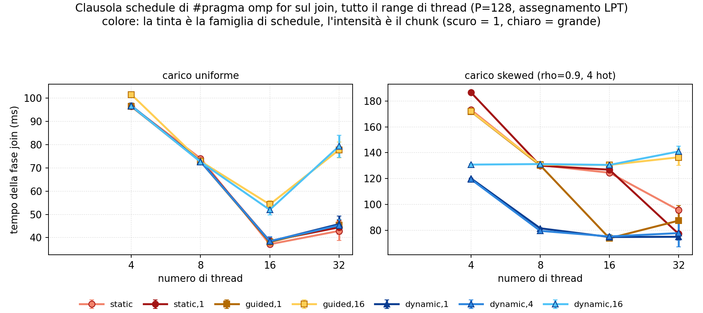

- Il report misura la schedule al solo T=8; qui T in {4, 8, 16, 32} e sette politiche.
- Il numero dopo la virgola è il chunk size, le iterazioni per prelievo; per `guided` è il minimo sotto cui il blocco non scende.

| schedule | assegnamento | blocco | blocchi a T=16 | join unif. (ms) | join skew (ms) |
|---|---|---|---|---|---|
| `static` | a priori | P/T contigue | 16 da 8 | 37.2 | 124.5 |
| `static,1` | a priori | 1, round robin | 16 da 8 sparse | 38.5 | 126.8 |
| `guided,1` | a runtime | decrescente, minimo 1 | 43, da 8 a 1 | 38.1 | 73.8 |
| `guided,16` | a runtime | decrescente, minimo 16 | 8 da 16 | 54.3 | 130.5 |
| `dynamic,1` | a runtime | 1 fisso | 128 | 38.4 | 74.8 |
| `dynamic,4` | a runtime | 4 fisso | 32 | 38.5 | 75.2 |
| `dynamic,16` | a runtime | 16 fisso | 8 | 52.0 | 130.5 |

- Uniforme: le politiche a chunk piccolo restano entro lo 0.4% a T=4 e il 6.8% a T=32.
- `dynamic,16` e `guided,16` degradano da T=16 (52.0 e 54.3 contro 37.2 di `static`): chunk 16 su P=128 lascia 8 blocchi, meno dei thread. La rottura cade dove T supera 8.
- `guided,16` degenera in `dynamic,16` per T oltre 8, perché la formula del runtime tiene il blocco fisso a 16. Coincidono a T=8, 16 e 32; divergono solo a T=4 (101.5 contro 96.6), dove il primo blocco vale 32.
- Skewed: le due `dynamic` a chunk piccolo dominano a ogni T (74.8 contro 124.5 di `static` a T=16).
- Correzione al report: `dynamic,1` non è mai peggiore delle alternative. Su uniforme `static` lo batte del 3.3% a T=16 e del 6.8% a T=32, con segno consistente su tutte le rep. L'argomento corretto è minimax: al più -7% su uniforme, +40% su skewed.

## Esp. 1: schedule del join su tutto il range

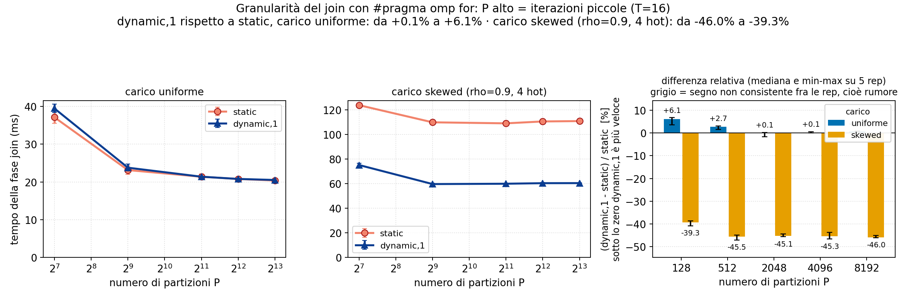

- A P=4096 il lavoro per iterazione è 32 volte inferiore che a P=128: un costo del dispatch emergerebbe qui.
- Uniforme: `dynamic,1` costa +6.3% a P=128 e sotto il punto percentuale da P=2048 in su. Trascurabile anche con 8192 iterazioni.
- Skewed: il bilanciamento domina a ogni granularità e il margine non si assottiglia (-39.4% a P=128, -45/-46% da P=512). Il vantaggio è del bilanciamento a runtime, non della granularità.
- Effetto collaterale: il join scende da 37.1 a 21.4 ms fra P=128 e P=2048 (tabelle per-partizione, 4 MB a P=128 e 256 KB a P=2048: con 8 thread per socket l'aggregato passa da 32 MB, fuori dai 20 MB di L3, a 2 MB), il totale da 61.1 a 48.4 ms con minimo da P=512. P=128 è ereditato dal report, non è l'ottimo.

## Esp. 2: costo del modello a task, per fase

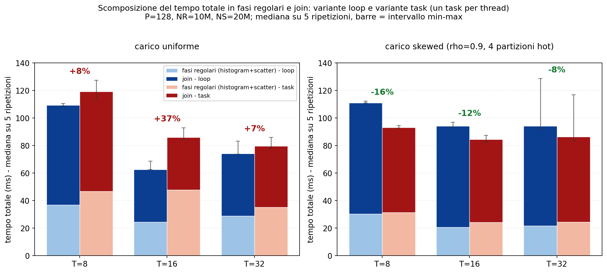

- Task alla granularità consegnata (un task per thread, `omp_ablation.cpp:330`); il gap è task rispetto a loop.
- **Uniforme, vantaggio del loop** (+8% a T=8, +37% a T=16). Il join coincide entro il 2% (72.4 contro 72.5 ms a T=8, 38.0 contro 38.2 a T=16): il divario sta nelle fasi regolari (+27%, +96%). Meccanismo: il costo per tupla di histogram e scatter è costante, quindi la varianza fra le unità di lavoro è nulla e non c'è sbilanciamento da recuperare. `schedule(static)` partiziona il range in ingresso alla regione e non ha costo di runtime; il modello a task paga emissione dal `single` e gestione della coda per un bilanciamento che qui non ha nulla da bilanciare. Il vantaggio del dinamico è proporzionale allo sbilanciamento: a sbilanciamento nullo resta solo il costo.
- **Skewed, vantaggio del task** (-16% a T=8, -12% a T=16), per la ragione simmetrica. Le fasi regolari restano a sfavore (+3%, +17%), il join le compensa (-24% a T=8, -18% a T=16). Meccanismo: f_hot = 0.9/4 + 0.1/128 = 0.226, e finché la partizione hot è un'unità di scheduling indivisibile il suo tempo è un termine seriale nel senso di Amdahl, che limita lo speedup del join a 1/f_hot = 4.4 per qualunque politica sul `for`. Lo split del probe in sotto-task rimuove l'indivisibilità: il tetto misurato passa da 4.6 a 5.5 (esp. 3). Il vantaggio non è del modello a task in sé, ma del `taskgroup` annidato come unico costrutto che esprime la suddivisione.
- Non affermabile: a T=32 i min-max si sovrappongono su entrambi i carichi (uniforme, loop 73.7-83.2 contro task 78.1-85.8; skewed 92.5-128.5 contro 83.9-116.7), quindi né il +7% né il -8%. Il picco a T=16 non è attribuito a un meccanismo. Il loop viene da `task_chunks.csv` e il task da `nowait.csv`: sulla stessa configurazione i due file derivano fino al 3.8%, dentro cui i valori a una cifra non sono distinguibili dal rumore.

## Esp. 2: nowait sul single di emissione

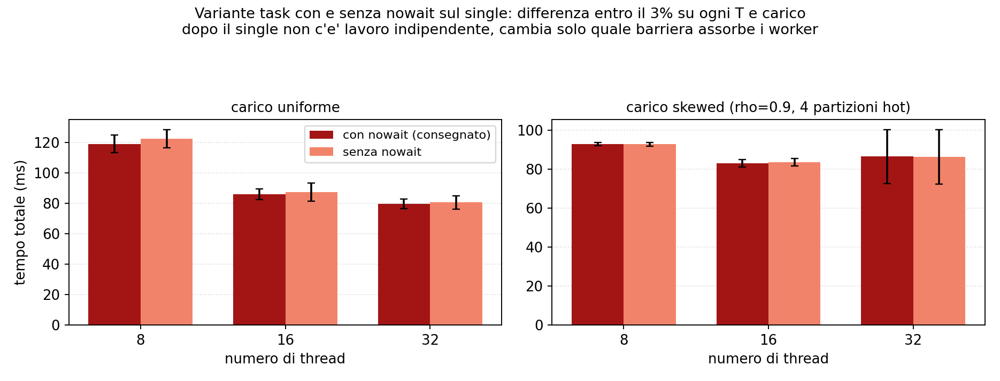

- Variante consegnata (con `nowait`) contro `-DNO_NOWAIT`, stesso sorgente.
- Differenza entro il 3% su ogni T e carico: la barriera implicita del `single` è un task scheduling point, quindi i thread fermi vi consumano comunque i task pendenti.
- Ragione strutturale: in `run_task` il `single` è l'unico costrutto della regione parallela (`omp_ablation.cpp:369-427`), e dopo la sua chiusura non c'è altro codice; con o senza `nowait` cambia solo quale barriera assorbe i worker, non il lavoro. Il `nowait` sarebbe rilevante solo con lavoro indipendente dopo il `single`, assente nel codice.

## Esp. 3: LPT e split intra-partizione

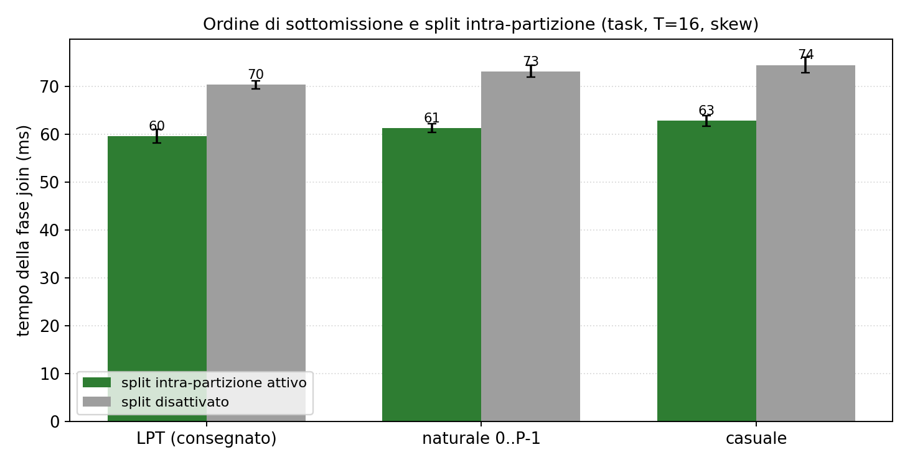

- La variante task combina ordinamento LPT e split del probe delle partizioni hot; la matrice ordine per split separa i due contributi.
- Lo split vale circa il 15% sul join a T=16 skewed (da 70-74 a 60-63 ms), qualunque sia l'ordine.
- LPT vale il 2-5% rispetto all'ordine naturale o casuale, con o senza split.
- Il vantaggio del task sotto skew è quindi dello split, non di LPT: con 128 partizioni per 16 thread la coda è abbastanza piena perché ogni ordine ragionevole tenga i thread occupati.

## Esp. 3: LPT e split intra-partizione

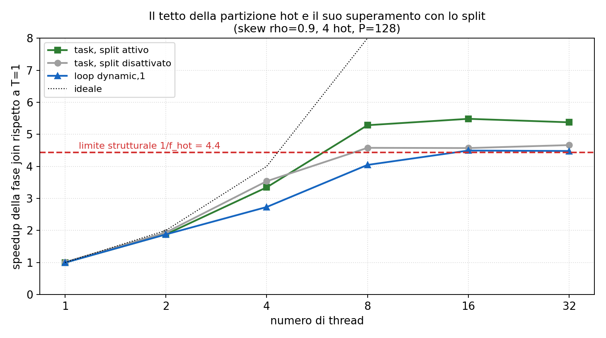

- La partizione hot più pesante contiene f_hot = rho/H + (1-rho)/P = 22.6% dei record: finché il probe è indivisibile, lo speedup del join non supera 1/f_hot = 4.4.
- Senza split la curva satura a 4.6 da T=8 in poi. Il tetto misurato è poco sopra il teorico perché il probe della hot, con la tabella di 4 chiavi in cache, costa meno per record della media.
- Con lo split arriva a 5.5: il probe della hot è servito da più thread cooperanti.
- Il loop `dynamic,1` senza split satura allo stesso modo (4.5): il limite è strutturale, non della politica di scheduling.

## Esp. 3: LPT e split intra-partizione

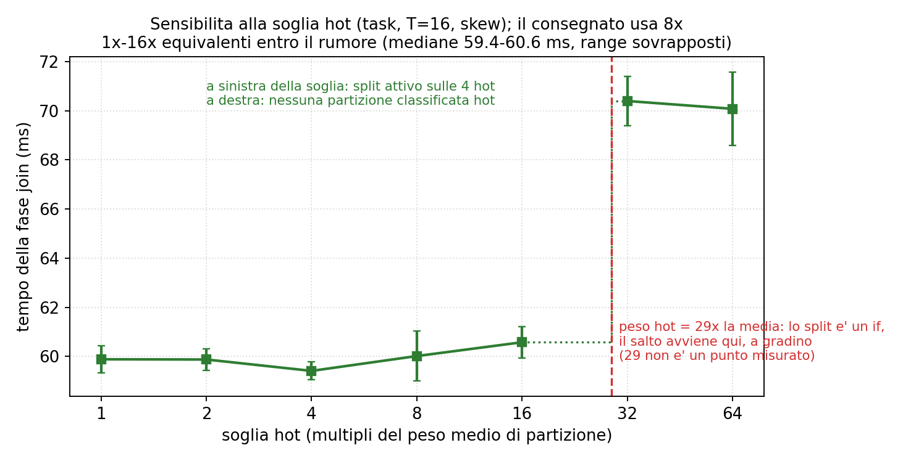

- La soglia consegnata (8x il peso medio di partizione) non è critica: il join è piatto da 1x a 16x, mediane fra 59.4 e 60.6 ms con range sovrapposti.
- Il peso della hot è f_hot per P = 29x la media, e lo split è una condizione booleana su quel peso: sotto 29x qualunque soglia seleziona le stesse 4 partizioni, sopra non ne seleziona nessuna e il join sale a 70 ms.
- La transizione è quindi un gradino esatto a 29x. Nel grafico i due regimi sono tratti separati; il raccordo tratteggiato indica la discontinuità attesa, non una misura.

## Esp. 4: prefetch software

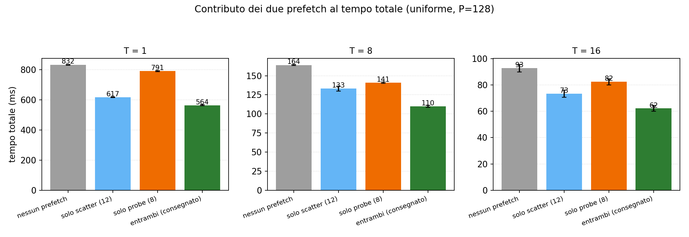

- Ablation on/off dei due `__builtin_prefetch` sullo stesso binario. A T=16 il totale passa da 93 a 62 ms, un fattore 1.49.
- Scatter da solo: 73 ms. Probe da solo: 82 ms. I contributi si compongono in modo indipendente, perché mascherano miss su strutture diverse (slot di destinazione dei buffer, slot della tabella hash).
- Sulla sola fase scatter l'effetto è 2.1x a ogni T (37 contro 17 ms a T=16; 407 contro 181 a T=1).
- Il conto del report sul confronto con il Modulo 2 (circa 56 ms sullo scatter a T=8 attribuiti al prefetch) è compatibile con la misura diretta: 59 contro 29 ms.

## Esp. 4: prefetch software

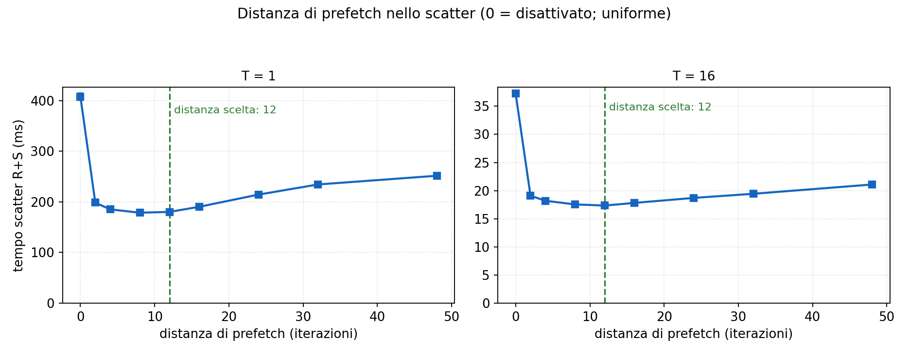

- Curva a U: a distanza 2-4 il prefetch arriva troppo tardi per coprire la latenza; oltre 24 la riga è sfrattata prima dell'uso o il cursore è già cambiato (+20/40% a distanza 48).
- Il minimo è largo, fra 8 e 16: la distanza consegnata (12) cade al centro del plateau e non richiede tuning fine.
- La forma è identica a T=1 e T=16: il fenomeno è per-thread, non dipende dalla contesa di banda.

## Esp. 4: prefetch software

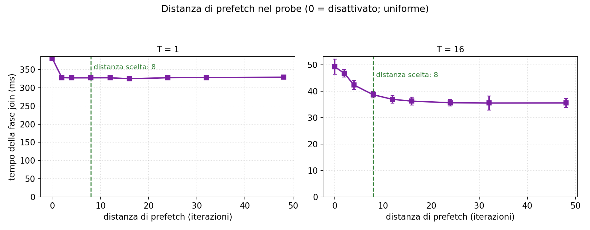

- A T=1 la curva satura a distanza 8 (da 381 a 327 ms) e resta piatta fino a 48: la distanza consegnata è al bordo del plateau.
- A T=16 il minimo si sposta avanti: 24-48 danno 35.6 ms contro 38.7 della distanza 8, un ulteriore 8%. Con la banda contesa da 16 thread la latenza per miss cresce e serve più lavoro fra prefetch e uso.
- A T=1 le distanze 2-48 sono equivalenti (327-329 ms): una costante unica a 16-24 sarebbe stata uguale a T=1 e migliore dell'8% a T=16, a parità di complessità.
- Il valore 8, calibrato a basso parallelismo, lascia circa 3 ms, il 5% del totale a T=16.

## Esp. 5: NUMA first-touch

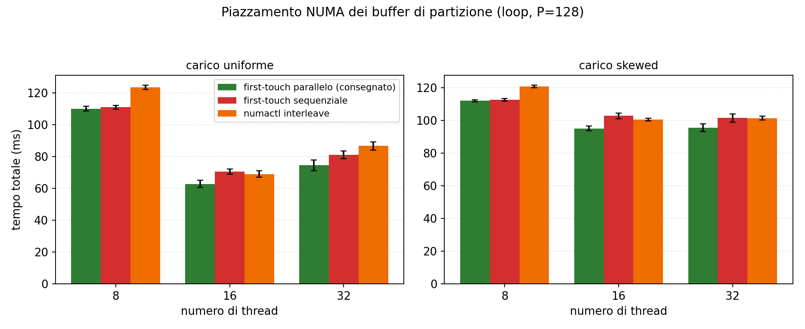

- Tre politiche: first-touch parallelo con `schedule(static)` (consegnato, ogni pagina sul nodo del thread che vi scrive nello scatter), first-touch sequenziale (tutte sul nodo del master), `numactl --interleave=all`.
- A T=8 parallelo e sequenziale coincidono: con `OMP_PROC_BIND=close` gli 8 thread stanno sul socket dove il sequenziale alloca.
- L'effetto compare quando il team attraversa i due socket: a T=16 uniforme 63 contro 71 ms, a T=32 74 contro 81 ms.
- L'interleave non è una via di mezzo: distribuisce le pagine indipendentemente dai proprietari e a T=16 uniforme costa quanto il first-touch sequenziale (69 ms).

## Esp. 5: NUMA first-touch

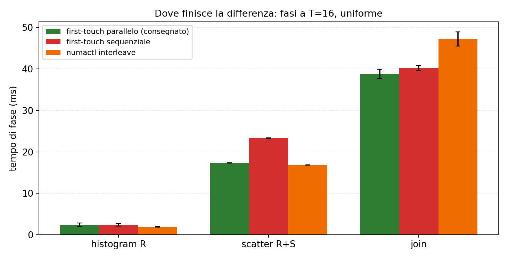

- Il first-touch sequenziale colpisce lo scatter (23 contro 17 ms, +35%): metà delle scritture attraversa QPI verso il socket remoto.
- L'interleave colpisce il join (47 contro 39 ms, +21%): build e probe leggono i buffer di partizione e metà delle letture cade sul nodo remoto, qualunque sia il thread proprietario.
- L'histogram è insensibile a entrambe: legge l'input, che le politiche non toccano, e scrive tabelle private residenti in cache.

## Esp. 6: baseline e superlinearità apparente

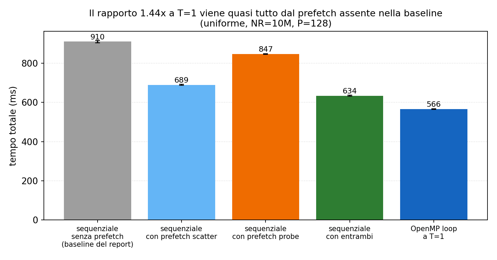

- Il report osserva efficienza sopra 1 a T basso e la attribuisce alle ottimizzazioni presenti nel binario OpenMP e assenti in `hashjoin_seq`. Qui la spiegazione è verificata dando alla baseline gli stessi prefetch.
- La baseline passa da 910 ms (nessun prefetch, configurazione del report) a 634 ms con entrambi; il binario OpenMP a T=1 fa 566 ms.
- Il prefetch spiega la gran parte dell'offset: 1.44 dei 1.61 misurati.
- Il residuo del 12% sta quasi tutto nello scatter e non è parallelismo. Pinning e NUMA sono esclusi (`taskset -c 0` e `numactl` danno tempi identici al run libero); restano candidate le differenze di compilazione e struttura fra i due binari, causa non identificata.

## Esp. 6: baseline e superlinearità apparente

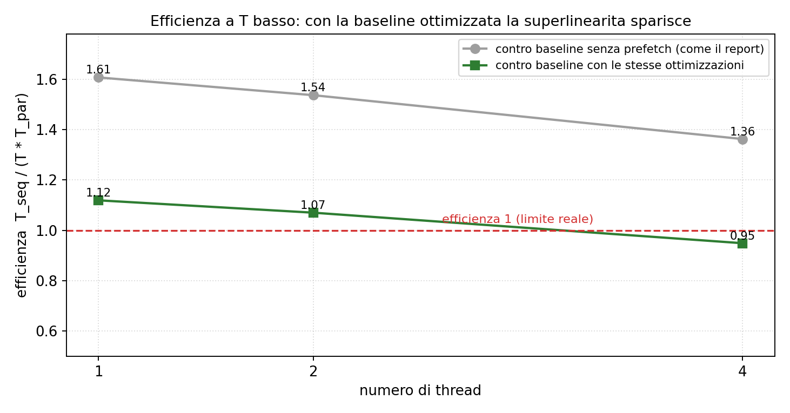

- Contro la baseline senza prefetch, l'efficienza a T in {1, 2, 4} vale 1.61, 1.54 e 1.36: sopra 1, come nel report.
- Contro la baseline con le stesse ottimizzazioni scende a 1.12, 1.07 e 0.95: la superlinearità sparisce e a T=4 l'efficienza è già sotto 1.
- Il confronto del report misura quindi insieme parallelismo e ottimizzazioni di sez. 2.4. Separati, il parallelismo si comporta normalmente: efficienza sotto 1 e decrescente.

## Esp. 7: breakdown sull'intero range di thread

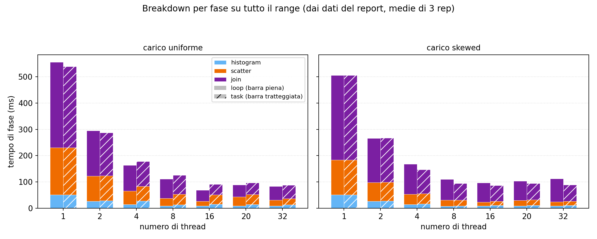

- Nessuna nuova misura: sono i dati dello strong scaling del report (medie di 3 rep), il cui CSV riporta i tempi per fase a ogni T. La fig. 4 del report ne mostra il sottoinsieme T in {4, 8, 16, 20}.
- La figura integrale mostra la ragione dell'omissione di T=1: la barra sequenziale (circa 550 ms) è 5-8 volte più alta di quelle del regime parallelo (70-110 ms), che su asse condiviso perdono le proporzioni fra fasi. È una scelta di scala, non di dati.
- A T=1 le proporzioni restano informative: join circa 60%, scatter 30% su entrambi i carichi; l'histogram è la fase minore a ogni T.

## Esp. 7: breakdown sull'intero range di thread

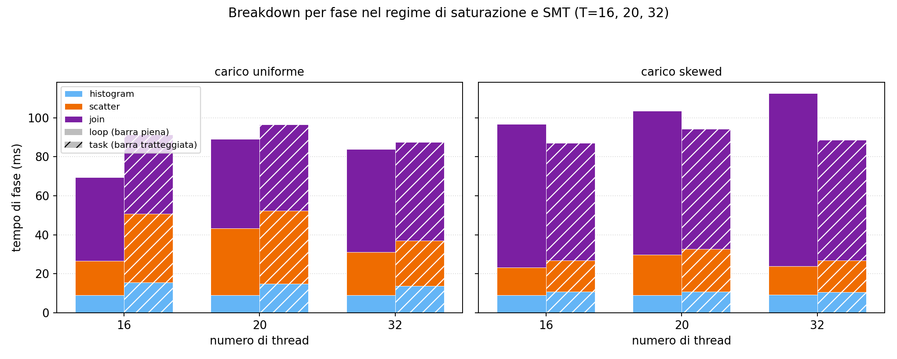

- Il dettaglio su T in {16, 20, 32} estende la fig. 4 al regime SMT e conferma per fase l'analisi dello strong scaling.
- Uniforme: il dip a T=20 è nelle fasi statiche (histogram+scatter del loop da 27 a 43 ms), dove gli 8 thread sui 4 core condivisi fanno da straggler alle barriere.
- A T=32 le fasi statiche recuperano (31 ms, simmetria ripristinata) mentre il join peggiora gradualmente (43, 46, 53 ms) per la contesa dei due contesti SMT su cache e banda.
- Skewed: histogram e scatter sono quasi identici fra loop e task a ogni T; la differenza è tutta nel join. Quello del loop cresce a T=32 (da 74 a 89 ms di media, rep fra 74 e 101) perché il thread che serve la hot dimezza la velocità quando condivide il core; quello del task resta piatto attorno a 62 ms grazie allo split.

## Esp. 8: la calibrazione del weak scaling

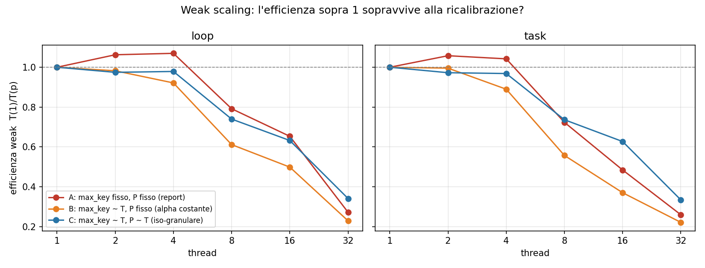

- Il weak del report scala NR con T ma tiene fissi max_key e P: la partizione cresce con T, la FlatCountMap è dimensionata sui record mentre le distinte saturano a max_key/P. Il load factor crolla da 0.39 a 0.04 e il footprint passa da 512 KB a 16 MB per thread.
- Tre bracci: A = report; B = max_key proporzionale a T (alpha costante); C = anche P proporzionale a T (iso-granulare). Il braccio A riproduce il report entro il 3%.
- L'efficienza sopra 1 (1.06 a T=2, 1.07 a T=4) esiste solo in A: in B fa 0.98/0.92, in C 0.97/0.98. Non è superlinearità, è la calibrazione.
- Il meccanismo è misurato: il probe passa da 15.19 ns (alpha 0.393) a 4.80 (alpha 0.074), -68% a parità di chiavi probate. Con alpha tenuto costante non ha trend.
- Banda e residenza separate: il ginocchio a T=8 resta anche a tabella fissa da 512 KB (+37%, aggregato 4 MB contro 20 di L3), quindi è banda; il degrado da T=16 in su è footprint (C: 110 -> 134 ms fra T=8 e T=32; B: 148 -> 345 a parità di alpha).
- A T=32 il weak iso-granulare fa 0.341 contro 0.272 del report: la curva del report è ottimista fino a T=16 e pessimista a T=32. Il 26% non è il limite del kernel.

## Esp. 9: confronto con M2 a parità di parametri

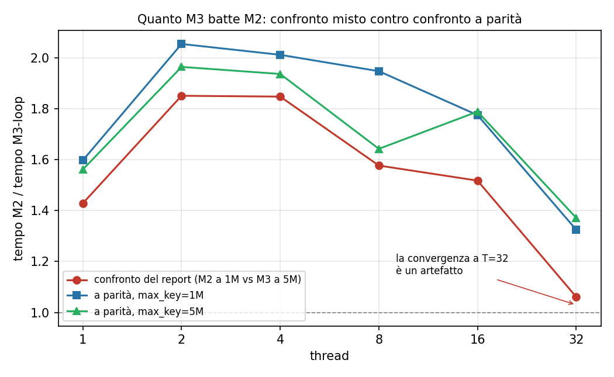

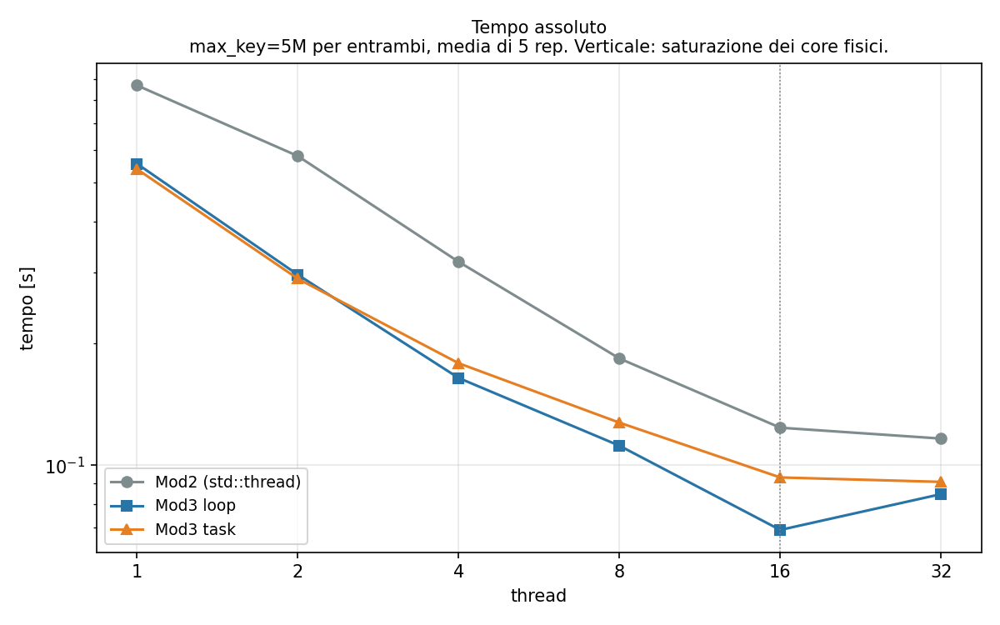

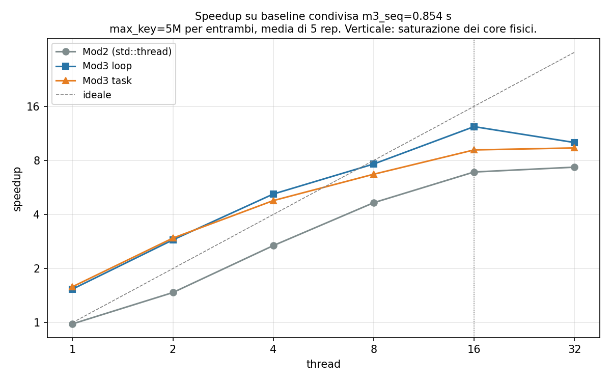

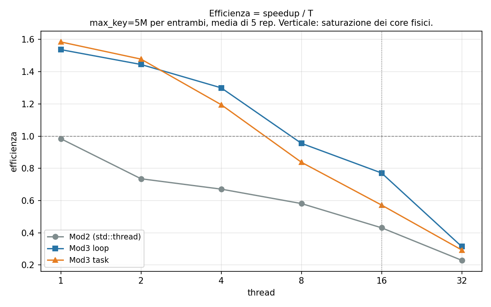

- Il confronto del report non è a parità: M2 gira con max_key=1M e best of 5 (`module_2/scripts/bench_slurm.sh:24,35-48`), M3 con max_key=5M e media di 3, e lo speedup di M2 è calcolato sulla baseline di M3. Le tre asimmetrie favoriscono M2.
- Rifatto nello stesso job, stessi parametri, stessa statistica. Validazione: a parità di max_key il `join_count` coincide (199999829 a 1M, 40006682 a 5M).

| T | 1M: m2 / m3-loop / gap | 5M: m2 / m3-loop / gap |
|---|---|---|
| 8 | 0.1762 / 0.0905 / 1.95x | 0.1835 / 0.1117 / 1.64x |
| 16 | 0.1050 / 0.0592 / 1.78x | 0.1238 / 0.0692 / 1.79x |
| 32 | 0.0900 / 0.0679 / 1.33x | 0.1164 / 0.0848 / 1.37x |

- Il gap a T=16 è 1.79x, contro 1.46x nel report. Il meccanismo è nel max_key: con 1M le distinte per partizione sono 7812 e alpha è 0.030, con 5M sono 33763 e alpha 0.129. Il report mette M2 sul primo carico e M3 sul secondo, quindi M3 paga catene di probe più lunghe sulla fase che pesa metà del suo tempo. Il gap è identico sui due carichi (1.78x e 1.79x): a parità non dipende più dalla calibrazione.
- A T=32 il gap si riduce ma non si annulla (1.37x). La tendenza del report è reale e il meccanismo è quello indicato (a saturazione domina la banda aggregata, uguale per i due moduli, e il modello di sincronizzazione pesa meno); non regge il punto di arrivo: la convergenza (0.086 contro 0.089) confronta 1M con 5M. La banda comprime il divario, non lo azzera.
- Le baseline sequenziali sono due: a 5M m2_seq 0.9214 e m3_seq 0.8538. Il report ne usa una (0.802) per entrambi; con la propria, M2 a T=16 fa 7.49 invece di 7.86. Il best-of-5 vale circa l'1%: delle tre asimmetrie è l'unica trascurabile.
- Non affermabile: M2 non emette i tempi per fase, quindi il confronto è sui totali e l'attribuzione del gap a scatter e histogram resta quella del report, non rimisurata a parità. Il gap a T=8 differisce fra i carichi (1.95x contro 1.64x) e il meccanismo non è isolato.
