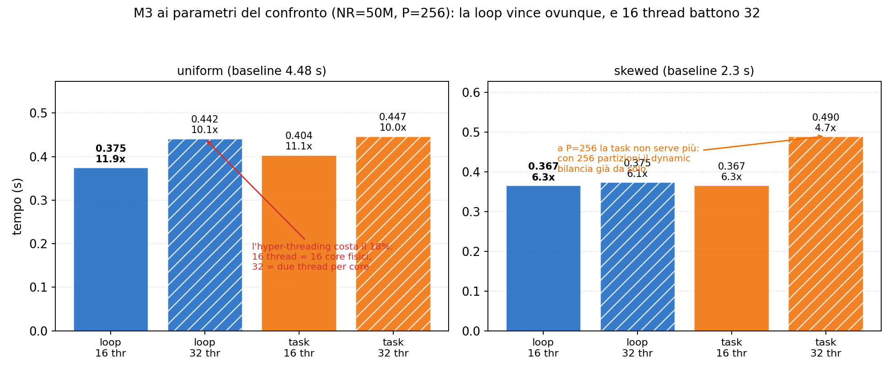
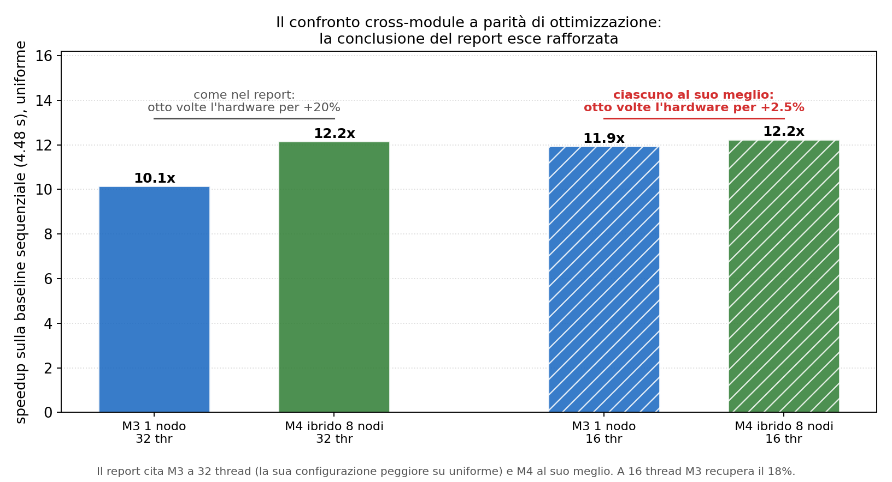

# Esp. 8: il confronto cross-module a parità di ottimizzazione

**Obiettivo.** Il confronto della sez. 5.1 del report è già onesto in un senso importante: M2 e M3
non sono citati dai loro report, sono stati **rigirati** ai parametri di M4 (NR=50M, NS=100M, P=256,
max_key=25M), sulla stessa macchina e contro la stessa baseline. Il `join_count` identico
(199.995.067 uniforme, 35.750.353 skewed) prova che i tre moduli calcolano la stessa cosa sullo
stesso input. Restano però due domande che il report non copre: M3 ha due varianti (loop e task) e
il confronto usa solo la loop; e ogni implementazione gira a 32 thread, cioè su tutte le CPU
logiche, mentre il nodo ha 16 core fisici.

**Come.** `run_m3_variants.sbatch` misura M3 in tutte e quattro le combinazioni (loop/task x
16/32 thread) ai parametri del confronto; `run_m4_threads.sbatch` misura l'ibrido di M4 a 16 e 32
thread per nodo, su 1 e 8 nodi. In entrambi `--cpus-per-task=32` assegna tutte le CPU logiche e
`OMP_NUM_THREADS` con `OMP_PLACES=cores` decide quanti core usare davvero, così 16 thread
significa 16 core fisici distinti e non 8 core con hyper-threading.

```bash
sbatch run_m3_variants.sbatch                      # da ~/module_3
for N in 1 8; do sbatch --nodes=$N run_m4_threads.sbatch; done   # da ~/module_4
python3 plot_crossmodule_fair.py
```

## Risultati



M3 ai parametri del confronto (mediane di 5):

| carico | T | loop | task | vince | speedup migliore |
|---|---|---|---|---|---|
| uniform | 16 | **0.3750** | 0.4040 | loop 1.08x | **11.9x** |
| uniform | 32 | **0.4415** | 0.4470 | loop 1.01x | 10.1x |
| skewed | 16 | **0.3666** | 0.3671 | pari | **6.3x** |
| skewed | 32 | **0.3751** | 0.4900 | loop 1.31x | 6.1x |

M4 ibrido, 16 contro 32 thread per nodo:

| carico | nodi | 16 thread | 32 thread | gap |
|---|---|---|---|---|
| uniform | 1 | 1.7332 | **1.6162** | 32t meglio 1.07x |
| uniform | 8 | **0.3658** | 0.3681 | pari (1.01x) |
| skewed | 1 | 1.5930 | **1.5813** | pari |
| skewed | 8 | 0.9194 | **0.9120** | pari |



## Lettura

1. **La variante task non serve a questi parametri, quindi la scelta del report è corretta.** Sui
   dati di M3 a NR=10M e P=128 la task batte la loop su skewed (1.31x a 32 thread); a NR=50M e
   P=256 il vantaggio sparisce (pari a 16 thread, loop meglio di 1.31x a 32). Il meccanismo: la
   task vinceva quando le partizioni erano poche e grosse, perché spezzava il lavoro più fine
   dell'unità dello `schedule(dynamic)`, che è una singola iterazione, cioè un'intera partizione.
   Con 256 partizioni su 50M il dynamic ha già grana sufficiente e il task-based paga solo
   l'overhead di creazione e scheduling. È lo stesso effetto che l'esp. 5 misura su M4 dal lato
   della cache, visto qui dal lato della granularità.
2. **M3 su uniforme perde il 18% con l'hyper-threading** (0.3750 a 16 thread contro 0.4415 a 32).
   Il nodo ha 16 core fisici e 32 CPU logiche: a 32 thread due thread per core si contendono le
   stesse porte di load/store e la stessa L1, e su un kernel memory-bound questo non compra latenza
   nascosta e costa contesa. Il report cita M3 uniforme a 32 thread (10.1x) ma M3 skewed a 16
   (6.2x): sceglie la configurazione migliore di M3 su un carico e la peggiore sull'altro.
3. **Il confronto chiave cambia di significato, e va a favore della tesi del report.** A parità di
   ottimizzazione:

   ```
   come nel report:  M4 ibrido 8 nodi 12.2x  contro  M3 1 nodo 10.1x  ->  +20%
   ciascuno al suo meglio: M4 ibrido 8 nodi 12.2x  contro  M3 1 nodo 11.9x  ->  +2.5%
   ```

   Otto nodi comprano il 2.5% su un singolo nodo, non il 20%. La conclusione del report ("la
   distribuzione si giustifica per capacità, non per velocità") ne esce **rafforzata**: è
   un'ammissione che va contro il proprio lavoro, e conviene farla prima che la domanda arrivi.
4. **M4 non paga l'hyper-threading, a differenza di M3** (gap 1.01-1.07x, per lo più a favore di
   32 thread). *Meccanismo non isolato dalla misura*: l'ipotesi plausibile è che le fasi di M4
   restino nel regime latency-bound, dove il secondo thread per core nasconde attesa invece di
   contendere banda. A 8 nodi ogni rank tratta 1/8 dei record, quindi il working set per thread è
   molto più piccolo che in M3; a 1 nodo lo `scatter_local` lavora su un buffer da 1.2 GB e paga
   TLB miss (vedi companion, sez. 2), che è il regime in cui l'hyper-threading aiuta. Va riportato
   come dato: il prezzo dell'HT dipende dal kernel, non è una proprietà della macchina.
5. **Su skewed nulla cambia**: M3 al suo meglio fa 6.3x, M4 ibrido a 8 nodi 2.5x. Un nodo batte
   otto nodi di 2.5x, per il pavimento dell'esp. 4 (ownership fissa contro dynamic scheduling in
   memoria condivisa).

## Cosa non è affermabile

- Il pure MPI a 16 rank per nodo non è misurato: a 8 nodi darebbe 128 rank, cioè il regime del dip
  dell'esp. 7, quindi il confronto non isolerebbe l'hyper-threading dall'algoritmo della
  collettiva.
- Il vantaggio di M3 a 16 thread non è stato scomposto per fase (M3 emette il breakdown, ma non è
  stato raccolto in queste run): che il 18% venga dalla contesa sulle porte di load/store è la
  spiegazione standard, non una misura di questo esperimento.
