# Companion di studio, Modulo 4 (materiale extra per l'orale)

Materiale di studio personale, separato dal report consegnato (che non viene toccato).
Copre: le risposte ai dubbi del todo, il walkthrough del report, i sei esperimenti
aggiuntivi (`01..06_*/`), i deep dive su MPI nel codice, i punti di onestà e il
cheat-sheet finale.

Tutti i numeri sono misurati: o dai CSV del report (`results/cluster/`), o dagli
esperimenti extra (`0N_*/results/`), girati sugli stessi nodi Ivy Bridge (E5-2640 v2,
32 CPU logiche, 2 NUMA) con job SLURM esclusivi fino a 8 nodi (job 696527-696532).
Parametri del report: NR=50M, NS=100M, P=256, seed 42, max_key=25M; baseline sequenziale
4.48 s (uniforme) e 2.30 s (skewed), ricompilata con `-march=ivybridge`.

---

## 1. Risposte rapide ai dubbi del todo

**Perché la baseline sequenziale è ricompilata con `-march=ivybridge`?**
La compilazione avviene sul login node, che è Haswell e ha AVX2; i compute node sono Ivy
Bridge e non lo hanno (AVX2 arriva con Haswell nel 2013; Ivy Bridge si ferma ad AVX, che
ha registri a 256 bit ma opera a 256 bit solo su float e double, non su interi). Con
`-march=native` sul login il binario emetterebbe AVX2, FMA e BMI2, illegali sui compute
node. `-march=ivybridge` fissa l'ISA del target. Quindi **AVX2 non viene mai eseguito**:
è un vincolo hardware, non una scelta.

Quanto costa non averlo: circa il 3%, e il breakdown sequenziale lo dimostra. Le uniche
istruzioni che AVX2 vettorizzerebbe sono il fold e la moltiplicazione di Fibonacci, che
essendo a 32 bit passerebbero da 4 lane (`pmulld`, SSE) a 8 (`vpmulld`, AVX2). Quel
calcolo vive nell'histogram, che pesa 256 ms su 4483, cioè il 5.7%: per Amdahl, anche
azzerandolo il totale scende sotto il 3%. Le due fasi dominanti non ne beneficiano:
lo scatter (57%) è limitato dalle scritture sparse, e servirebbe uno scatter vettoriale
che AVX2 non ha (arriva con AVX512); il join (37%) fa probe casuali ed è latency-bound
sulla memoria, dove SIMD non aiuta. Nota che in M1 `-march=native` vale +8%
(1216 -> 1317 Mkeys/s), ma su node09, che è Zen1 con AVX2, e su un kernel in streaming
senza scritture sparse né probe: non è trasferibile qui.

**Perché la baseline skewed (2.30 s) è più veloce dell'uniforme (4.48 s)?**
Il breakdown sequenziale separa i contributi (mediana di 5 rep):

| fase | uniforme | skewed | rapporto |
|---|---|---|---|
| histogram R+S | 256.1 ms | 258.5 ms | 0.99x |
| scatter R+S | 2573.9 ms | 765.1 ms | 3.36x |
| join | 1650.7 ms | 1273.0 ms | 1.30x |
| totale | 4483.2 ms | 2297.5 ms | 1.95x |

Il risparmio è per l'83% nello scatter (1809 ms dei 2186 totali). Il meccanismo è isolato
dal fatto che l'histogram NON cambia: histogram e scatter leggono gli stessi record e
calcolano lo stesso hash, e differiscono solo perché il secondo scrive il record a
destinazione. Quindi il costo è nella scrittura, non nel calcolo. Con record da 8 byte e
linee da 64, un flusso contiguo riempie una linea ogni 8 record: in uniforme i 256 stream
attivi fanno cadere scritture consecutive su linee diverse (circa 1 miss per record),
sotto skew il 90% dei record va in pochi stream (1 miss ogni 8) e il 10% resta sparso.
Il conto atteso, 150M / (135M/8 + 15M) = 4.7x, si confronta con il 4.58x misurato
isolando la sola scrittura (scatter meno histogram: 2318 contro 507 ms). Quale livello
della gerarchia si paghi (dTLB con 256 pagine attive contro 64 entry, conflict miss in L1,
write-allocate) non è isolato senza contatori hardware: fermarsi a "scrittura sparsa
contro scrittura in pochi stream".

Attenzione a una cosa che il report liquida troppo in fretta. La frase "not output size"
regge per lo scatter, che precede il join e non può dipendere dall'output, ed è dove sta
l'83% del risparmio. Ma l'output sotto skew è **più piccolo**, non più grande:
join_count 35.750.353 contro 199.995.067, cioè 5.6x meno match (verificato in
`strong_scaling.csv` e `breakdown.csv`). R e S hanno seed diversi, quindi le 4 hot key di
R e le 4 di S sono chiavi diverse e il grosso di R non matcha il grosso di S. Il conto
torna: hot di R contro coda di S (4 x 11.25M x 0.4 = 18M), hot di S contro coda di R
(4 x 22.5M x 0.2 = 18M), coda contro coda (2M), totale circa 38M contro 35.75M misurati;
in uniforme 25M chiavi x 2 x 4 = 200M. Nel join (1.30x, il 17% del risparmio) concorrono
quindi sia le tabelle hot in cache sia il minor numero di match da emettere.

**Le partizioni hot sono 4 o 8?** Fino a 8. R e S sono generate con seed diversi
(`seed` e `seed ^ S_SEED_OFFSET`), quindi le 4 hot key di R e le 4 di S sono diverse e
cadono su partizioni diverse (salvo coincidenze). Le 4 hot di S pesano 0.225 x 100M =
22.5M record l'una, le 4 di R 0.225 x 50M = 11.3M. Il rank più carico a 128 rank riceve
infatti 22.6M record (misurato, esp. 4): una hot di S più il rumore uniforme.

**Da dove viene il "hard floor" sotto skew, in numeri?** Esp. 4: a 128 rank il rank più
carico riceve 22.6M record contro una media di 1.2M (19x). La partizione hot più pesante
è indivisibile con questo schema di ownership: nessun mapping partizione-rank può
scendere sotto quel massimo. Per questo il remapping non basta e servirebbe replicare il
build side (sez. 4.5 del report).

**Il remapping consapevole dei pesi conviene?** Dipende dal regime (esp. 4):
a 8 rank sì (le hot collidono sotto `pid mod R`: 58.1M sul rank peggiore; il greedy le
separa e dimezza il totale, 0.88 contro 1.70 s, con un costo di piano di 2-3 ms);
a 128 rank no, anzi fa danno (il pavimento è già raggiunto da mod, il greedy peggiora la
collettiva del 2.3x perché i send count diventano irregolari, e il totale del 75%). La
scelta del report (mapping semplice, niente remap) è giusta nel regime in cui il report
opera.

**Perché `MPI_Barrier` prima di ogni collettiva? Non falsa la misura?** Il barrier
allinea i rank così il timer della collettiva misura lo scambio e non l'attesa del rank
in ritardo dalla fase precedente. Esp. 4: senza barrier il totale cambia meno del 5%, ma
lo skew di arrivo non sparisce, si accumula sull'ultima sincronizzazione globale:
`reduce_final` passa da 0.24 a 208 ms su uniforme e da 0.29 a 433 ms su skew, mentre
`comm_sizes` assorbe solo 3-6 ms. La riduzione MAX per fase mostra il rank più lento,
cioè il critical path di quella fase. La difesa è quindi: i barrier attribuiscono
l'attesa alla fase che la causa invece di scaricarla sulla collettiva finale, e il loro
effetto sul totale è marginale.

**FUNNELED vs MULTIPLE: quanto costa davvero MULTIPLE?** Zero misurabile qui (esp. 6:
0.49 contro 0.50 s su uniforme, dentro il rumore). Il locking interno di MULTIPLE pesa
solo se più thread chiamano MPI concorrentemente; in questo codice ogni chiamata MPI sta
fuori dalle regioni OpenMP. La motivazione onesta di FUNNELED: chiedere il livello minimo
documenta il contratto (solo il main thread parla con MPI) e non lascia costi latenti,
non che MULTIPLE renda questa pipeline più lenta.

**Perché P=256?** Vincoli: P multiplo di ogni rank count usato (fino a 256 rank in pure
MPI, quindi P almeno 256). Esp. 5: per l'ibrido P conta poco (il join migliora con P per
via delle tabelle in cache, lo scambio no); per il pure MPI su uniforme P=1024 sarebbe
meglio (0.71 contro 1.12 s a P=128), su skewed peggio oltre 256. P=256 è il compromesso
che copre tutte le configurazioni con un solo valore.

**comm_sizes: perché 10-13 ms da 2 nodi in su se scambia pochi byte?** L'Alltoall dei
contatori muove R interi per rank, ma è comunque una collettiva a R partecipanti: paga la
sincronizzazione. In più qualunque residuo di disallineamento dopo il barrier si scarica
sul primo che si blocca. Esp. 4 (barrier off) lo conferma: la fase cresce di 3-6 ms
proprio quando il barrier non c'è (da 0.9 a 4.1 ms su uniforme, a 6.5 su skew). Resta
comunque due ordini di grandezza sotto il payload.

**Lo skip-ahead di splitmix64.** Lo stato di splitmix64 avanza di una costante fissa
(la sezione aurea a 64 bit) a ogni estrazione: lo stato dopo k estrazioni è
`seed + GOLDEN*k`, calcolabile in O(1). Ogni rank quindi genera solo la propria fetta
partendo da `seed + GOLDEN*offset`, e la concatenazione delle fette è byte per byte la
sequenza del generatore sequenziale. Per lo skewed non si può: la selezione iniziale
delle hot key fa rejection sampling (numero di estrazioni variabile), quindi l'offset
per-record non è noto e ogni rank rigenera l'intera relazione e ne taglia la fetta,
fuori dalla regione misurata.

**Perché il naive verifier è una prova forte?** È un doppio ciclo O(NR x NS) senza hash,
senza partizionamento e senza codice condiviso con il kernel: un bug del kernel non può
riprodursi identico in un'implementazione indipendente, quindi la coincidenza della
tripla (join_count, ck1, ck2) su input piccoli è un test severo. Sui 46 casi di
validazione: piccoli con naive, medi e grandi contro `hashjoin_seq`, rank da 1 a 128,
con il vincolo P >= R (ogni rank deve possedere almeno una partizione) che sui piccoli
input (P=16) limita i rank a 8.

---

## 2. Walkthrough del report

**Pipeline a 8 fasi.** histogram_local e scatter_local preparano il buffer di invio in
ordine dest-major (blocchi contigui per destinatario: requisito di Alltoallv);
comm_sizes scambia i contatori per dimensionare esattamente i buffer di ricezione;
comm_payload è l'Alltoallv dei record; histogram_post e scatter_post rimettono il buffer
ricevuto in layout per-partizione così il kernel del Modulo 3 si riusa senza modifiche;
join_local fa build+probe sulle partizioni possedute; reduce_final è un Allreduce dei tre
aggregati in O(log R) round.

**Strong scaling (fig. 1, tab. 1).** Ibrido monotono da 2.8x (1 nodo) a 12.0x (8 nodi).
Pure MPI: picco 7.6x a 2 nodi, crollo a 3.0x a 4 nodi (128 rank), recupero a 7.1x a 8.

*La forma delle curve.* Pure MPI accoppia rank count e node count (32 rank per nodo:
1/2/4/8 nodi = 32/64/128/256 rank), l'ibrido no (1 per nodo). Il totale è la somma di un
termine che scala e di uno che non scala:

| | nodi | rank | locali | payload | totale | speedup |
|---|---|---|---|---|---|---|
| mpi unif. | 1 | 32 | 0.523 | 0.092 | 0.653 | 6.86x |
| | 2 | 64 | 0.264 | 0.293 | 0.592 | 7.57x |
| | 4 | 128 | 0.142 | 1.346 | 1.470 | 3.05x |
| | 8 | 256 | 0.070 | 0.532 | 0.629 | 7.12x |
| mpi skew | 1 | 32 | 0.884 | 0.105 | 1.031 | 2.23x |
| | 4 | 128 | 0.731 | 1.109 | 1.889 | 1.22x |
| | 8 | 256 | 0.708 | 0.839 | 1.586 | 1.45x |
| ibrido unif. | 1 | 1 | 0.909 | 0.367 | 1.613 | 2.78x |
| | 8 | 8 | 0.144 | 0.183 | 0.374 | 11.99x |

Su uniforme le locali scalano 7.5x (0.523 -> 0.070) e il payload segue la curva del rank
count, con il massimo a 128: da 2 a 4 nodi le locali guadagnano 0.122 e il payload perde
1.053, da qui il crollo; da 4 a 8 il payload recupera 0.814. A 8 nodi la curva non torna
sopra il 7.57x di 2 nodi perché per Amdahl la frazione che non scala è ormai l'85% del
tempo. Sotto skew le locali NON scalano (0.884 -> 0.708, 1.25x) per il pavimento
dell'esp. 4: manca il termine che compensava, quindi la curva non risale. L'ibrido sale
sempre perché il rank count resta 1-8 e il suo payload DECRESCE (0.367 -> 0.183): in
strong scaling il volume per rank cala e il fan-out resta piccolo.

*Perché l'ibrido parte da 2.78x contro 6.86x.* Il breakdown a 1 nodo su uniforme (32
processi contro 1 processo x 32 thread) dice che NON è OpenMP a rendere meno:

| fase | pure MPI | ibrido | rapporto |
|---|---|---|---|
| histogram_local | 0.044 | 0.063 | 1.43x |
| scatter_local | 0.130 | **0.477** | **3.66x** |
| comm_payload | 0.092 | **0.367** | **3.99x** |
| histogram_post | 0.041 | 0.044 | 1.05x |
| scatter_post | 0.068 | 0.077 | 1.13x |
| join_local | 0.239 | 0.249 | 1.04x |
| totale | 0.653 | 1.613 | 2.47x |

Join, histogram_post e scatter_post sono equivalenti (1.04-1.13x): i 32 thread fanno lo
stesso lavoro dei 32 processi. Il ritardo (0.960 s) è concentrato in due fasi.

- `comm_payload` (0.275 s del ritardo, 29%): con un solo rank l'Alltoallv non tocca la
  rete, è una self-copy, ma la esegue il solo main thread perché MPI è FUNNELED (le
  chiamate MPI stanno fuori dalle regioni OpenMP). 1.2 GB a 3.3 GB/s, la banda di un
  core. Nel pure MPI la stessa copia la fanno 32 processi in parallelo via shared memory:
  0.092 s, circa 13 GB/s aggregati.
- `scatter_local` (il grosso dei 0.387 s di ritardo sulle locali, 40%): dipende da come R
  cambia il layout. Con R=32 ogni processo scrive solo il suo 1/32 dei record in un buffer
  privato da 37 MB; con R=1 l'unico rank scrive tutti i 150M record in un buffer da 1.2 GB,
  con i 256 slot a 4.7 MB di distanza l'uno dall'altro. Il nodo scrive a 9.2 GB/s nel primo
  caso e a 2.5 GB/s nel secondo. *Ipotesi non isolata*: con huge page da 2 MB i 37 MB
  stanno in 19 pagine e il dTLB le contiene, mentre 1.2 GB sono 600 pagine e ogni thread
  ne tocca 256, contro le 32 entry del TLB per huge page di Ivy Bridge. Servirebbero i
  contatori di dTLB miss.

Il problema si attenua oltre un nodo, perché il buffer per rank si divide: a 8 nodi le
locali dell'ibrido (0.144) sono il doppio di quelle del pure MPI (0.070) ma su un totale
che è la metà. Coerente con l'esp. 3, dove il minimo sta a 16 rank per nodo.

*Il dip non è il costo del fan-out.* Il report attribuisce la varianza alla selezione
dell'algoritmo e il costo al "128-way fan-out". La seconda parte è contraddetta dai dati.
Esiste un tetto di banda: su 8 nodi ogni nodo spedisce 131 MB off-node su 1.15 GB/s, cioè
114 ms, e ogni configurazione che funziona atterra lì (64 rank: 0.124 s; 128 rank con
pairwise: 0.128 s). Il fan-out semantico (R-1 destinatari) è identico in tutti gli
algoritmi: a cambiare è il fan-out concorrente, cioè quanti flussi si contendono la NIC
insieme (127 con basic linear, 1 con pairwise). In termini di utilizzo del link:

| configurazione | volume/NIC | tempo | utilizzo |
|---|---|---|---|
| 2 nodi, 64 rank | 305 MB | 0.293 s | 91% |
| 4 nodi, 128 rank | 227 MB | 1.346 s | 15% |
| 8 nodi, 128 rank | 132 MB | 1.107 s | 10% |
| 8 nodi, 256 rank | 132 MB | 0.532 s | 22% |
| 8 nodi, 128 rank, pairwise | 131 MB | 0.128 s | 89% |

A 128 rank il link è fermo per l'85-90% del tempo: il problema non è saturazione, è
sotto-utilizzo. Il recupero da 4 a 8 nodi (2.53x) si scompone esattamente in due fattori:
il tetto che scende (197 -> 115 ms, 1.71x, perché il traffico si divide su 8 NIC invece di
4) e il degrado che si attenua (6.83x -> 4.63x dal tetto, 1.48x). Il prodotto 1.71 x 1.48
= 2.53 coincide col misurato. Quindi l'argomento del report ("each rank sends half as much
data") è impreciso: il volume che attraversa una NIC dipende dal node count, non dal rank
count.

*Catena di prova.* (a) 128 rank su 8 nodi mostrano la stessa fase lenta e rumorosa
(`confirm_4v8`: A 4 nodi 1.162 s CV 23.2%, C 8 nodi 1.107 s CV 23.1%, contro B 256 rank
0.589 s CV 8.7%), quindi conta il rank count e non i nodi; (b) l'esp. 1 riproduce il
fenomeno con buffer sintetici, senza pipeline; (c) pairwise forzato è veloce E stabile
(0.128 s contro 0.400 a 8 nodi, spread 4 ms contro 255) e raggiunge il tetto di banda.
Cosa NON è affermabile: che la varianza venga dalla *selezione* dell'algoritmo. Che
forzare basic linear dia un risultato stabile non implica che il default scelga algoritmi
diversi run per run. Vedi esp. 7 per la verifica diretta.

**Weak scaling (fig. 2).** Ibrido 0.58 di efficienza a 8 nodi, pure MPI 0.21. Il report
lo spiega con il modello di Hockney: per-rank (R-1) alpha + beta V, con il termine banda
costante per costruzione, quindi crescono gli startup. L'esp. 2 corregge il meccanismo:
con alpha misurato (22 us) gli startup valgono 5.6 ms a 256 rank, non 3.1 s; ciò che
cresce con i rank per nodo è il volume che attraversa ogni scheda di rete (32 rank/nodo
= 32 x 48 MB per NIC). Il modello "beta x volume off-node per nodo" segue la curva; la
conclusione (meno partecipanti = meglio) resta, il termine dominante è la banda per NIC.

**Breakdown a 4 nodi (fig. 3).** Pure MPI uniforme: 88% del tempo in comm_payload,
fasi locali ~0.07 s (ogni rank tocca 1/128 dell'input). Ibrido: fasi locali qualche
decina di ms l'una (OpenMP), comm_payload al 44% ma su un totale di 0.61 contro 1.30 s.
Skewed: pure MPI metà tempo in comunicazione e il resto nelle fasi post (i rank hot
rifanno histogram e scatter su 20x i record medi); l'ibrido soffre nel join locale
perché la partizione hot è una sola iterazione del loop dynamic e un thread la macina da
solo. Nota: nell'ibrido a 4 rank fino a 4 delle hot possono capitare su rank diversi, ma
dentro il rank la hot resta indivisibile a livello di schedule.

**Skew (fig. 4).** L'ibrido rallenta poco; il pure MPI non scende mai sotto il tempo a
1 nodo. Il punto concettuale: in shared memory il dynamic schedule può bilanciare il
volume (ogni thread vede tutte le partizioni); dopo l'Alltoallv ogni rank possiede
fisicamente le sue partizioni e nessuno può rubare lavoro senza muovere dati. Il farm a
stato partizionato con hashing bilancia il numero di partizioni, non il loro volume.
Esp. 4 quantifica il pavimento (19x) e mostra che il remapping non lo rimuove.

**Cross-module (fig. 5, tab. 3-4).** Uniforme: M3 su 1 nodo 10.1x; M4 ibrido su 8 nodi
12.0x: otto volte l'hardware per +20%. Il collo condiviso: il join è memory-bound e la
collettiva cresce con i rank. Skewed: M3 6.2x contro M4 2.5x, per la ragione del punto
precedente. Conclusione del report: la distribuzione si giustifica per capacità (input
che non sta su un nodo), non per velocità su questo input da 1.2 GB.

*Il punto di forza da dire per primo:* il confronto è a parità vera. M2 e M3 non sono
citati dai loro report, sono stati RIGIRATI ai parametri di M4 (NR=50M, P=256, max_key=25M)
sulla stessa macchina e contro la stessa baseline; il `join_count` identico
(199.995.067 uniforme, 35.750.353 skewed) prova che calcolano la stessa cosa. Serve
saperlo perché il confronto M2-vs-M3 dentro il report di M3 NON era a parità
(`module_3/extra_experiments/09_fair_m2`: a parità il vantaggio di M3 è 1.79x, non 1.46x,
e la "convergenza a T=32" è un artefatto).

*Ma il confronto sottostima M3 su uniforme (esp. 8).* Il report cita M3 uniforme a 32
thread e M3 skewed a 16: la configurazione peggiore su un carico e la migliore sull'altro.
Il nodo ha 16 core fisici e 32 CPU logiche, e su uniforme l'hyper-threading costa a M3 il
18% (0.375 a 16 thread contro 0.442 a 32). A parità di ottimizzazione:

```
come nel report:        M4 ibrido 8 nodi 12.2x  contro  M3 1 nodo 10.1x  ->  +20%
ciascuno al suo meglio: M4 ibrido 8 nodi 12.2x  contro  M3 1 nodo 11.9x  ->  +2.5%
```

Otto nodi per il 2.5%, non per il 20%. La conclusione del report ne esce RAFFORZATA, ed è
un'ammissione che conviene fare prima che la domanda arrivi. Su skewed non cambia nulla
(M3 6.3x contro M4 2.5x). M4 invece non paga l'hyper-threading (1.01-1.07x): meccanismo
non isolato, l'ipotesi è che le sue fasi restino latency-bound, dove il secondo thread per
core nasconde attesa invece di contendere banda.

*Perché 8-10x e non 32x (roofline, `utils/roofline_analysis`).* Tetti misurati sul cluster:
STREAM Triad 10.88 GB/s a 1 thread e 60.09 a 32 (5.5x); scatter fan-out con P=128 1.07 GB/s
a 1 thread e 26.4 a 32 (24.7x). Lo scatter misurato di M2 a 1 thread fa 1.20 GB/s, cioè è
già al tetto dello scatter sintetico. Il kernel cambia regime: a 1 thread è latency-bound
(1.07 contro 10.88 dello streaming, 10x sotto, perché ogni scrittura sparsa attende la
precedente), a 32 diventa bandwidth-bound (26.4 contro 60.09, 2x sotto). Lo speedup 8-10x
è il guadagno del passaggio fra i due regimi: né 32x (sarebbe compute-bound) né 5.5x (il
puro rapporto di banda dello streaming).

**Ibrido (sez. 6).** Prima iterazione: solo il join era parallelo dentro il rank e a
1 nodo faceva 6.25 s, peggio del sequenziale (Amdahl: histogram e scatter seriali su 150M
record). Parallelizzare tutte le fasi locali porta a 1.61 s. Il calo di rank (256 -> 8)
taglia l'Alltoallv da 0.53 a 0.18 s a parità di payload.

---

## 3. I sei esperimenti (spiegazione, meccanismo, conferma)

### Esp. 1: anatomia di MPI_Alltoallv (`01_alltoallv_anatomy/`)

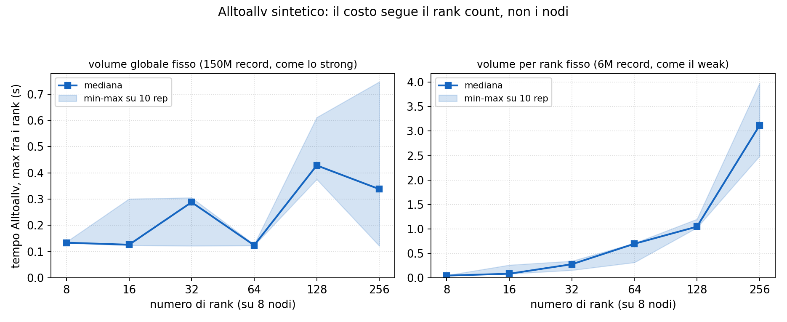
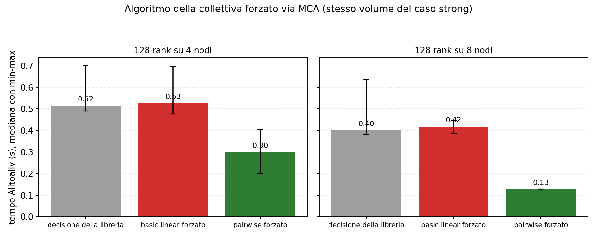
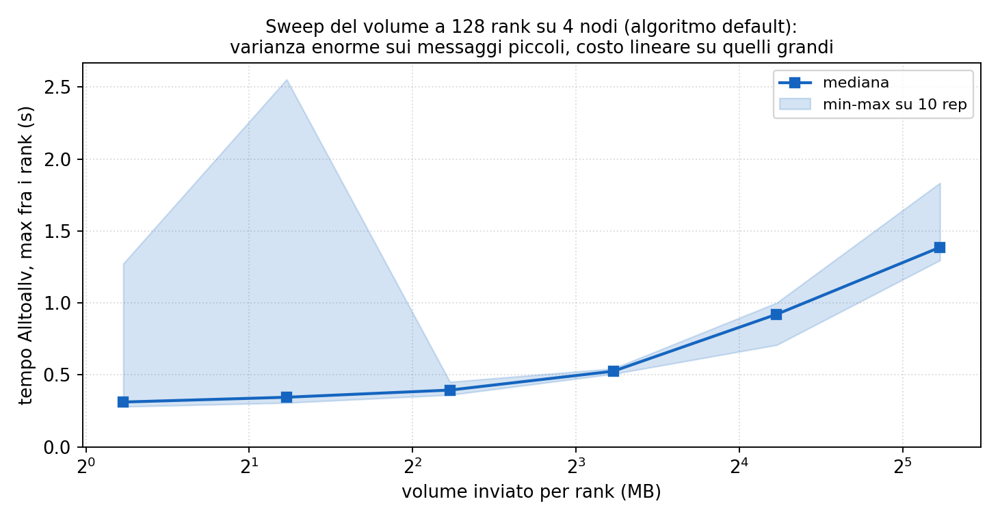

Microbenchmark (`common/alltoallv_bench.cpp`): solo lo scambio, buffer sintetici,
warm-up più 10 rep misurate con barrier e riduzione max. Tre risultati:

1. **Il dip è del rank count.** A volume globale fisso su 8 nodi: 64 rank 0.12 s,
   128 rank 0.43 s con metà dei dati per rank, 256 rank mediana 0.34 s ma spread
   0.12-0.75. Riprodotto senza join né generatore.
2. **Pairwise è la cura.** Forzando `coll_tuned_alltoallv_algorithm=2`: 0.30 contro
   0.52 s (4 nodi), 0.13 contro 0.40 s (8 nodi, stabile). La decisione automatica in
   questo regime si comporta come basic linear. Openmpi sceglie l'algoritmo con
   euristiche su taglia e participant count tarate su altri sistemi: qui sbaglia.
   Pairwise scambia in R-1 round strutturati (al passo k il rank r manda a r+k e riceve
   da r-k): niente incast, traffico bilanciato per round.
3. **La varianza vive sui messaggi piccoli.** Volume sweep a 128 rank: sotto ~4 MB per
   rank il rapporto max/min sale da 1.2x a 8.3x (a 2.34 MB: 0.31-2.55 s); sopra, il costo
   cresce col volume e le ripetizioni sono stabili.
4. **Pairwise arriva al tetto di banda, e questo chiude la questione dell'overlap.** A
   8 nodi porta i 128 rank a 0.128 s, cioè al livello dei 64 rank (0.124 s) e ai 114 ms
   predetti dal modello NIC dell'esp. 2; a 4 nodi si ferma a 0.300 s contro 196 ms
   predetti, perché lì 32 rank per nodo si contendono un link. Elimina la penalità dello
   scheduling, non quella della banda per nodo. Il corollario sulla scelta di Alltoallv
   contro Isend/Irecv (tetti dell'overlap, confronto fra ritorni) è in
   `01_alltoallv_anatomy/README.md`, ripreso in sez. 4.

### Esp. 2: Hockney misurato (`02_hockney/`)

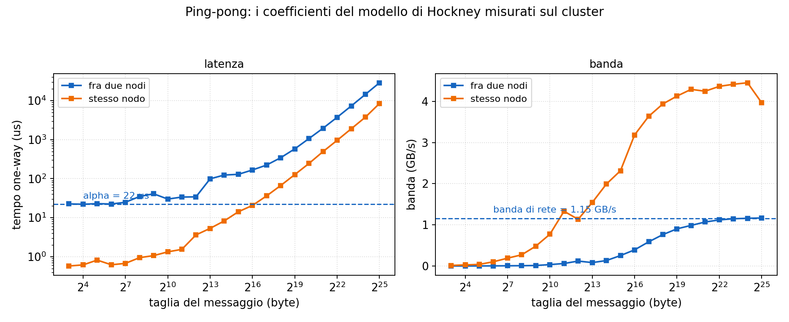
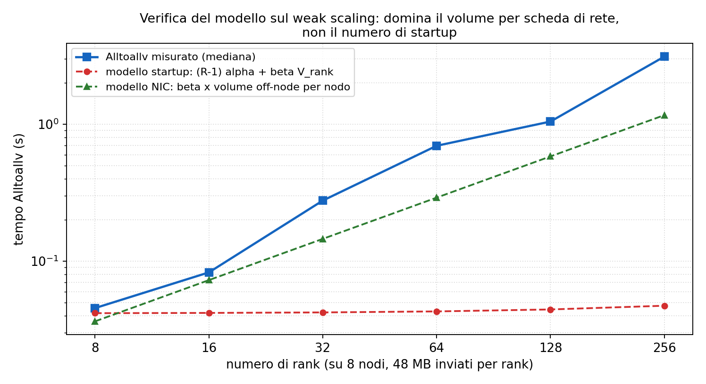

Ping-pong (`common/pingpong_bench.cpp`) fra 2 rank su nodi diversi e sullo stesso nodo,
8 B - 32 MB: alpha = 22.4 us, banda 1.15 GB/s inter-nodo (da 10 GbE); 0.6 us e 4.3 GB/s
intra-nodo. Verifica sul weak scaling dell'Alltoallv (dati esp. 1):

- Modello del report, (R-1) alpha + beta V_rank: piatto a ~48 ms, due ordini di
  grandezza sotto il misurato a 256 rank (3.1 s). Gli startup non sono il costo.
- Modello a volume per NIC, beta x (rpn x V_rank x quota off-node): segue la curva entro
  un fattore 1.1-2.7, sempre sotto il misurato (il resto è contesa/incast). A 8 rank
  (1 per nodo) predice 36 ms contro 45 misurati; a 256 rank 1.16 s contro 3.1 s. A basso
  rank count i due modelli quasi coincidono (36 contro 42 ms) perché domina il termine di
  banda: il modello del report si smonta solo salendo di rank, cioè nel regime in cui il
  report lo invoca.
- Take-away: il payload globale è lo stesso nelle due configurazioni, quindi l'ibrido non
  vince perché muove meno dati né perché fa meno startup. Vince perché a 1 rank per nodo
  un solo processo inietta traffico sulla NIC, mentre a 32 rank per nodo trentadue si
  contendono lo stesso link (32 x 48 MB x 7/8 = 1.3 GB per nodo su 1.15 GB/s). Il
  parametro di controllo è il numero di partecipanti alla collettiva.

**2.3 Prova per esclusione (`02_hockney/plots/weak_algo.png`).** Nello strong il collo è
l'algoritmo (esp. 7); se lo fosse anche nel weak, la tesi del volume per NIC cadrebbe.
Ripetendo il weak DEL REPORT (32 rank/nodo, nodi 1/2/4/8, 48 MB per rank) con ogni
algoritmo forzato. Nota il setup: qui rpn resta costante a 32 e a crescere è la quota
off-node, da 0 a 0.875.

| nodi | rank | quota off | default | basic linear | pairwise | tetto NIC | startup |
|---|---|---|---|---|---|---|---|
| 1 | 32  | 0.000 | 0.113 | **0.113** | 0.090 | 0 (intra) | 0.042 |
| 2 | 64  | 0.500 | 0.671 | 1.039 | **0.670** | **0.668** | 0.043 |
| 4 | 128 | 0.750 | 1.645 | **1.583** | 2.383 | 1.002 | 0.045 |
| 8 | 256 | 0.875 | 3.212 | 2.361 | **3.021** | 1.169 | 0.047 |

- **Il modello NIC azzecca il punto a 2 nodi**: predice 668 ms, misurato 671 (errore 0.4%),
  link saturo al 100%. Gli startup lì valgono 43 ms. Distribuzioni nettamente separate
  (default 0.670-0.673, pairwise 0.669-0.673, linear 0.911-1.105, CV 0%).
- **La libreria sceglie sul rank count e IGNORA la taglia del messaggio.** La scelta è
  identica nei due regimi a parità di rank (32 linear, 64 pairwise, 128 linear, 256
  pairwise) benché le taglie siano tutt'altre. Ed è il difetto: a 128 rank con messaggi da
  73 KB (strong) pairwise è 3.1x meglio e la libreria sceglie linear, SBAGLIANDO; con
  messaggi da 375 KB (weak) pairwise è 1.5x peggio e la libreria sceglie linear,
  INDOVINANDO. Stessa scelta, esiti opposti: nel weak indovina per caso.
- **Ma l'algoritmo non è il collo**: efficienza dell'Alltoallv (t_1nodo/t_N) 0.097 al tetto,
  0.035 col default, 0.048 col miglior algoritmo. Il crollo da 1.0 a 0.097 è strutturale
  (il gradino 1 -> 2 nodi: da zero traffico di rete a 768 MB per NIC). Il miglior algoritmo
  recupera un terzo della strada. Nello strong forzare pairwise portava il link dal 15%
  all'89%; qui non c'è nulla di paragonabile.
- Il modello startup resta piatto a 42-47 ms contro tutti e tre gli algoritmi: se fossero
  loro il collo, le tre curve sarebbero indistinguibili e piatte.

### Esp. 3: il continuum rank per nodo (`03_rankspernode/`)

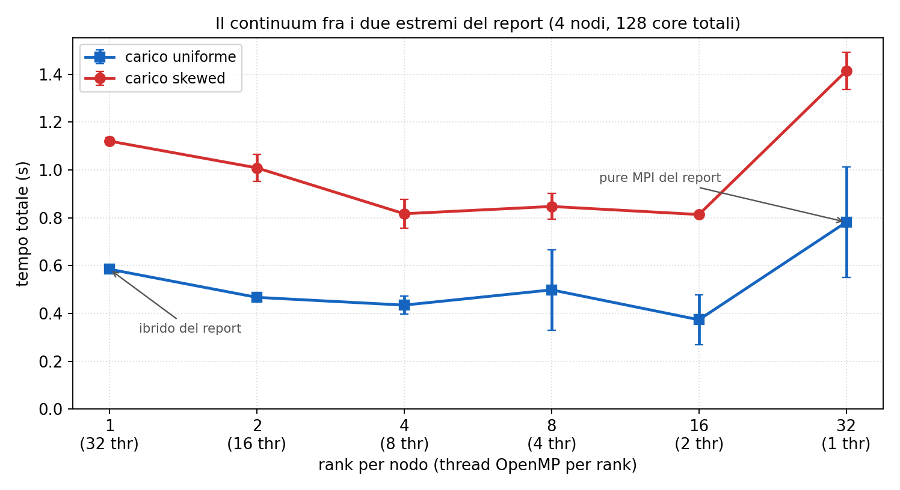
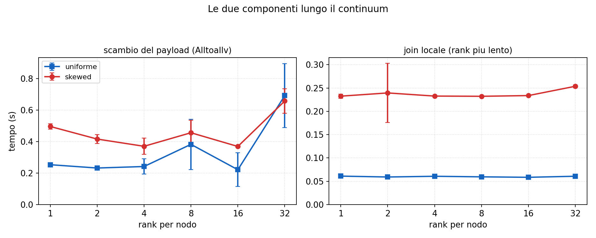

Driver `common/threadlevel_bench.cpp` (riusa `include/mpi_pipeline.hpp` consegnato,
livello FUNNELED): a 4 nodi, rank per nodo in {1,2,4,8,16,32} con thread complementari
(rpn x T = 32). Risultato: il minimo è in mezzo, non agli estremi.

- Uniforme: 16 rpn x 2 thread = 0.37 s contro 0.59 (1 rpn, l'ibrido del report) e 0.78
  (32 rpn, il pure MPI). Skewed: 4-16 rpn a 0.81-0.85 s contro 1.12 e 1.41.
- Meccanismo: lo scambio resta economico fino a 64 rank totali (la soglia critica è 128,
  esp. 1), e già 2-8 thread per rank bastano a parallelizzare le fasi locali. I due
  estremi pagano per intero uno dei due costi.
- Il join (max fra i rank) non dipende dalla configurazione: su skewed è 0.23-0.25 s
  ovunque, cioè l'imbalance non si cura spostando il confine rank/thread.
- 2 rank per nodo (uno per socket) era il candidato NUMA-naturale: è buono (0.47/1.01 s)
  ma non il migliore; il fattore dominante qui è il rank count della collettiva, non la
  località NUMA dentro il nodo.

### Esp. 4: imbalance e remapping (`04_remap_imbalance/`)

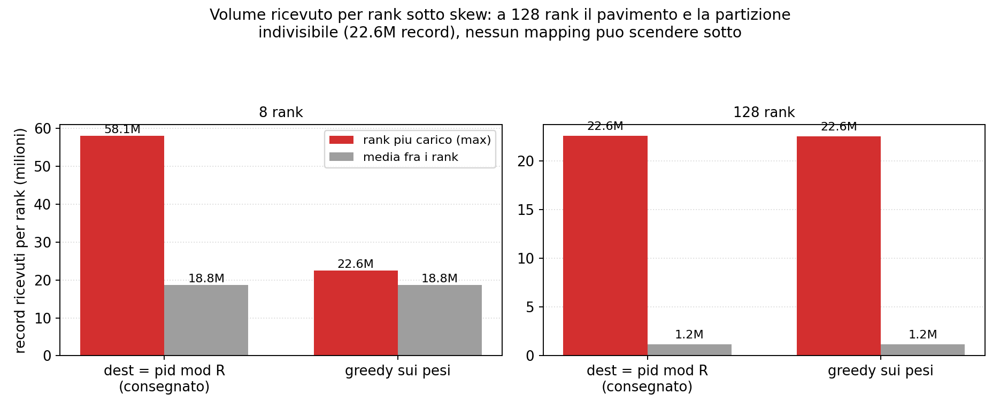
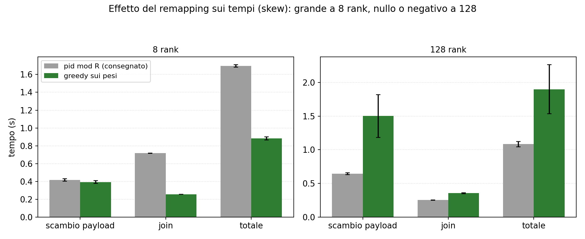
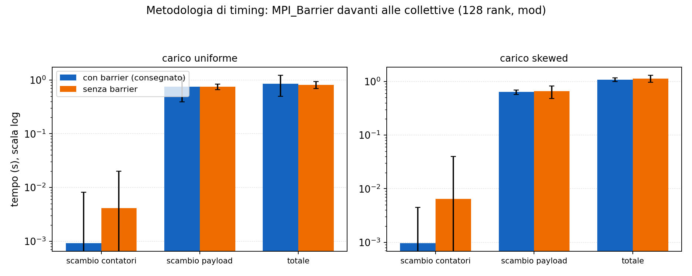

`common/mpi_remap.cpp`: pipeline pura MPI autonoma con mappa partizione-rank
parametrica (`-remap mod|greedy`) e barrier disattivabili (`-barrier 0`). Il greedy:
istogramma globale dei pesi per partizione (un Allreduce su P contatori, misurato
2-3 ms), ordinamento per peso decrescente, ogni partizione al rank più scarico
(LPT sui rank); il piano è deterministico e identico su tutti i rank.

- Imbalance misurato (la cifra che mancava al report): 128 rank skewed, recv_max 22.6M
  contro media 1.2M (19x). Il pavimento è la partizione hot di S (22.5M), indivisibile.
- A 8 rank il mod collide (58.1M sul rank peggiore) e il greedy ripara: totale da 1.70 a
  0.88 s, join del rank più carico da 717 a 256 ms. A 128 rank il greedy non può nulla
  sul pavimento e fa danno: totale +75% (1.08 -> 1.90 s), collettiva 2.3x (0.64 -> 1.50 s)
  per i send count irregolari, e anche il join +40% (253 -> 355 ms) a parità di recv_max,
  meccanismo non isolato dalla misura (dirlo come dato, non spiegarlo). Su uniforme le due
  mappe pareggiano (0.86 contro 0.89 s), come atteso con pesi già uniformi.
- Conclusione da difendere all'orale: il remapping è la risposta giusta alle COLLISIONI
  (pochi rank), non allo skew intrinseco (la partizione indivisibile), per il quale
  serve la replicazione del build side che il report discute e motiva di non aver fatto.
- Barrier on/off: totale entro il 5% (in entrambi i sensi: 0.814 contro 0.854 su uniforme,
  1.129 contro 1.080 su skew). Ma l'attesa non sparisce senza barrier, si concentra
  sull'ultima sincronizzazione globale: reduce_final da 0.24 a 208 ms (uniforme) e da 0.29
  a 433 ms (skew), mentre comm_sizes assorbe solo 3-6 ms. La metodologia del report regge,
  e la ragione è che i barrier attribuiscono l'attesa alla fase che la causa.

### Esp. 5: sensibilità a P (`05_p_sweep/`)

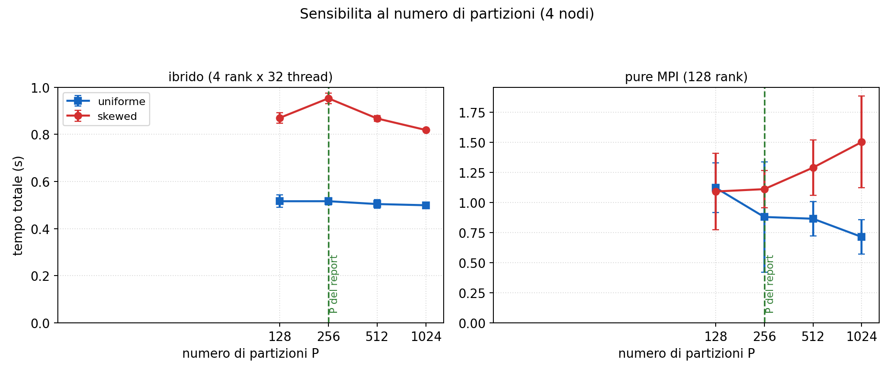

- Ibrido (4 rank x 32 thread): totale piatto su uniforme (0.50-0.52 s); il join scende
  da 74 a 40 ms alzando P a 1024 (tabelle in cache, stesso fenomeno dei moduli 2-3).
- Pure MPI (128 rank): su uniforme P=1024 vale 0.71 s contro 1.12 di P=128 (scambio più
  regolare e join in cache); su skewed oltre P=256 peggiora (1.50 s a P=1024:
  la collettiva paga i send count sbilanciati dello skew su più partizioni).
- P=256 del report: compromesso unico che rispetta P multiplo di 256 rank e non
  penalizza nessuna configurazione.

### Esp. 7: quale algoritmo sceglie la libreria (`07_decision_function/`)

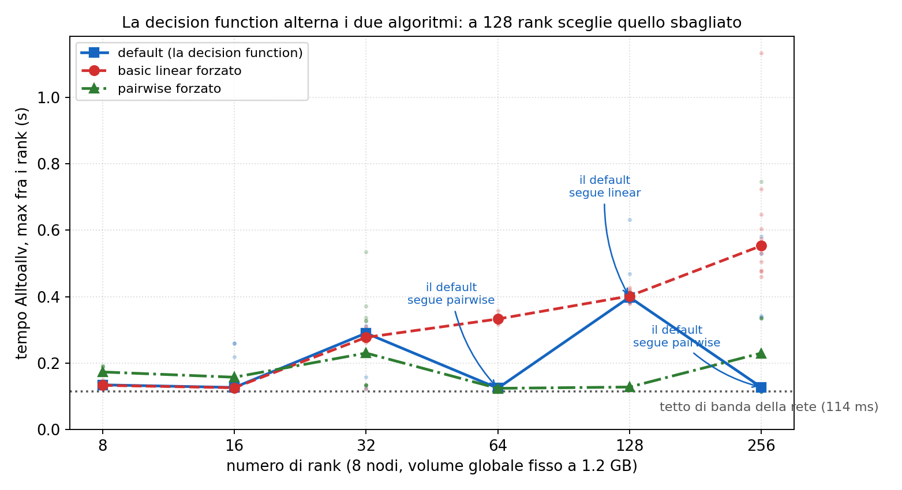
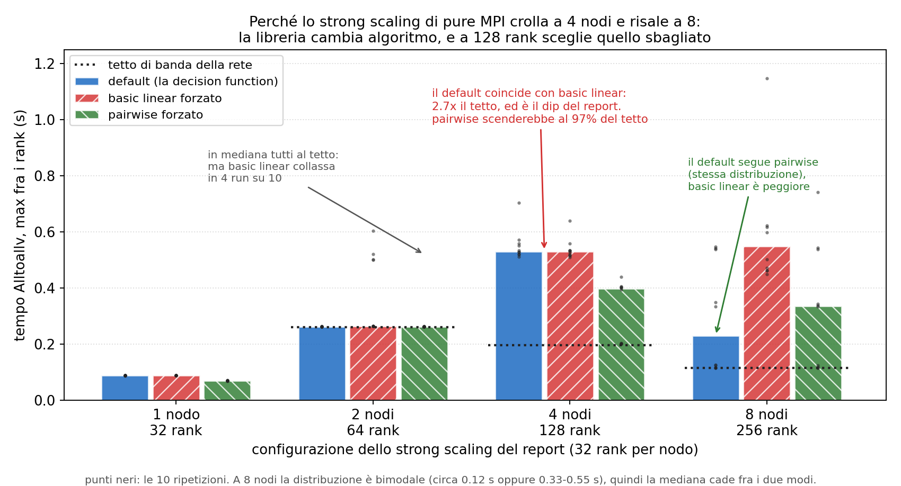

L'esp. 1 aveva forzato gli algoritmi solo a 128 rank, lasciando aperta la domanda: il default
degrada perché la decision function cambia scelta, o perché l'algoritmo che sceglie collassa? Qui
si forza ogni algoritmo a ogni rank count: dove il default coincide con un algoritmo forzato, è
quello che la libreria esegue. Il verbose interno non serve (questa build ha `Internal debug
support: no`), e l'inferenza dai tempi è più forte perché misura il comportamento.

**Cosa fanno i due algoritmi, e perché il vincitore cambia.** Realizzano lo stesso scambio: ogni
rank ha dati distinti per gli altri R-1, quindi invia R-1 messaggi e ne riceve R-1. Cambia solo
*quando*. `basic linear` posta le R-1 Isend e le R-1 Irecv tutte insieme e attende: più mittenti
convergono sullo stesso ricevente (incast), la coda della sua NIC si satura, TCP chiude la finestra
e attende, e il link resta inutilizzato. Il danno cresce con il fan-out concorrente, cioè con R.
`pairwise` esegue R-1 round e al passo k il rank r invia a `(r+k) mod R` e riceve da `(r-k) mod R`:
ogni round è una permutazione, un solo mittente per destinatario, nessun incast, ma paga R-1
sincronizzazioni. Conviene solo quando il costo dell'incast supera quello dei round: con messaggi
da 18 MB (8 rank) linear vince (0.133 contro 0.173), con 73 KB e 127 destinatari (128 rank)
pairwise vince di 3.1x (0.128 contro 0.402). È la stessa ragione per cui a 8/16 rank la euristica
sceglie linear e fa bene.

Sweep a 8 nodi (mediane, 10 rep):

| rank | default | basic linear | pairwise | chi esegue |
|---|---|---|---|---|
| 8   | 0.133 | **0.133** | 0.173 | linear (e fa bene) |
| 16  | 0.126 | **0.126** | 0.157 | linear (e fa bene) |
| 32  | 0.290 | **0.277** | 0.230 | linear |
| 64  | 0.123 | 0.333 | **0.123** | **pairwise** |
| 128 | 0.398 | **0.402** | 0.128 | **linear: sbaglia** |
| 256 | 0.127 | 0.553 | **0.230** | pairwise |

I quattro punti della curva del report (32 rank/nodo), che è ciò che spiega lo strong scaling:

| nodi | rank | default | linear | pairwise | tetto | chi esegue | link |
|---|---|---|---|---|---|---|---|
| 1 | 32  | 0.088 | **0.088** | 0.070 | n/a | linear | intra-nodo |
| 2 | 64  | 0.262 | 0.265 (4/10 collassano) | **0.262** | 261 ms | **pairwise** | 100% |
| 4 | 128 | 0.531 | **0.530** | 0.397 | 196 ms | **linear** | 37% |
| 8 | 256 | 0.230 | 0.550 | **0.336** | 114 ms | **pairwise** | 50% |

- `default` == `dyn_ignore` a ogni rank count: attivare le dynamic rules di per sé non cambia nulla,
  quindi ogni differenza è dell'algoritmo.
- **Il dip è un cambio di scelta, non un collasso**: a 2 nodi pairwise satura il link, a 4 nodi la
  libreria passa a basic linear e il link scende al 37%, a 8 nodi torna a pairwise. Il recupero
  4 -> 8 nodi (2.53x) = 1.71x (tetto che scende: 8 NIC invece di 4) x 1.48x (algoritmo che torna
  quello giusto).
- **A 8 e 16 rank la euristica ha ragione**: pairwise sarebbe più lento (0.173 contro 0.133), perché
  con messaggi da 18 MB i round serializzati non aiutano. Sbaglia a 128 rank, non in generale.
- Non spiegabile: la regola non è monotona (linear a 8/16/32, pairwise a 64, linear a 128, pairwise
  a 256) e la build non espone il verbose. C'è poi una bimodalità sovrapposta indipendente
  dall'algoritmo (a 4 nodi pairwise fa 0.201 in 4 run e 0.40 nelle altre 6; a 2 nodi CV 0%).

### Esp. 8: il confronto cross-module a parità di ottimizzazione (`08_crossmodule_fair/`)


Il report lascia due domande aperte: M3 ha due varianti (loop e task) e il confronto usa solo
la loop; e tutto gira a 32 thread, cioè su CPU logiche, mentre il nodo ha 16 core fisici.

| carico | T | loop | task | vince | speedup migliore |
|---|---|---|---|---|---|
| uniform | 16 | **0.3750** | 0.4040 | loop 1.08x | **11.9x** |
| uniform | 32 | **0.4415** | 0.4470 | loop 1.01x | 10.1x |
| skewed | 16 | **0.3666** | 0.3671 | pari | **6.3x** |
| skewed | 32 | **0.3751** | 0.4900 | loop 1.31x | 6.1x |

- **La task non serve a questi parametri**: a NR=10M e P=128 batteva la loop su skewed (1.31x a
  32 thread), a NR=50M e P=256 il vantaggio sparisce. Con 256 partizioni il `schedule(dynamic)`
  ha già grana sufficiente e il task-based paga solo l'overhead. La scelta del report è corretta.
- **L'hyper-threading costa il 18% a M3 su uniforme** (0.375 a 16 thread contro 0.442 a 32): due
  thread per core si contendono le porte di load/store, e su un kernel memory-bound non c'è
  latenza da nascondere. Il report cita M3 uniforme a 32 (peggiore) e M3 skewed a 16 (migliore).
- **A parità di ottimizzazione otto nodi comprano il 2.5%, non il 20%.** La conclusione del
  report esce rafforzata.
- **M4 non paga l'HT** (1.01-1.07x, ibrido a 16 contro 32 thread su 1 e 8 nodi): meccanismo non
  isolato; ipotesi, le sue fasi restano latency-bound (a 8 nodi il working set per thread è 1/8
  di quello di M3; a 1 nodo lo scatter_local lavora su 1.2 GB e paga TLB miss).
- Non misurato: il pure MPI a 16 rank per nodo (a 8 nodi darebbe 128 rank, cioè il dip dell'esp. 7,
  quindi non isolerebbe l'HT dall'algoritmo della collettiva).

### Esp. 6: FUNNELED vs MULTIPLE (`06_threadlevel/`)

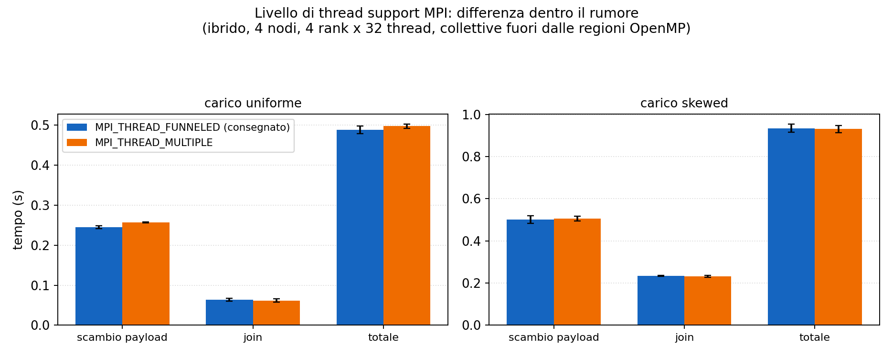

Stessa pipeline, livello richiesto a runtime (`-threadlevel`), livello fornito
verificato nell'output (funneled/multiple). Differenze dentro il rumore su entrambi i
carichi. Vedi sez. 1 per la formulazione onesta.

---

## 4. Deep dive: MPI nel codice

**Layout dest-major.** `dest_major_pid(pid) = dest * P_per_rank + lp` con
`dest = pid % R`, `lp = pid / R`: una permutazione di [0, P) che rende il buffer di
invio contiguo per destinatario, requisito di `MPI_Alltoallv` (un blocco per rank,
descritto da counts e displacements). Il vincolo `P mod R = 0` mantiene lo stesso numero
di partizioni per rank.

**Perché due histogram e due scatter (pre e post)?** Il primo passaggio ordina per
DESTINATARIO (per lo scambio); dopo lo scambio i record di un rank arrivano mescolati
fra le sue P/R partizioni, e il kernel del join vuole il layout per-partizione: serve un
secondo histogram+scatter sul buffer ricevuto (chiave -> pid -> lp = pid / R). È il
prezzo del riuso del kernel M3 senza modifiche.

**Perché Alltoallv e non Isend/Irecv con overlap?** Il tetto dell'overlap è il lavoro
post-scambio sovrapponibile (hist_post + scatter_post + join), perché il risparmio non può
eccedere min(T_scambio, W_post): a 4 nodi 93 ms su 1.305 s (pure MPI, 7.1%) e 116 ms su
0.612 s (ibrido, 19.0%). Il costo: spezzare la collettiva in scambi per-partizione,
rifacendo a mano lo scheduling interno dell'implementazione tuned, che l'esp. 1 quantifica
in un fattore fino a 3x. Due precisazioni che il report non fa:

- Il 7-19% è il range del solo carico UNIFORME. Sotto skew il tetto sale al 44.8% (pure
  MPI: W_post 0.686 s contro payload 0.755 s) e al 25.5% (ibrido), perché i rank hot
  rifanno histogram e scatter su 20x i record medi. La giustificazione del report vale per
  l'uniforme.
- Con pairwise il tetto NON si riduce: W_post non dipende dall'algoritmo della collettiva
  (restano 93 ms), e in percentuale il tetto sale perché cala il denominatore (proiettando
  il rapporto 1.7x del sintetico: 93/826 = 11.3% contro 7.1%).

L'argomento giusto è un confronto fra ritorni: pairwise compra ~480 ms con una variabile
d'ambiente, l'overlap al massimo 93 ms riscrivendo la redistribuzione e rischiando il 3x
dello scheduling. Non ho ristrutturato per il minore dei due, e il rimedio giusto al dip
non era l'overlap ma un parametro MCA. Analisi completa in `01_alltoallv_anatomy/README.md`
("Corollario").

**Allreduce finale.** Tre uint64 per rank, riduzione ad albero in O(log R) round:
sotto il millisecondo sempre (misurato 1-6 ms includendo il barrier di allineamento).

**Generazione per fette.** Uniforme: skip-ahead O(1) (stato = seed + GOLDEN*offset),
nessuno scatter iniziale, nessun nodo tiene mai l'intera relazione. Skewed: rigenerazione
completa e taglio della fetta (rejection sampling delle hot key rende l'offset ignoto),
fuori dalla regione misurata; costa memoria e tempo di setup, non tempo misurato.

---

## 5. Onestà: le sfumature dove conviene essere precisi

1. **Il modello di Hockney del report ha il termine sbagliato in evidenza.** Con i
   coefficienti misurati gli startup valgono millisecondi, non secondi: a dominare è il
   volume per NIC (che cresce con i rank per nodo) più la contesa. La conclusione non
   cambia, il meccanismo sì.
2. **Il dip a 128 rank aveva una cura da un parametro:** pairwise forzato (3x più veloce
   e stabile a 8 nodi). Il report ha provato solo basic linear; dirlo come "diagnosi
   parziale, esplorazione incompleta". L'esp. 7 chiude il punto e corregge DUE
   affermazioni del report: (a) la varianza NON viene dalla selezione dell'algoritmo,
   perché a 128 rank la scelta è fissa (basic linear su 10 rep su 10, CV 4%), e un
   algoritmo fisso non produce varianza da selezione; (b) il costo NON è il "128-way
   fan-out", perché il fan-out semantico è identico nei due algoritmi e con pairwise gli
   stessi 128 rank scendono al tetto di banda. A costare è il fan-out CONCORRENTE (quanti
   flussi si contendono la NIC insieme: 127 con basic linear, 1 con pairwise), che è un
   parametro dell'algoritmo, non del problema.
3. **Gli estremi del report non sono l'ottimo:** a 4 nodi la configurazione migliore è
   16 rank x 2 thread (0.37 contro 0.59 s dell'ibrido su uniforme). Il report confronta
   i due modelli canonici; il continuum mostra che il vero parametro è il rank count
   totale della collettiva.
4. **Il remapping "possibile lavoro futuro" ora ha numeri:** utile solo contro le
   collisioni a basso rank count; a 128 rank è addirittura dannoso (totale +75%). La
   replicazione del build side resta l'unica via oltre il pavimento, come il report
   sostiene.
5. **MULTIPLE non costa nulla di misurabile qui.** L'argomento "locking overhead" è
   potenziale, non misurato: formularlo come igiene del contratto di concorrenza.
6. **Le partizioni hot sono fino a 8 (4 di R + 4 di S), non 4.** Il report parla di
   "four hot keys" per relazione; ai fini del floor conta la più pesante (hot di S,
   22.5M record = 15% dell'input globale).
7. **I barrier: il meccanismo non è quello che si direbbe.** Senza barrier l'attesa non si
   redistribuisce fra le fasi, si accumula sull'Allreduce finale (da 0.24 a 208 ms su
   uniforme, da 0.29 a 433 ms su skew). Il totale resta entro il 5%, quindi la
   metodologia del report tiene, ma la ragione da dare è l'attribuzione del costo alla
   fase che lo causa, non "comm_sizes assorbe lo skew di arrivo".

---

## 6. Cheat-sheet orale M4 (numeri da ricordare)

- Nodi: E5-2640 v2, 32 CPU logiche, 10 GbE (misurato: alpha 22 us, banda 1.15 GB/s
  inter-nodo; 4.3 GB/s intra). Input 1.2 GB: NR=50M, NS=100M, P=256, max_key=25M.
- Baseline seq: 4.48 s uniforme, 2.30 s skewed (località scatter 3.4x, tabelle hot in cache).
- Strong uniforme: ibrido 2.8x -> 12.0x (1 -> 8 nodi); pure MPI 6.9x, 7.6x, 3.0x, 7.1x.
  Dip a 128 rank: comm_payload 0.09/0.29/1.35/0.53 s. Sintetico: 64 rank 0.12 s,
  128 rank 0.43 s. Pairwise forzato: 0.13 s a 8 nodi (3x sul default, stabile).
- **Perché la curva ha quella forma** (esp. 7): pure MPI accoppia rank e nodi (32 rank/nodo),
  e la libreria cambia algoritmo. 1 nodo: tutto intra-nodo, 32 processi copiano in
  parallelo (0.092 s). 2 nodi/64 rank: sceglie pairwise, link al 100% del tetto (0.262 vs
  261 ms) -> 7.6x. 4 nodi/128 rank: sceglie basic linear, link al 37% -> crollo a 3.0x.
  8 nodi/256 rank: torna a pairwise -> risale a 7.1x. Recupero 4->8 = 1.71x (tetto scende:
  8 NIC invece di 4) x 1.48x (algoritmo giusto) = 2.53x, quanto misurato.
- Tetto di banda (volume off-node per nodo / 1.15 GB/s): 2 nodi 261 ms, 4 nodi 196, 8 nodi
  114. Utilizzo del link: 91% a 64 rank, 15% a 128 (4 nodi), 22% a 256, 89% con pairwise
  a 128. A 128 rank il link è fermo per l'85%: non è saturazione, è sotto-utilizzo.
- Ibrido a 1 nodo (1.613 s contro 0.653): NON è OpenMP a rendere meno. Join 1.04x,
  histogram_post 1.05x, scatter_post 1.13x: equivalenti. Il ritardo è in due fasi sole,
  comm_payload (3.99x: self-copy del solo main thread, FUNNELED, 1.2 GB a 3.3 GB/s contro
  i 32 processi paralleli a 13 GB/s) e scatter_local (3.66x: con R=1 il buffer per rank è
  1.2 GB invece di 37 MB; nodo a 2.5 GB/s contro 9.2). Il payload dell'ibrido DECRESCE
  (0.367 -> 0.183) ma non è trascurabile: 44-49% del totale a 4-8 nodi.
- Weak: ibrido 0.58, pure 0.21 a 8 nodi; payload ibrido 15 -> 52 ms, pure 0.12 -> 3.17 s.
  Startup (R-1) alpha = 5.6 ms a 256 rank: non spiegano; volume per NIC sì.
- Continuum (4 nodi): migliore 16 rpn x 2 thr = 0.37 s (uniforme); estremi 0.59 e 0.78 s.
  Skew: 4-16 rpn ~0.82 s contro 1.12 / 1.41.
- Skew floor: recv_max 22.6M vs media 1.2M (19x) a 128 rank; a 8 rank mod collide (58M),
  greedy ripara (totale 1.70 -> 0.88 s); a 128 rank greedy fa danno: totale +75%
  (1.08 -> 1.90 s), collettiva 2.3x, join +40%.
- Barrier off: totale entro il 5%, ma reduce_final da 0.24 a 208 ms (uniforme) e da 0.29 a
  433 ms (skew): l'attesa si sposta sull'ultima collettiva, non sparisce.
- Ibrido: prima iterazione 6.25 s a 1 nodo (Amdahl), tutte le fasi parallele 1.61 s;
  Alltoallv 256 -> 8 rank: 0.53 -> 0.18 s.
- Cross-module: uniforme M3 1 nodo 10.1x vs M4 8 nodi 12.0x; skew M3 6.2x vs M4 2.5x.
  Distribuzione = capacità, non velocità, su questo input.
- Validazione: 46 configurazioni PASS; naive O(N²) indipendente sui piccoli; vincolo
  P >= R; skip-ahead splitmix64 (stato += GOLDEN per estrazione).
