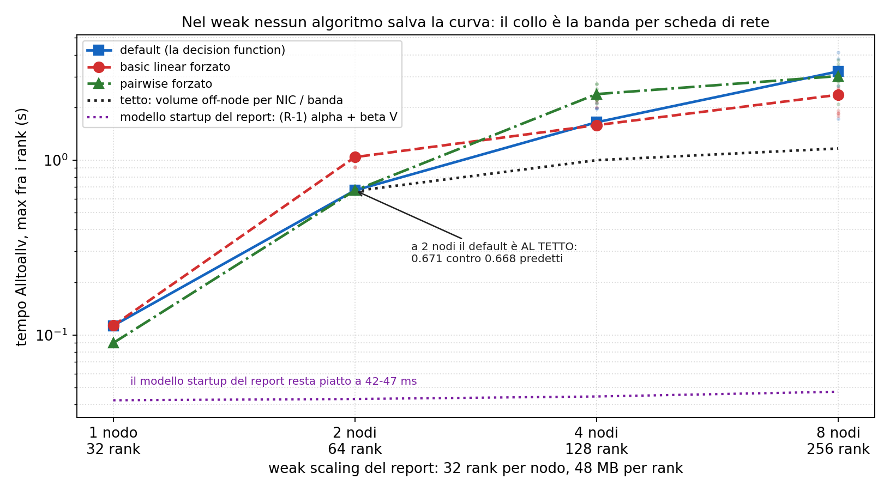

# Modulo 4: esperimenti aggiuntivi

Esperimenti a supporto del report del Modulo 4 (partitioned hash join distribuito, MPI e MPI+OpenMP). Per ciascuno il grafico e i punti principali. Misure sui nodi Ivy Bridge del cluster (Xeon E5-2640 v2, 32 CPU logiche, 2 nodi NUMA per nodo), gli stessi del report, con job SLURM esclusivi fino a 8 nodi. Parametri del report dove applicabile: NR=50M, NS=100M, P=256, seed 42, max_key=25M.

| Esperimento | Riferimento nel report |
|---|---|
| Esp. 1: anatomia di MPI_Alltoallv | Sez. 4.2, il dip a 128 rank e la varianza |
| Esp. 2: modello di Hockney misurato | Sez. 4.3, weak scaling e termine di startup |
| Esp. 3: continuum rank per nodo | Sez. 4-5, pure MPI vs hybrid |
| Esp. 4: imbalance e remapping sotto skew | Sez. 4.5, hard floor e partition-aware remapping |
| Esp. 5: sensibilità a P | Sez. 4.1, scelta P=256 |
| Esp. 6: livello di thread support | Sez. 6, FUNNELED vs MULTIPLE |
| Esp. 7: quale algoritmo sceglie la libreria | Sez. 4.2, la forma della curva di strong scaling |
| Esp. 8: cross-module a parità di ottimizzazione | Sez. 5.1, il confronto con M2 e M3 |

## Esp. 1: anatomia di MPI_Alltoallv

- Il microbenchmark ripete il solo scambio Alltoallv della pipeline con buffer sintetici (barrier, timer, riduzione max; 10 ripetizioni, banda min-max nel grafico).
- A volume globale fisso (pannello sinistro, la forma dello strong scaling) il costo non è monotono nel rank count: 64 rank su 8 nodi scambiano in 0.12 s, 128 rank in 0.43 s con metà dei dati per rank; a 256 rank la mediana scende ma la dispersione esplode (0.12-0.75 s).
- Il dip del report a 4 nodi / 128 rank è quindi una proprietà della collettiva a quel rank count, riprodotta qui senza join, senza generatore e su un set di nodi fisso.
- A volume per rank fisso (pannello destro, la forma del weak scaling) il costo cresce di 69 volte da 8 a 256 rank: la controparte sintetica dei 0.12 s -> 3.17 s della pipeline.

## Esp. 1: anatomia di MPI_Alltoallv

- Il report mostra che forzare basic linear rende lo scambio stabile ma uniformemente lento; qui il confronto include pairwise, l'altro algoritmo di coll tuned per Alltoallv.
- Pairwise forzato batte la decisione della libreria di un fattore 1.7 a 4 nodi (0.30 contro 0.52 s) e di un fattore 3.1 a 8 nodi (0.13 contro 0.40 s), con varianza quasi nulla a 8 nodi.
- La decisione automatica della libreria in questo regime coincide di fatto con basic linear (0.52 e 0.53 s a 4 nodi) ed è quella sbagliata: un singolo parametro MCA (`coll_tuned_alltoallv_algorithm=2`) avrebbe rimosso gran parte del dip osservato nello strong scaling.
- Pairwise elimina la penalità dello scheduling, non quella della banda per nodo: a 8 nodi porta i 128 rank a 0.13 s, cioè al livello dei 64 rank (0.12 s) e al tetto di banda della NIC (114 ms predetti dal modello dell'esp. 2); a 4 nodi si ferma a 0.30 s perché lì 32 rank per nodo si contendono un solo link (196 ms predetti) e nessun algoritmo può scendere sotto.
- Ricaduta sulla scelta di Alltoallv contro Isend/Irecv con overlap: lo scheduling della collettiva vale fino a 3.1x ed è ciò che andrebbe rifatto a mano spezzandola per partizione, mentre il tetto dell'overlap è il solo lavoro post-scambio (93 ms su 1.305 s, il 7.1%, per pure MPI uniforme a 4 nodi; 44.8% sotto skew, dove W_post cresce). Pairwise compra circa 480 ms con una variabile d'ambiente, l'overlap al massimo 93 ms riscrivendo la redistribuzione: il rimedio giusto al dip era il parametro, non la ristrutturazione.

## Esp. 1: anatomia di MPI_Alltoallv

- A parità di 128 rank il costo mediano cresce con il volume (0.31 -> 1.39 s per 1.2 -> 37.5 MB per rank), ma in modo molto meno che proporzionale nella parte bassa: il costo fisso della sincronizzazione a 128 partecipanti domina i messaggi piccoli.
- La varianza run-to-run è massima proprio sui volumi piccoli (min-max da 0.31 a 2.55 s a 2.3 MB per rank, cioè max/min 8.3x contro 1.2x a 4.7 MB): il regime instabile osservato nel report vive dove i messaggi per coppia sono piccoli e il fan-out è alto.

## Esp. 7: quale algoritmo sceglie la libreria

- **I due algoritmi.** Entrambi realizzano lo stesso scambio: ogni rank ha dati distinti per gli altri R-1, quindi manda R-1 messaggi e ne riceve R-1. Cambia *quando*. `basic linear` posta le R-1 Isend e le R-1 Irecv tutte insieme e attende; `pairwise` esegue R-1 round e al passo k il rank r invia a `(r+k) mod R` e riceve da `(r-k) mod R`, quindi ogni round è una permutazione: un solo mittente per destinatario.
- **Perché il vincitore cambia.** Con basic linear più mittenti convergono sullo stesso ricevente (incast): la coda della sua scheda di rete si satura, TCP riduce la finestra e attende, e il link resta inutilizzato. Il danno cresce col fan-out concorrente, cioè con R. Pairwise ordina il traffico e non produce incast, ma paga R-1 sincronizzazioni: conviene solo quando il costo dell'incast supera quello dei round. Con messaggi da 18 MB (8 rank) i round costano più di quanto rendano e linear vince (0.133 contro 0.173); con messaggi da 73 KB e 127 destinatari (128 rank) l'incast domina e pairwise vince di 3.1x (0.128 contro 0.402).
- L'esp. 1 forzava gli algoritmi solo a 128 rank. Qui a ogni rank count: il default coincide con basic linear a 8, 16, 32 e 128 rank, e con pairwise a 64 e 256. La libreria alterna i due, e a 128 rank sceglie quello sbagliato.
- Attivare le dynamic rules di per sé non cambia nulla (`default` e `dyn_ignore` coincidono ovunque): ogni differenza è attribuibile all'algoritmo. La regola però non è monotona né nel rank count né nella taglia del messaggio, e la build ha `Internal debug support: no`: resta una misura, non una spiegazione.

## Esp. 7: quale algoritmo sceglie la libreria

- I quattro punti del report (32 rank/nodo) spiegano la forma della curva di speedup: a 2 nodi la libreria sceglie pairwise e satura il link (0.262 contro 261 ms di tetto, 100%); a 4 nodi passa a basic linear e il link scende al 37%, ed è il dip; a 8 nodi torna a pairwise e lo speedup risale.
- Il recupero da 4 a 8 nodi (2.53x sul payload) si scompone in due fattori esatti: 1.71x perché il traffico si divide su 8 schede di rete invece di 4 (tetto da 196 a 114 ms) e 1.48x perché l'algoritmo torna a essere pairwise.
- Ricaduta sul report: la varianza non viene dalla selezione dell'algoritmo (a 128 rank la scelta è fissa, basic linear su 10 rep su 10) e il costo non è il fan-out a 128 vie (identico nei due algoritmi: con pairwise gli stessi rank scendono al tetto). A costare è il fan-out concorrente, cioè quanti flussi si contendono la NIC insieme.

## Esp. 2: modello di Hockney misurato

- Il report usa il modello di Hockney (alpha + beta m) senza coefficienti misurati; il ping-pong li fornisce: alpha = 22 us e banda asintotica 1.15 GB/s fra nodi diversi (compatibile con 10 Gb Ethernet), 0.6 us e 4.3 GB/s dentro il nodo.
- Il rapporto fra le due bande (circa 4x) e fra le due latenze (circa 37x) quantifica quanto lo scambio intra-nodo sia più economico: è la ragione per cui conta soprattutto il volume che attraversa la scheda di rete.

## Esp. 2: modello di Hockney misurato

- Con i coefficienti misurati, il termine di startup del report vale (R-1) x 22 us = 5.6 ms a 256 rank: due ordini di grandezza sotto i 3.1 s misurati. Il modello a startup non spiega la crescita.
- Un modello a volume per scheda di rete (beta x volume off-node per nodo, che cresce con i rank per nodo) segue la curva misurata entro un fattore 2-3 su tutto il range: la crescita del weak scaling di pure MPI viene dal fatto che 32 rank per nodo iniettano 32 volte più traffico per NIC, non dal numero di message startup.
- La conclusione del report (l'ibrido vince perché tiene basso il numero di partecipanti) resta valida, ma il meccanismo quantitativo corretto è il volume per NIC più la contesa, non il termine (R-1) alpha.

## Esp. 2.3: nessun algoritmo salva il weak scaling

- Nello strong il collo è l'algoritmo (esp. 7). Se lo fosse anche nel weak, la tesi del volume per NIC cadrebbe: qui si ripete il weak del report (32 rank per nodo, nodi 1/2/4/8, 48 MB per rank) forzando ogni algoritmo. Nel weak del report i rank per nodo restano costanti a 32 e a crescere è la quota di traffico che esce dal nodo, da 0 a 0.875.
- Il modello per NIC azzecca il punto a 2 nodi: predice 668 ms, misurato 671, errore dello 0.4%, con il link saturo al 100%. Gli startup lì valgono 43 ms.
- La libreria sceglie sul rank count e ignora la taglia del messaggio: la scelta è identica nei due regimi a parità di rank (32 linear, 64 pairwise, 128 linear, 256 pairwise) benché le taglie siano tutt'altre. Ed è il difetto, perché l'ottimo dipende dalla taglia: a 128 rank con messaggi da 73 KB (strong) pairwise è 3.1x meglio e la libreria sceglie linear sbagliando; con messaggi da 375 KB (weak) pairwise è 1.5x peggio e la stessa scelta indovina, per caso.
- Ma l'algoritmo non è il collo: l'efficienza dell'Alltoallv (t_1nodo/t_N) vale 0.097 al tetto, 0.035 col default e 0.048 col miglior algoritmo. Il crollo da 1.0 a 0.097 è strutturale, cioè il gradino fra 1 nodo (zero traffico di rete) e 2 nodi (768 MB per scheda). Il miglior algoritmo possibile recupera solo un terzo della strada: è la prova per esclusione che il collo è la banda per scheda di rete.
- Il modello startup del report resta piatto a 42-47 ms contro tutti e tre gli algoritmi: nessuna scelta cambia il numero di startup, quindi se fossero loro il collo le tre curve sarebbero indistinguibili e piatte.

## Esp. 3: continuum rank per nodo

- Il report confronta solo gli estremi: 32 rank/nodo (pure MPI) e 1 rank/nodo (hybrid). Qui il continuum a parità di 128 core: rank per nodo in {1, 2, 4, 8, 16, 32} con thread OpenMP complementari.
- Il minimo non è a nessuno dei due estremi: su uniforme la configurazione migliore è 16 rank x 2 thread (0.37 s contro 0.59 dell'ibrido e 0.78 del pure MPI); su skewed le configurazioni da 4 a 16 rank/nodo stanno a 0.81-0.85 s contro 1.12 e 1.41 degli estremi.
- La lettura: bastano pochi thread per parallelizzare le fasi locali dentro il rank, e fermarsi a 64 rank totali evita il regime instabile della collettiva a 128; gli estremi pagano ciascuno uno dei due costi per intero.

## Esp. 3: continuum rank per nodo

- Lo scambio del payload è piatto fino a 16 rank/nodo (64 rank totali) e salta a 32 rank/nodo (128 rank totali, 0.66-0.69 s): è la stessa soglia del microbenchmark dell'esp. 1, che si manifesta dentro la pipeline.
- Il join locale (max fra i rank) è indipendente dalla configurazione su uniforme (0.06 s) e dominato dalle partizioni hot su skewed (0.23-0.25 s ovunque): conferma che l'imbalance sotto skew non si sposta cambiando la ripartizione rank/thread.

## Esp. 4: imbalance e remapping sotto skew

- Il numero che il report cita senza quantificare: sotto skew a 128 rank il rank più carico riceve 22.6M record contro una media di 1.2M (rapporto 19x). È il pavimento strutturale: la partizione hot più pesante è indivisibile e da sola vale il 15% dell'input globale (R e S hanno hot key diverse, generate da seed diversi, quindi le partizioni hot sono fino a 8: le 4 di S pesano 22.5M l'una, le 4 di R 11.3M).
- A 8 rank il mapping mod soffre di collisioni: più partizioni hot cadono sullo stesso rank (58.1M ricevuti, circa due hot di S più una di R). Il remapping greedy dai pesi globali le separa e riporta il massimo al pavimento di 22.6M.

## Esp. 4: imbalance e remapping sotto skew

- A 8 rank il greedy dimezza il totale (0.88 contro 1.70 s) tagliando il join del rank più carico da 0.72 a 0.26 s: quando l'imbalance è da collisione, il remapping consapevole dei pesi lo rimuove al costo di un Allreduce da 2-3 ms sull'istogramma globale.
- A 128 rank il greedy non recupera nulla sul pavimento (la partizione indivisibile) e peggiora lo scambio (1.50 contro 0.64 s): i send count non più regolari degradano la collettiva. Il totale peggiora del 75%, e anche il join del 40% (0.36 contro 0.25 s) a parità di recv_max, per un meccanismo che questa misura non isola.
- Questo è esattamente il confine dichiarato nel report: oltre il pavimento della partizione indivisibile serve la replicazione del build side con split del probe, non un mapping migliore.

## Esp. 4: imbalance e remapping sotto skew

- Senza i barrier il totale cambia meno del 5% (0.81 contro 0.85 s su uniforme, 1.13 contro 1.08 su skew), ma lo skew di arrivo non sparisce: si accumula quasi tutto sull'ultima sincronizzazione globale, l'Allreduce finale, che passa da 0.24 a 208 ms su uniforme e da 0.29 a 433 ms su skew. Lo scambio dei contatori ne assorbe solo 3-6 ms, e il payload resta dominato dal proprio costo.
- La scelta metodologica del report (barrier prima di ogni collettiva, riduzione max per fase) è quindi difendibile, ma per la ragione giusta: attribuisce l'attesa alla fase che la causa invece di scaricarla sulla collettiva finale, e il suo effetto sul totale è marginale a questi volumi.

## Esp. 5: sensibilità a P

- Vincolo strutturale: P deve essere multiplo dei rank, quindi il pure MPI a 128 rank ammette solo P da 128 in su.
- Ibrido: P conta poco sul totale (0.50-0.52 s su uniforme); il join migliora con P (le tabelle per partizione rientrano in cache, da 74 a 40 ms) ma lo scambio non cambia.
- Pure MPI su uniforme: P=1024 è nettamente meglio di P=128 (0.71 contro 1.12 s), sia per il join sia per lo scambio (send count più regolari). Su skewed l'ordine si inverte oltre P=256.
- P=256 del report è una scelta di mezzo ragionevole per coprire entrambe le implementazioni e i due carichi con un solo valore.

## Esp. 6: livello di thread support

- La stessa pipeline ibrida (4 rank x 32 thread) inizializzata con i due livelli: la differenza su ogni fase e sul totale è dentro il rumore (0.49 contro 0.50 s su uniforme).
- In questo codice tutte le chiamate MPI avvengono fuori dalle regioni OpenMP, quindi il locking aggiuntivo di MULTIPLE non viene mai esercitato sul percorso caldo.
- La scelta di FUNNELED resta corretta come principio (chiedere il livello minimo necessario documenta il contratto di concorrenza), ma l'argomento di costo va formulato come potenziale, non come overhead misurato.

## Esp. 8: il confronto cross-module a parità di ottimizzazione

- Il confronto del report è a parità vera: M2 e M3 sono stati rigirati ai parametri di M4 (NR=50M, P=256, max_key=25M) sulla stessa macchina e contro la stessa baseline, e il `join_count` identico prova che calcolano la stessa cosa. Restano due domande: M3 ha due varianti (loop e task) e il confronto usa solo la loop; e tutto gira a 32 thread, mentre il nodo ha 16 core fisici e 32 CPU logiche.
- La variante task non serve a questi parametri: batteva la loop su skewed a NR=10M e P=128 (1.31x a 32 thread), ma a NR=50M e P=256 il vantaggio sparisce (pari a 16 thread, loop meglio di 1.31x a 32). Con 256 partizioni lo `schedule(dynamic)` ha già grana sufficiente e il task-based paga solo l'overhead di creazione. La scelta del report è corretta.
- L'hyper-threading costa a M3 il 18% su uniforme (0.375 s a 16 thread contro 0.442 a 32): due thread per core si contendono le porte di load/store, e su un kernel memory-bound non c'è latenza da nascondere. Il report cita però M3 uniforme a 32 thread (la sua configurazione peggiore) e M3 skewed a 16 (la migliore).

## Esp. 8: il confronto cross-module a parità di ottimizzazione

- A parità di ottimizzazione otto nodi comprano il **2.5%** su un singolo nodo (12.2x contro 11.9x), non il 20% dichiarato dal report (12.2x contro 10.1x): la differenza è tutta nel fatto che il report confronta il migliore di M4 con una configurazione non ottimale di M3.
- La conclusione del report ("la distribuzione si giustifica per capacità, non per velocità") ne esce rafforzata, ed è un'ammissione che conviene fare prima che la domanda arrivi.
- M4 non paga l'hyper-threading (1.01-1.07x fra 16 e 32 thread, su 1 e 8 nodi), a differenza di M3. Meccanismo non isolato: l'ipotesi è che le fasi di M4 restino latency-bound, dove il secondo thread per core nasconde attesa invece di contendere banda.
- Su skewed nulla cambia: M3 al suo meglio fa 6.3x contro i 2.5x di M4 su otto nodi, per il pavimento dell'esp. 4.
